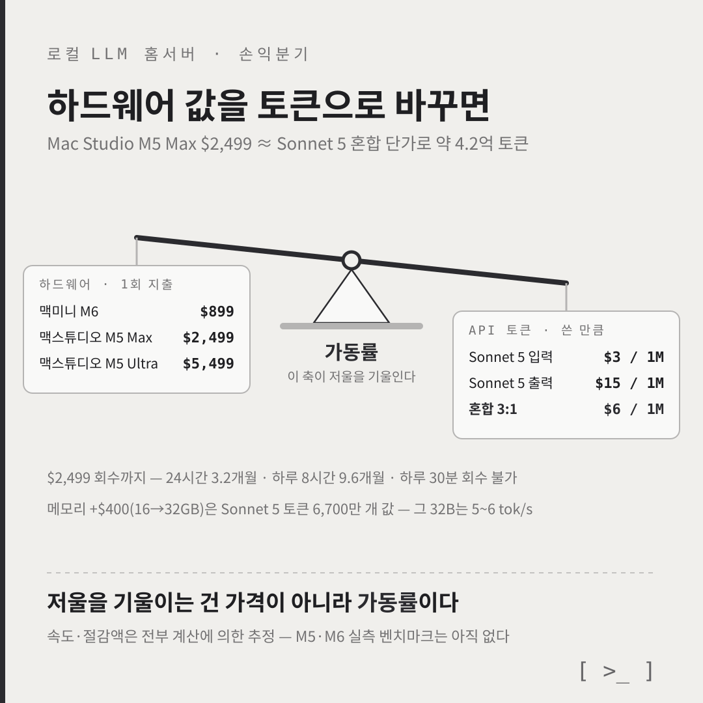
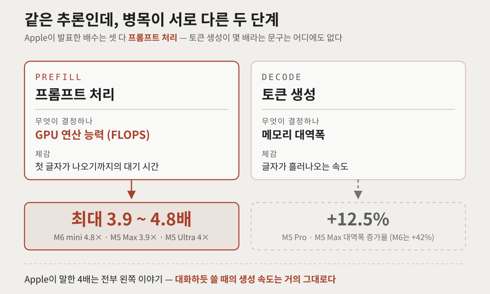
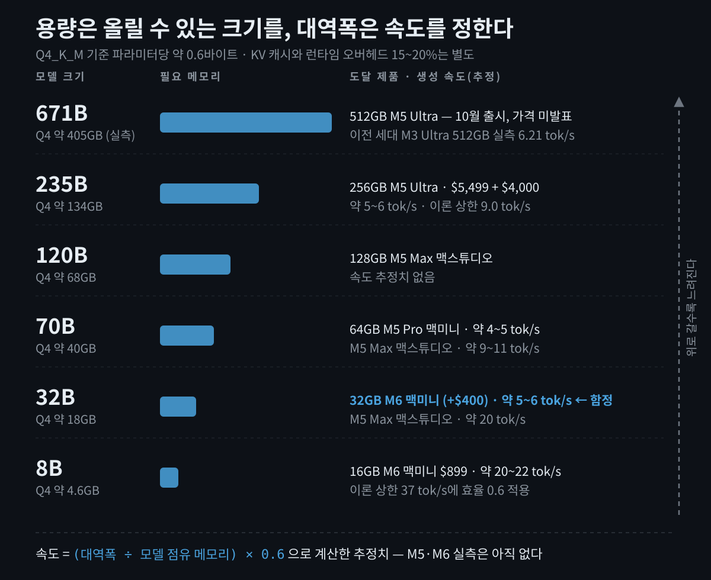
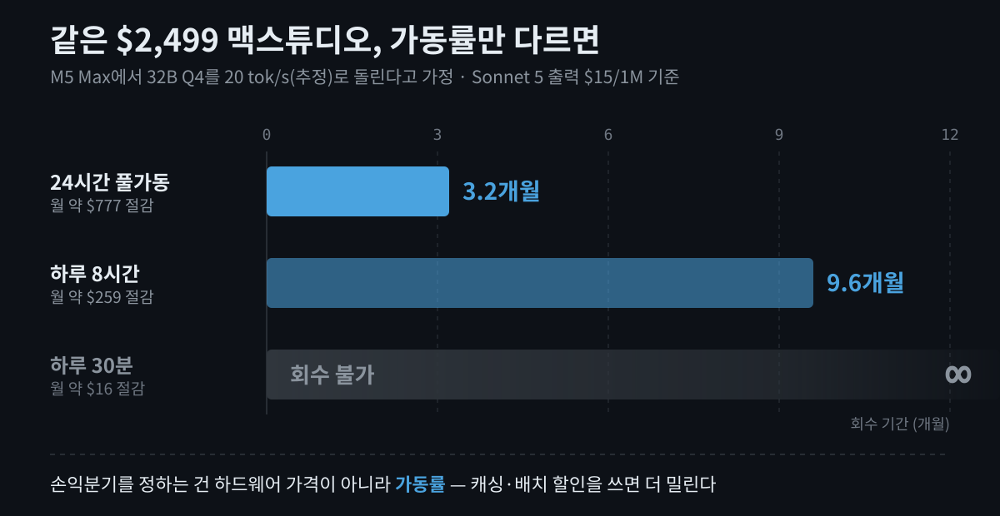

홈서버에 로컬 LLM(대규모 언어 모델)을 올려보려고 맥미니를 알아보던 중이었습니다. 그러다 2026년 8월 25일 Apple이 M6·M5 Pro/Max/Ultra를 한꺼번에 내놨고, 가격표를 열어보고 잠깐 멈췄습니다. **선택지는 늘었는데 고민은 더 늘었습니다.** 맥미니 시작가가 $899가 됐고, 맥스튜디오 M5 Ultra의 256GB 메모리 옵션은 업그레이드 비용만 $4,000입니다.

그래서 "좋아 보이네"에서 멈추지 않고, **로컬 LLM 홈서버를 실제로 사는 게 맞는지 숫자로 계산해봤습니다.** 결론부터 말하면 이 글은 "사세요"도 "사지 마세요"도 아닙니다. 대신 어떤 숫자를 어디에 대입해야 자기 답이 나오는지, 그 기준을 세우는 글입니다. 로컬 추론을 처음 검토하는 분이라면 전체 구조를, 이미 견적을 뽑아본 분이라면 '4배'라는 발표 문구의 실체와 손익분기 부분을 참고하실 수 있습니다.

## 뭐가 나왔고, 얼마인가?

먼저 스펙과 가격부터 짧게 정리하겠습니다. 이 글의 본론은 아니지만, 뒤의 계산에 계속 쓰이는 숫자들입니다.

| 칩 | 최대 통합 메모리 | 메모리 대역폭 | 비고 |
|---|---|---|---|
| M6 | 32GB | 170GB/s | Apple 최초 2nm, 듀얼 16코어 Neural Engine |
| M5 Pro | 64GB | 307GB/s | — |
| M5 Max | 128GB | 614GB/s | — |
| M5 Ultra | 512GB | 1.2TB/s | M 시리즈 최초 쿼드 다이(quad-die) |

([Apple 뉴스룸 — M6·M5 Ultra 발표](https://www.apple.com/newsroom/2026/08/apple-introduces-m6-and-m5-ultra-for-a-big-leap-in-performance-and-ai-compute/))

가격은 **모두 USD·세금 별도, 2026년 8월 25일 발표 기준**입니다.

| 제품 | 시작가(USD) | 한국 시작가(VAT 포함) |
|---|---|---|
| Mac mini M6 (16GB/256GB) | $899 | 1,499,000원 |
| Mac mini M5 Pro (24GB/512GB) | $1,699 | 2,990,000원 |
| Mac Studio M5 Max (36GB/512GB) | $2,499 | 4,290,000원 |
| Mac Studio M5 Ultra (96GB/1TB) | $5,499 | 9,490,000원 |

([Mac mini 발표](https://www.apple.com/newsroom/2026/08/apple-unveils-a-more-powerful-mac-mini-featuring-the-all-new-m6-and-m5-pro/), [Mac Studio 발표](https://www.apple.com/newsroom/2026/08/apple-introduces-new-mac-studio-with-m5-max-and-m5-ultra/), 한국 가격은 [GeekNews 정리](https://news.hada.io/topic?id=32880) 기준)

여기서 진짜 눈에 띄는 건 **메모리 옵션 단가**입니다. 맥미니 16GB → 32GB가 **+$400**, 맥스튜디오 M5 Ultra 96GB → 256GB가 **+$4,000**입니다([AppleInsider](https://appleinsider.com/articles/26/08/25/you-can-spend-18299-on-a-mac-studio-today-or-more-in-october)). 512GB 구성은 10월 출시 예정이고 **가격은 아직 Apple이 발표하지 않았습니다.** 매체들이 "$6,000 이상 추가" 같은 추정을 내놓고 있지만 어디까지나 추정입니다.

"정말 오른 게 맞나"는 기준점에 따라 답이 갈립니다. 2026년 5~6월에 이미 한 차례 인상이 있었기 때문입니다.

- **원래 출시가 기준**: 맥미니는 M4 시절 $599에서 $899로 약 50% 상승([Macworld](https://www.macworld.com/article/3220063/apple-launches-new-m6-mac-mini-with-another-price-hike.html)), 맥스튜디오 최상위는 M3 Ultra $3,999에서 M5 Ultra $5,499로 +37.5%([MacRumors](https://www.macrumors.com/2026/08/25/mac-studio-mac-mini-tidbits/)).
- **직전 판매가 기준**: 맥미니는 $799 → $899로 +$100, M5 Max 맥스튜디오는 인상 후 M4 Max와 **같은 $2,499**입니다([Macworld](https://www.macworld.com/article/3220024/apple-announces-the-m5-ultra-mac-studio-with-up-to-512gb-of-ram.html)).

둘 다 사실입니다. 원인은 Apple도 공개적으로 인정한 **AI 데이터센터발 메모리 품귀**입니다. Tim Cook은 2026년 6월 "AI 수요로 메모리 가격이 오르고 있고 그 비용이 고객에게 전가되고 있다"고 밝혔습니다([Tom's Hardware](https://www.tomshardware.com/tech-industry/apple-pulls-512-mac-studio-upgrade-option)).

## "AI 성능 4배"는 무엇이 4배 빨라진 걸까?

이 글에서 제일 하고 싶은 이야기입니다. 발표 헤드라인만 보면 절대 알 수 없는 부분이거든요.

Apple 발표문에 나온 AI 관련 배수를 그대로 옮겨보겠습니다.

- M6 맥미니: "M4 대비 AI 성능 최대 4배", "**LLM 프롬프트 처리** M4 대비 최대 4.8배"
- M5 Max: "LM Studio에서 **LLM 프롬프트 처리** M4 Max 대비 3.9배"
- M5 Ultra: "**LLM 프롬프트 처리** M3 Ultra 대비 4배"

**셋 다 '프롬프트 처리'입니다.** 토큰 생성 속도가 몇 배 빨라졌다는 주장은 Apple 자료 어디에도 없습니다.

LLM 추론은 성격이 완전히 다른 두 단계로 나뉩니다.

- **프리필(Prefill, 프롬프트 처리)** — 입력 전체를 한 번에 행렬곱으로 밀어 넣는 단계입니다. 병렬성이 높아서 **GPU 연산 능력(FLOPS)이 좌우**합니다. 체감으로는 "첫 글자가 나오기까지의 대기 시간"입니다.
- **디코드(Decode, 토큰 생성)** — 토큰 하나를 만들 때마다 모델 가중치 전체를 메모리에서 읽어야 합니다. 그래서 **메모리 대역폭이 좌우**합니다. 체감으로는 "글자가 흘러나오는 속도"입니다.

즉, 두 단계는 **서로 다른 부품이 담당합니다.** 그리고 신형 칩의 대역폭 증가율을 보면 이야기가 달라집니다.

| 등급 | 이전 세대 | 신형 | 대역폭 증가율 |
|---|---|---|---|
| 베이스 | M4 120GB/s | M6 170GB/s | **+42%** |
| Pro | M4 Pro 273GB/s | M5 Pro 307GB/s | **+12.5%** |
| Max | M4 Max 546GB/s | M5 Max 614GB/s | **+12.5%** |
| Ultra | M3 Ultra 819GB/s | M5 Ultra 1,200GB/s | **+46%** |

이 표가 뜻하는 바는 분명합니다. **Pro·Max 등급에서 토큰 생성 속도 향상은 10~12% 수준에 그칩니다.** "4배"는 전부 프리필 쪽 이야기고, 정작 대화하듯 쓸 때 체감하는 생성 속도는 거의 그대로라는 뜻입니다.

### 그럼 프리필 4배는 별거 아닌가?

아닙니다. 오히려 **그동안 Apple Silicon의 최대 약점을 정면으로 때린, 진짜 업데이트**입니다. 이걸 보여주는 실측 두 가지가 있습니다.

**하나.** 이전 세대인 M3 Ultra 맥스튜디오 512GB에서 llama.cpp로 DeepSeek 671B(q4_K_M)를 돌린 실측입니다. 8,001토큰짜리 프롬프트 하나를 처리하는 데 **888초, 14분 48초**가 걸렸습니다. 생성은 6.21 tok/s, 총 소요 17분 13초였습니다([hardware-corner](https://www.hardware-corner.net/mac-studio-m3-ultra-deepseek-llamacpp/)). 코딩 에이전트처럼 긴 컨텍스트를 매번 밀어 넣는 용도라면, 이 조합은 사실상 쓸 수 없었다는 뜻입니다.

**둘.** EXO Labs가 같은 모델(Llama-3.1 8B FP16, 8,192토큰)로 두 기계를 비교한 실측입니다.

| 기기 | 프리필 | 디코드 | 합계 |
|---|---|---|---|
| NVIDIA DGX Spark (~100 TFLOPs, 273GB/s) | **1.47초** | 2.87초 | 4.34초 |
| Mac Studio M3 Ultra (~26 TFLOPs, 819GB/s) | 5.57초 | **0.85초** | 6.42초 |
| 두 대를 결합 | 1.47초 | 0.85초 | **2.32초** |

([EXO Labs](https://blog.exolabs.net/nvidia-dgx-spark/))

연산이 4배 높은 DGX Spark이 프리필에서 3.8배 빠르고, 대역폭이 3배 높은 M3 Ultra가 디코드에서 3.4배 빠릅니다. **FLOPS와 대역폭이 서로 다른 일을 한다는 걸 이보다 깔끔하게 보여주는 실험은 없습니다.** 그래서 둘을 붙이면 2.8배가 나옵니다.

> **유의사항** — M5·M6 세대의 **실측 벤치마크는 2026년 8월 26일 현재 존재하지 않습니다.** 위 실측은 전부 이전 세대(M3 Ultra, M4 Pro/Max) 수치입니다. 검색하면 "M5 Max로 70B를 28 tok/s"류의 숫자가 잡히지만, 뒤에서 보듯 이런 값은 대역폭 상 물리적으로 불가능합니다. 자동 생성으로 의심되는 집계 사이트의 수치는 걸러내시는 편이 좋습니다.

## 내 메모리로는 어떤 모델까지 올릴 수 있을까?

여기서 가장 중요한 문장을 하나 놓겠습니다.

> **메모리 용량은 '올릴 수 있는 모델 크기'를 정하고, 메모리 대역폭은 '생성 속도'를 정합니다. 서로 다른 부품이 서로 다른 일을 합니다.**

### 용량: 파라미터당 몇 바이트인가

가장 널리 쓰이는 4비트 양자화(Q4_K_M)를 기준으로 하면 **파라미터당 약 0.6바이트**입니다. Q8은 약 1.06바이트, FP16은 정확히 2바이트입니다. 여기에 KV 캐시와 런타임 오버헤드로 **15~20%** 정도를 더 얹어야 합니다.

이 경험칙은 검증됩니다. DeepSeek 671B를 q4_K_M로 로드했을 때 실측 메모리 사용량이 약 405GB였는데, 671 × 0.6 = 403GB로 거의 정확히 맞습니다.

| 모델 크기 | Q4_K_M 기준 필요 메모리 |
|---|---|
| 8B | 약 4.6GB |
| 32B | 약 18GB |
| 70B | 약 40GB |
| 120B | 약 68GB |
| 235B | 약 134GB |
| 671B | 약 405GB (실측) |

즉, 70B 모델을 4비트로 돌리려면 **최소 40GB에 오버헤드까지 여유가 있는 기계**가 필요합니다.

> **유의사항** — macOS는 GPU에 할당 가능한 통합 메모리를 기본적으로 전체의 약 75%로 제한합니다(`iogpu.wired_limit_mb`로 조정 가능). 32GB 머신이면 실제로 쓸 수 있는 건 24GB 선이라고 보시는 게 안전합니다.

### 속도: 대역폭을 모델 크기로 나눈다

디코드는 대역폭 바운드이므로 이론 상한이 단순합니다. `대역폭 ÷ 모델이 차지한 메모리`입니다. 그리고 M4 세대 실측을 보면 실제로는 이 상한의 **약 60%** 정도가 나옵니다.

| 칩 | 대역폭 | 7B Q4 생성 속도(실측) |
|---|---|---|
| M4 Pro | 273GB/s | 50.74 tok/s |
| M4 Max | 546GB/s | 83.06 tok/s |

대역폭이 정확히 2배일 때 생성 속도도 거의 그만큼 오릅니다. 7B Q4는 약 4GB니까 M4 Max의 이론 상한은 546÷4 = 136 tok/s인데, 실측이 83 tok/s입니다. 효율 약 60%가 여기서 나옵니다.

그래서 쓸 만한 어림 공식이 하나 나옵니다.

> **현실적 생성 속도 ≈ (메모리 대역폭 ÷ 모델 점유 메모리) × 0.6**

이 공식으로 신형 조합을 추정해보겠습니다. **아래는 전부 계산에 의한 추정치이며, 실측이 아닙니다.**

| 조합 | 이론 상한 | 추정 현실값 |
|---|---|---|
| M6 mini 16GB, 8B Q4 (4.6GB) | 37 tok/s | 약 20~22 tok/s |
| **M6 mini 32GB, 32B Q4 (18GB)** | 9.4 tok/s | **약 5~6 tok/s** |
| M5 Pro mini 64GB, 70B Q4 (40GB) | 7.7 tok/s | 약 4~5 tok/s |
| M5 Max Studio, 32B Q4 (18GB) | 34 tok/s | 약 20 tok/s |
| M5 Max Studio, 70B Q4 (40GB) | 15.4 tok/s | 약 9~11 tok/s |
| M5 Ultra 256GB, 235B Q4 dense (134GB) | 9.0 tok/s | 약 5~6 tok/s |

굵게 표시한 줄이 **가장 흔한 함정**입니다. 32GB M6 맥미니는 32B 모델을 '적재'할 수는 있지만 5~6 tok/s로 돕니다. 사람이 글을 읽는 속도보다 느립니다. **$400을 더 내고 산 것이 못 쓸 속도인 셈입니다.** 대역폭이 낮은 등급에서 메모리만 키우는 건 최악의 조합입니다. 같은 돈이라면 "32GB 맥미니"보다 "16GB 맥미니 + API"가 대부분 낫습니다.

참고로 검색에 자주 잡히는 "M5 Max, 70B Q4, 28 tok/s"는 **이론 상한 15.4 tok/s의 1.8배로, 물리적으로 나올 수 없는 값**입니다. 이런 숫자를 보면 그 출처 전체를 의심하시는 게 맞습니다.

### MoE는 규칙을 한 번 더 바꾼다

한 가지 예외가 있습니다. 전문가 혼합(MoE, Mixture-of-Experts) 모델입니다. 671B짜리 모델이라도 토큰 하나당 활성화되는 파라미터가 37B뿐이라면, 매 토큰마다 읽어야 할 메모리는 405GB가 아니라 22GB 남짓입니다. 실제로 M3 Ultra 512GB에서 DeepSeek-R1 671B가 16~18 tok/s로 돌았다는 리뷰가 있습니다([AppleInsider](https://appleinsider.com/articles/25/03/18/heavily-upgraded-m3-ultra-mac-studio-is-great-for-ai-projects), 2025년 3월).

정리하면 이렇습니다. **용량은 전체 모델 크기가 정하고, 속도는 활성 파라미터가 정합니다.** 통합 메모리 머신을 고를 때 가장 중요한 규칙입니다.

## 로컬 LLM 홈서버, 얼마나 돌려야 본전일까?

이제 진짜 계산입니다. 하드웨어 가격을 **API 토큰으로 환산**해보겠습니다.

실사용은 입력이 출력보다 훨씬 많으므로 **입력:출력 = 3:1**로 가정하겠습니다. Claude Sonnet 5 기준(입력 $3 / 출력 $15 per 1M)이면 혼합 단가가 1M 토큰당 $6, Opus 5(입력 $5 / 출력 $25)면 $10이 됩니다([Claude 요금 페이지](https://claude.com/pricing)).

| 구매 | 가격 | Sonnet 5 환산 | Opus 5 환산 |
|---|---|---|---|
| Mac mini M6 16GB | $899 | 약 1.5억 토큰 | 약 9,000만 토큰 |
| **32GB 업그레이드분만** | $400 | **약 6,700만 토큰** | 약 4,000만 토큰 |
| Mac Studio M5 Max | $2,499 | 약 4.2억 토큰 | 약 2.5억 토큰 |
| **256GB 업그레이드분만** | $4,000 | 약 6.7억 토큰 | **약 4억 토큰** |

한 줄로 말하면 이렇습니다. **메모리를 16GB에서 32GB로 올리는 $400은, Sonnet 5 토큰 6,700만 개와 같은 값입니다.** 그런데 앞에서 봤듯 그 32GB로 돌릴 32B 모델은 5~6 tok/s입니다.

### 반대 방향: 그 토큰을 맥이 만들려면 며칠 걸리나

환산만으로는 부족합니다. **하드웨어가 그 토큰 수를 물리적으로 생산할 수 있어야** 손익분기가 성립하니까요.

맥스튜디오 M5 Max에서 32B를 20 tok/s(추정치)로 돌린다고 해보겠습니다.

- 1시간 = 72,000토큰
- 하루 8시간 × 30일 = **약 1,730만 출력 토큰/월**
- 24시간 풀가동 = **약 5,180만 출력 토큰/월**

이걸 Sonnet 5 출력 단가($15/1M)로 사면 이렇게 됩니다.

| 가동률 | 월 절감액(추정) | $2,499 회수 기간 |
|---|---|---|
| 하루 30분 | 약 $16 | 사실상 회수 불가 |
| 하루 8시간 | 약 $259 | **약 9.6개월** |
| 24시간 풀가동 | 약 $777 | **약 3.2개월** |

**같은 하드웨어인데 회수 기간이 3개월에서 무한대까지 벌어집니다.** 여기가 이 글의 핵심입니다. 손익분기를 정하는 건 하드웨어 가격이 아니라 **가동률**입니다. 대량 요약·분류·임베딩·라벨링처럼 24시간 돌릴 배치 워크로드가 있으면 3~6개월에 회수되고, 하루 30분 챗봇으로 쓴다면 영원히 회수되지 않습니다.

전기요금은 어떨까요. M3 Ultra 맥스튜디오 실측 기준으로 유휴 32\~34W, LLM 추론 중 160\~200W였습니다([TechRadar](https://www.techradar.com/pro/apple-mac-studio-m3-ultra-workstation-can-run-deepseek-r1-671b-ai-model-entirely-in-memory-using-less-than-200w-reviewer-finds)). 180W로 하루 8시간, 30일이면 43.2kWh입니다. 한국전력 2026년 여름철 주택용 저압 2단계(214.6원/kWh) 기준 **월 약 9,300원**입니다([한국전력공사 요금표](https://home.kepco.co.kr/kepco/front/html/CY/E/E/CYEEHP00101.html)).

월 $259 절감액에 비하면 무시할 수준입니다. **전기요금은 맥 기반 홈서버에서 손익분기의 결정 변수가 아닙니다.** 다만 한국은 누진제라, 이미 월 400kWh 근처를 쓰는 가구라면 43kWh가 구간을 밀어 올려 전체 사용량에 더 비싼 단가가 붙을 수 있습니다. 이건 맥의 문제가 아니라 누진제의 문제입니다.

## API가 더 싸지는 쪽 계산도 해봤을까?

반대편 계산도 해봐야 합니다.

- **프롬프트 캐싱** — 반복되는 컨텍스트가 많으면 캐시 읽기 단가가 기본 입력의 약 0.1배로 떨어집니다. 입력 비용이 최대 90%까지 줄어듭니다. 위 환산표의 "1.5억 토큰"이 몇 배로 늘어난다는 뜻입니다.
- **배치 API** — 비동기로 처리해도 되는 작업이라면 50% 할인됩니다. 그런데 하필 **배치성 워크로드는 로컬 온프렘이 가장 유리하다고 했던 바로 그 영역**입니다. 온프렘의 최대 강점 구간에서 API도 반값이 됩니다.
- **단가는 내려가는 추세입니다** — OpenAI가 2026년 7월 가격을 인하했고, 인트로 할인이 붙는 모델도 있습니다. 하드웨어 가격은 산 순간 고정이지만 API 단가는 계속 움직입니다.
- **모델 품질 격차** — $5,499짜리 M5 Ultra에서 돌리는 235B 오픈웨이트가 Opus 5보다 낫다는 보장은 없습니다. 그리고 하드웨어는 2년 뒤에도 그 자리에 있지만 API 모델은 계속 좋아집니다.

캐싱과 배치를 제대로 쓰면 앞의 회수 기간 표는 통째로 뒤로 밀립니다. 정직하게 말하면, **순수하게 돈만 보면 API가 이기는 경우가 더 많습니다.**

그럼 왜 사느냐. 돈으로 환산되지 않는 쪽에 이유가 있습니다.

1. **프라이버시가 요구사항인 경우** — 계약상·법적으로 외부 API에 못 보내는 데이터가 있다면 손익분기 계산 자체가 성립하지 않습니다. 선택지가 하나뿐이니까요.
2. **무제한 실험** — 토큰 미터가 안 돌아가면 하는 실험의 성격이 바뀝니다. 프롬프트를 100번 갈아엎거나 전체 데이터를 재처리하는 일을 망설이지 않게 됩니다.
3. **오프라인·네트워크 격리 환경.**
4. **맥은 AI 전용 기계가 아닙니다** — 어차피 데스크톱이 필요했다면 증분 비용만 계산하면 됩니다. NVIDIA 홈서버는 보통 '추가로 사는 기계'라 이 계산이 안 됩니다.

## 맥이 아닌 선택지는 어떤가?

"선택지가 늘었다"의 실체도 짚어보겠습니다.

| 선택지 | 메모리 | 대역폭 | 전력 | 가격(USD) | 성격 |
|---|---|---|---|---|---|
| Mac mini M6 | 16~32GB | 170GB/s | 낮음 | $899~$1,299 | 가격·크기·정숙성 |
| Mac Studio M5 Max | 36~128GB | 614GB/s | 약 200W | $2,499~ | 용량·대역폭 균형점 |
| Mac Studio M5 Ultra | 96~512GB | 1.2TB/s | 약 270W | $5,499~$18,299(256GB 기준) | 초대형 모델의 거의 유일한 해법 |
| RTX 5090 빌드 | 32GB | 1,792GB/s | 575W+ | $3,200~$4,800 | 속도 압도 |
| DGX Spark | 128GB | 273GB/s | — | $4,699 | CUDA·프리필 강세 |
| Ryzen AI Max+ 395 | 128GB | — | — | 약 $2,800 | 가성비 |
| 중고 M4 Max Studio | ~128GB | 546GB/s | 약 180W | (중고 시세) | 디코드 성능 대비 최저가 |

(맥 외 제품의 시세·성능 수치는 커뮤니티·비교 자료 기반이라 방향성 참고용으로만 보시는 게 좋습니다)

이 표에서 읽어야 할 건 순위가 아니라 **교환 관계**입니다.

- **RTX 5090**은 32B급을 압도적으로 빠르게 돌리지만, **70B Q4(약 40GB)가 32GB VRAM에 애초에 안 들어갑니다.** 멀티 GPU로 가는 순간 비용·전력·소음이 급증합니다. 같은 조건에서 전기요금도 맥 대비 4.5배쯤 나옵니다.
- **DGX Spark**은 $4,699에 128GB인데 대역폭이 273GB/s입니다. M5 Max 맥스튜디오(614GB/s)에 **대역폭에서 2.25배 집니다.** 다만 $2,499는 36GB 기본 구성 가격이라, 128GB로 맞추면 맥 쪽 가격도 올라갑니다. 대신 CUDA 생태계와 프리필이 강합니다.
- **Ryzen AI Max+ 395**는 128GB에 약 $2,800으로 가성비상 가장 위협적인 대안입니다.

그리고 이 글에서 가장 실용적인 결론일 수도 있는 항목이 하나 있습니다. **중고 M4 Max 맥스튜디오**입니다. M5 Max와 대역폭 차이가 **12.5%뿐**입니다. 차이가 나는 건 프리필 3.9배 하나입니다. 즉 **긴 컨텍스트를 매번 밀어 넣는 용도가 아니라면, 신형 M5 Max를 살 이유가 생각보다 크지 않습니다.**

반대로 코딩 에이전트처럼 매 턴 수천~수만 토큰짜리 컨텍스트를 통째로 넣는 워크로드라면, 프리필 4배는 "돌아가긴 하는데 못 쓰겠다"와 "쓸 만하다"를 가르는 차이입니다. 앞서 본 14분 48초가 그 이유입니다.

소프트웨어 쪽도 한 줄 정리하면, Apple Silicon에서는 Apple의 공식 프레임워크인 **MLX**가 현재 가장 빠른 경로이고, Ollama도 0.19(2026년 3월)부터 내부 엔진을 MLX로 전환했습니다. Apple이 성능을 주장할 때 기준으로 삼은 앱은 **LM Studio**입니다. 일상적으로는 Ollama, 세밀한 제어가 필요하면 llama.cpp 정도로 접근하면 무난합니다.

## 마무리하며

계산을 끝내고 남은 건 결론이 아니라 **순서**였습니다. 정리하면 이렇습니다.

1. **먼저 어떤 모델을 돌릴지 정합니다.** 그게 필요한 메모리 용량(파라미터 × 0.6바이트 + 20%)을 정합니다.
2. **그 용량에서 나올 속도를 계산합니다.** `(대역폭 ÷ 모델 점유 메모리) × 0.6`. 여기서 대화형으로 못 쓸 숫자가 나오면 그 조합은 후보에서 빼는 게 맞습니다.
3. **하루 몇 시간 돌릴지를 정직하게 적습니다.** 가격이 아니라 이 숫자가 손익분기를 정합니다.
4. **캐싱·배치를 적용한 API 비용과 비교합니다.** 그래도 온프렘이 남는다면, 그건 대개 돈이 아니라 프라이버시나 무제한 실험 때문입니다.

'용량과 속도는 다른 부품이 정한다', 이 한 줄만 기억해도 견적서에서 가장 비싼 실수는 피할 수 있습니다. 메모리만 키우는 옵션 앞에서 한 번 멈추게 되니까요.

지금 로컬 LLM 홈서버를 고민 중이시라면, 구매 버튼을 누르기 전에 **돌리려는 모델 하나를 정해서 위 공식에 숫자를 대입해보시길 권합니다.** 숫자 두 개만 넣어보면 사야 할 등급이 대체로 저절로 드러납니다. 그리고 M5·M6 세대 실측이 아직 없는 만큼, 급하지 않다면 첫 벤치마크가 올라오는 것을 한 달쯤 기다려보는 것도 나쁘지 않은 선택입니다.

## 참고 자료 (공식 출처)

- [Apple 뉴스룸 — Apple introduces M6 and M5 Ultra](https://www.apple.com/newsroom/2026/08/apple-introduces-m6-and-m5-ultra-for-a-big-leap-in-performance-and-ai-compute/) (2026-08-25)
- [Apple 뉴스룸 — Mac mini with M6 and M5 Pro](https://www.apple.com/newsroom/2026/08/apple-unveils-a-more-powerful-mac-mini-featuring-the-all-new-m6-and-m5-pro/) (2026-08-25)
- [Apple 뉴스룸 — Mac Studio with M5 Max and M5 Ultra](https://www.apple.com/newsroom/2026/08/apple-introduces-new-mac-studio-with-m5-max-and-m5-ultra/) (2026-08-25)
- [Apple 코리아 — Mac mini 제품 페이지](https://www.apple.com/kr/mac-mini/)
- [한국전력공사 — 주택용 전기요금표](https://home.kepco.co.kr/kepco/front/html/CY/E/E/CYEEHP00101.html)
- [Anthropic — Claude 요금 안내](https://claude.com/pricing)
- [EXO Labs — DGX Spark + Mac Studio 결합 실측](https://blog.exolabs.net/nvidia-dgx-spark/) (1차 벤치마크 데이터)
- [hardware-corner — M3 Ultra + DeepSeek 671B 실측](https://www.hardware-corner.net/mac-studio-m3-ultra-deepseek-llamacpp/)
- [AppleInsider — Mac Studio 최대 구성 가격](https://appleinsider.com/articles/26/08/25/you-can-spend-18299-on-a-mac-studio-today-or-more-in-october) (2026-08-25)
- [Macworld — M6 Mac mini 가격 인상](https://www.macworld.com/article/3220063/apple-launches-new-m6-mac-mini-with-another-price-hike.html) (2026-08-25)
- [Macworld — M5 Ultra Mac Studio 발표](https://www.macworld.com/article/3220024/apple-announces-the-m5-ultra-mac-studio-with-up-to-512gb-of-ram.html) (2026-08-25)
- [MacRumors — 신형 Mac mini·Mac Studio 놓치기 쉬운 13가지](https://www.macrumors.com/2026/08/25/mac-studio-mac-mini-tidbits/) (2026-08-25)
- [Tom's Hardware — 512GB 옵션 단종과 메모리 가격 압박](https://www.tomshardware.com/tech-industry/apple-pulls-512-mac-studio-upgrade-option)
- [TechRadar — M3 Ultra Mac Studio 전력 실측](https://www.techradar.com/pro/apple-mac-studio-m3-ultra-workstation-can-run-deepseek-r1-671b-ai-model-entirely-in-memory-using-less-than-200w-reviewer-finds)
- [Ars Technica — Apple leans hard into local AI inference](https://arstechnica.com/apple/2026/08/with-new-mac-studio-and-mac-mini-apple-leans-hard-into-local-ai-inference/) (2026-08-25)

#로컬LLM #홈서버 #맥미니 #맥스튜디오 #AppleSilicon #M6맥미니 #M5Ultra #메모리대역폭 #온프렘AI #Ollama #MLX #LLM추론 #양자화 #손익분기 #AI홈서버
