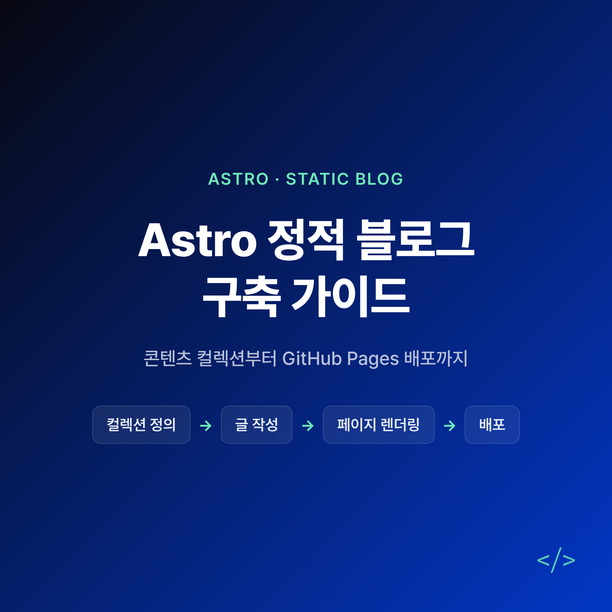
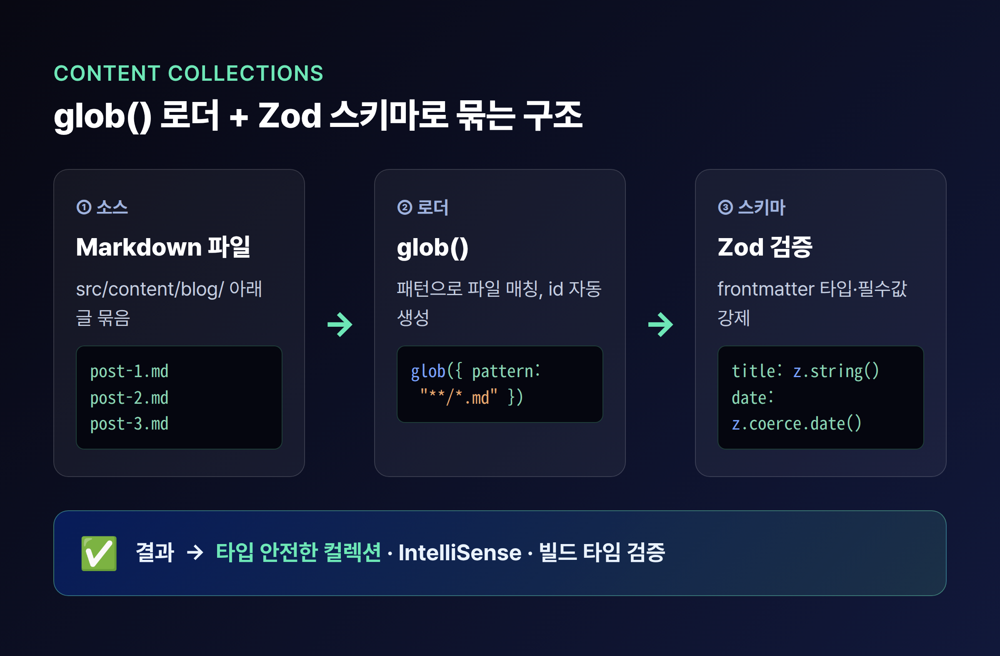
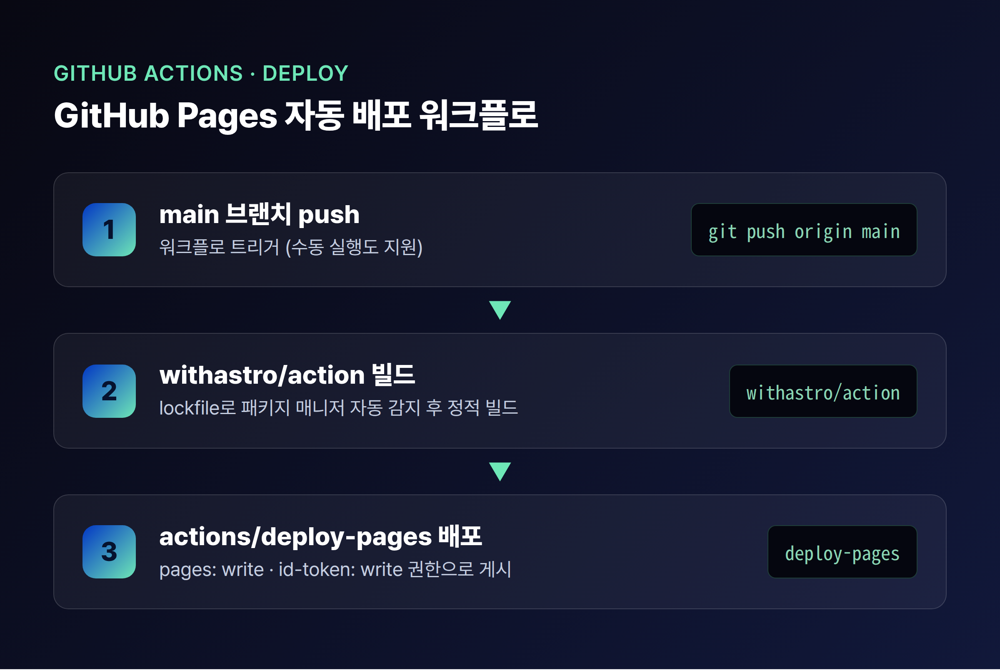

"블로그 하나 만드는데 자바스크립트가 이렇게 많이 실려야 할까요?" 가벼운 글 몇 편 올리려는데 빌드는 무겁고, 페이지는 느리고, 글 관리도 손이 많이 간다면 한 번쯤 해봤을 고민입니다. 이 글은 **Astro 정적 블로그**를 처음부터 끝까지 — 콘텐츠 컬렉션(Content Collections)으로 글을 구조화하고, GitHub Pages에 배포하는 흐름까지 — 한 번에 짚어보려는 분을 위한 가이드입니다. 처음 접하는 분이라면 전체 흐름을, 이미 Astro가 익숙한 분이라면 스키마·배포 설정의 디테일을 참고하실 수 있습니다.

## Astro란 무엇이고, 왜 블로그에 좋을까요?

Astro는 "콘텐츠 중심(content-driven) 웹사이트를 위한 웹 프레임워크"입니다. 가장 큰 특징은 **기본적으로 클라이언트 자바스크립트를 0으로 출력(zero JS by default)**한다는 점이죠. 즉, 블로그처럼 대부분이 읽기용 콘텐츠인 사이트라면 불필요한 JS 없이 가볍고 빠른 정적 페이지를 받게 됩니다.

인터랙션이 필요한 부분만 골라서 동작하게 만드는 방식을 **아일랜드(Islands) 아키텍처**라고 부릅니다. 쉽게 얘기하면, 정적인 바다 위에 인터랙티브한 '섬'만 띄우는 구조인 것이죠. 라이선스는 MIT 오픈소스라 부담 없이 쓸 수 있습니다.

버전 이야기를 잠깐 하면, 현행 최신은 **Astro 7.0(2026-06-22 출시)**입니다. Vite 8 기반의 더 빠른 빌드, 새로운 Rust 컴파일러, Advanced Routing, 백그라운드 dev 서버, 구조화된 로깅 등이 들어갔습니다. 그 직전 **Astro 6.0(2026-03-10)**에서는 dev 서버 리팩터와 **라이브 콘텐츠 컬렉션(live content collections)** 등이 도입됐고요.

> **유의사항**: 일부 비공식 블로그에서 "최신은 Astro 6", "Cloudflare가 Astro를 인수했다" 같은 서술을 볼 수 있는데, 공식 Astro 블로그 기준으로는 **최신이 7.0이며 인수 관련 언급은 확인되지 않습니다.** 버전·성능 수치는 공식 출처로 한 번 더 확인하시길 권합니다.

## 콘텐츠 컬렉션이란 무엇인가요?

블로그 글, 제품 설명, 레시피처럼 **구조가 비슷한 콘텐츠 묶음을 관리하는 권장 방식**이 바로 콘텐츠 컬렉션입니다. Astro 2.0에서 "타입 안전한 Markdown"으로 처음 도입됐고, 지금은 블로그를 만들 때 가장 먼저 손대는 기반이 됩니다.

콘텐츠 컬렉션을 쓰면 좋은 점은 분명합니다.

- 글들을 한곳에서 **정리·쿼리**하기 쉬워집니다.
- 에디터에서 **IntelliSense·타입 체크**가 켜집니다.
- 모든 콘텐츠에 **자동 TypeScript 타입 안전성**이 붙습니다.

데이터를 어디서 불러올지는 **Content Layer API의 로더(loader)**가 담당합니다. 빌드 타임에 동작하는 내장 로더가 두 가지인데요.

- **`glob()`**: glob 패턴으로 디렉터리 안의 파일들을 매칭합니다. `base`(파일 위치 경로)와 `pattern`이 필요하고, Markdown·MDX·JSON 등에서 각 엔트리의 `id`를 **파일명 기반의 URL 친화적 형식으로 자동 생성**해 줍니다.
- **`file()`**: 하나의 JSON/YAML/TOML 파일에서 여러 엔트리를 한꺼번에 로드합니다. 각 엔트리는 고유한 `id` 속성을 가져야 합니다.

여기에 더해, CMS·DB·API 같은 원격 데이터를 빌드 타임에 가져오는 **커스텀 로더**도 만들 수 있습니다. 대부분의 블로그는 로컬 Markdown만 다루므로 `glob()` 하나면 충분합니다.

한 가지 구분해 둘 점이 있습니다. 위처럼 **빌드 타임 컬렉션**은 빌드 시점에 데이터를 갱신해 저장하므로 빠릅니다. 반면 매우 자주 바뀌어 실시간 신선도가 필요한 데이터라면 **라이브 컬렉션**(`src/live.config.ts`의 `defineLiveCollection()`)을 쓰고 `getLiveCollection()`·`getLiveEntry()`로 조회합니다. 다만 라이브 컬렉션은 **MDX 렌더링과 이미지 최적화를 하지 못한다**는 제약이 있으니, 블로그 본문에는 보통 빌드 타임 컬렉션이 정답입니다.

## Zod 스키마로 frontmatter를 어떻게 강제할까요?

컬렉션의 핵심은 스키마(Schema)입니다. Astro는 **Zod**로 스키마를 정의하는데, Zod는 TypeScript용 스키마 선언·검증 라이브러리입니다. frontmatter의 필수 속성과 각 속성의 타입을 강제해, "필요할 때 이 데이터가 예측 가능한 형태로 존재함"을 보장해 주죠. 오타가 난 날짜나 빠진 제목 같은 문제를 **빌드 타임에 바로 잡아줍니다.** (Zod는 `astro:content`에서 가져옵니다.)

블로그에서 자주 쓰는 Zod 타입은 다음과 같습니다.

- `z.string()` — 문자열 (제목, 설명)
- `z.coerce.date()` — 문자열을 Date로 자동 변환 (frontmatter 날짜에 특히 유용)
- `z.array(z.string())` — 문자열 배열 (태그 목록)
- `z.boolean()` — 불리언 (발행 여부)
- `z.enum(['draft','published'])` — 지정한 값만 허용하는 enum (발행 상태)

설정 파일은 **`src/content.config.ts`**(또는 `.js`/`.mjs`)에 둡니다. 여기서 `defineCollection`으로 컬렉션을 정의하고, loader는 `glob({ pattern: "**/*.{md,mdx}", base: "./src/content/blog" })`처럼, schema는 `title: z.string()`, `description: z.string()`, `pubDate: z.coerce.date()`, `tags: z.array(z.string())`, `draft: z.boolean()` 같은 형태로 구성합니다. 로컬 MDX까지 컬렉션에 넣으려면 패턴을 `"**/*.{md,mdx}"`로 잡아 `.mdx`도 매칭되게 하면 됩니다(MDX는 `@astrojs/mdx` 인테그레이션으로 지원).

> **유의사항**: 여기서 `draft` 불리언(또는 enum)을 스키마에 두는 패턴은, "작성 중인 글은 발행에서 빼는" 운영 방식과 자연스럽게 맞물립니다. 비공개·미완성 글을 `draft: true`로 표시해 두면 관리가 한결 깔끔해집니다.

## 작성한 글을 페이지로 어떻게 렌더링하나요?

컬렉션을 정의하고 `src/content/blog/` 아래에 Markdown 글을 채웠다면, 이제 그걸 화면에 뿌릴 차례입니다. 쿼리용 함수가 준비돼 있습니다.

- **`getCollection('blog')`** — 컬렉션의 모든 엔트리를 가져옵니다(글 목록 페이지에 사용).
- **`getEntry(collection, id)`** — 단일 엔트리를 가져옵니다.
- **`render(entry)`** — Markdown/MDX 엔트리를 HTML로 변환하고, 페이지에서 쓸 `<Content />` 컴포넌트를 돌려줍니다.

글 상세 페이지의 표준 패턴은 동적 라우트입니다. 예를 들어 `src/pages/blog/[...slug].astro`에서 `getCollection`으로 정적 경로를 만들고, `render`로 본문을 출력하는 구성이죠. 정리하면, **컬렉션 정의 → 글 작성 → `getCollection`+`render`로 페이지 생성**이 블로그의 한 사이클입니다.

참고로 이 함수들(`getCollection`·`render`)은 **빌드 타임 컬렉션 전용**입니다. 라이브 컬렉션이라면 앞서 말한 `getLiveCollection()`·`getLiveEntry()`를 써야 합니다.

## 검색 노출을 위해 RSS와 사이트맵은 어떻게 다나요?

블로그를 만들었으면 검색엔진과 구독자에게도 잘 보여야겠죠. 두 가지를 보태면 좋습니다.

**RSS 피드 (`@astrojs/rss`)** — `npm install @astrojs/rss`로 설치합니다. `src/pages/`에 `rss.xml.js` 같은 `.xml.js` 파일을 만들어 피드 출력 URL로 씁니다. `@astrojs/rss`의 `rss`와 `astro:content`의 `getCollection`을 가져온 뒤, async `GET` 함수에서 글을 모아 `title`·`description`·`site`·`items`를 담은 객체를 반환하면 됩니다. 브라우저가 자동으로 찾을 수 있도록 레이아웃 `<head>`에 다음 한 줄을 넣어 두세요.

`<link rel="alternate" type="application/rss+xml" title="RSS Feed" href="/rss.xml" />`

**사이트맵 (`@astrojs/sitemap`)** — 패키지를 설치하고 `astro.config.mjs`의 `integrations`에 추가합니다. 이때 `site`(http:// 또는 https://로 시작)를 **반드시** 설정해야 합니다. 빌드하면 출력 디렉터리에 `sitemap-index.xml`과 `sitemap-0.xml`이 생성되는데, index가 번호 매겨진 사이트맵들을 링크하고 `sitemap-0.xml`이 실제 페이지 목록을 담습니다. `serialize` 함수로 URL 패턴별 `changefreq`·`priority`도 손볼 수 있습니다.

> **유의사항**: 사이트맵은 `site` 설정이 없으면 **아예 생성되지 않습니다.** RSS도 절대 URL이 필요하므로, 사실상 두 기능 모두 `site` 설정이 전제라고 보면 됩니다.

## GitHub Pages 배포는 어떻게 하나요?

마지막은 배포입니다. Astro 정적 블로그는 GitHub Pages에 깔끔하게 올라갑니다.

먼저 `astro.config.mjs`를 손봅니다.

- **`site`**: 배포될 사이트 URL. 유저/조직 페이지라면 `'https://<username>.github.io'` 형태입니다.
- **`base`**: GitHub Pages는 보통 `https://<username>.github.io/<my-repo>/` 경로로 게시되므로 `base: '/my-repo'`처럼 저장소명과 맞춥니다. 다만 저장소 이름이 `<username>.github.io` 패턴이라면 `base`는 필요 없습니다.

> **유의사항**: `base`를 설정하면 **모든 내부 링크에 base 프리픽스를 붙여야 합니다**(예: `<a href="/my-repo/about">`). 이 부분을 빠뜨리면 배포 후 링크가 깨지니 주의하세요.

다음은 자동 배포입니다. 프로젝트에 `.github/workflows/deploy.yml`을 만들고, 공식 **`withastro/action`**으로 빌드한 뒤 GitHub의 `actions/deploy-pages` 액션으로 Pages에 올립니다. main 브랜치에 push할 때 트리거되며, 수동 실행(`workflow_dispatch`)도 됩니다. 워크플로에 필요한 권한은 세 가지입니다.

- `contents: read`
- `pages: write`
- `id-token: write`

`withastro/action`은 선택 파라미터로 `path`(프로젝트 루트), `node-version`(기본 24), `package-manager`(lockfile로 자동 감지)를 받습니다. 패키지 매니저 자동 감지를 위해 `package-lock.json` 같은 **lockfile을 꼭 커밋**해 두세요.

커스텀 도메인을 붙이고 싶다면, 배포 후 `./public/CNAME`에 도메인(예: `sub.example.com`)을 넣고 `site`를 그 도메인으로 바꾼 뒤, `base` 설정과 내부 링크의 base 프리픽스를 제거하면 됩니다.

## 마무리하며

정리하면 Astro 정적 블로그의 뼈대는 **'컬렉션 정의 → 글 작성 → 페이지 렌더링 → 배포'** 4단계로 압축됩니다. 핵심은 화려한 기능이 아니라, **타입 안전한 콘텐츠 구조 위에서 군더더기 없이 빠른 사이트를 만드는 것**이죠.

이제 막 블로그를 시작하는 분이라면, 거창한 설계보다 `src/content.config.ts`에 `glob()` 로더와 Zod 스키마 한 벌을 잡는 것부터 시작해보시길 권합니다. 이미 Markdown 글이 쌓여 있는 분이라면, 먼저 콘텐츠 컬렉션으로 옮겨 타입 안전성과 검증을 확보한 뒤 RSS·사이트맵을 얹어보시는 걸 권합니다. 작게 시작해 배포 파이프라인까지 한 번 돌려보면, 그다음부터는 글쓰기에만 집중할 수 있습니다.

여러분의 첫 Astro 블로그가 가볍고 빠르게 세상에 나오길 바랍니다. 다음 콘텐츠에서는 **MDX 컴포넌트와 이미지 최적화로 블로그 본문을 풍성하게 만드는 법**을 다뤄보겠습니다.

#Astro #정적블로그 #콘텐츠컬렉션 #ContentCollections #GitHubPages #Zod스키마 #SSG #정적사이트생성기 #AstroRSS #사이트맵 #기술블로그 #블로그SEO
