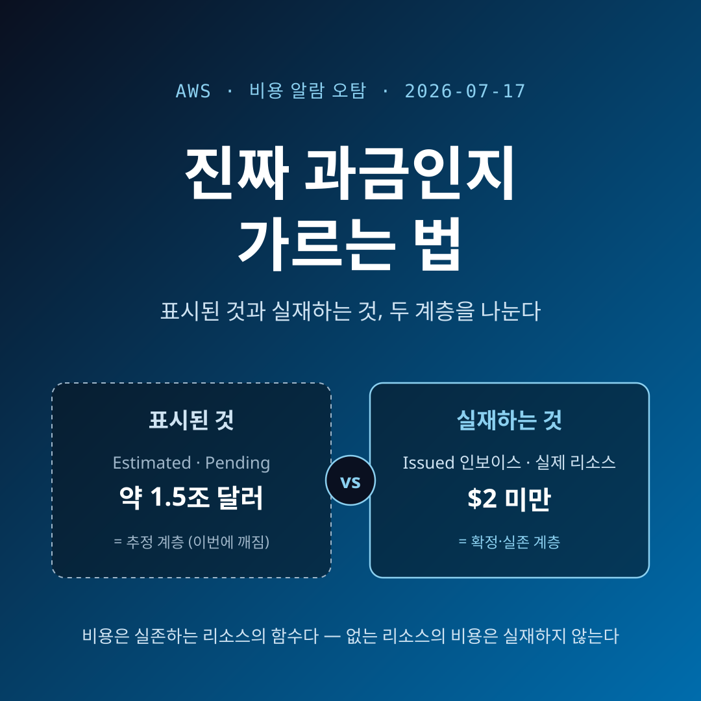
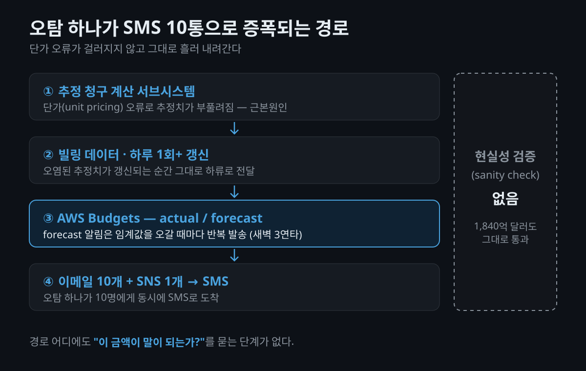
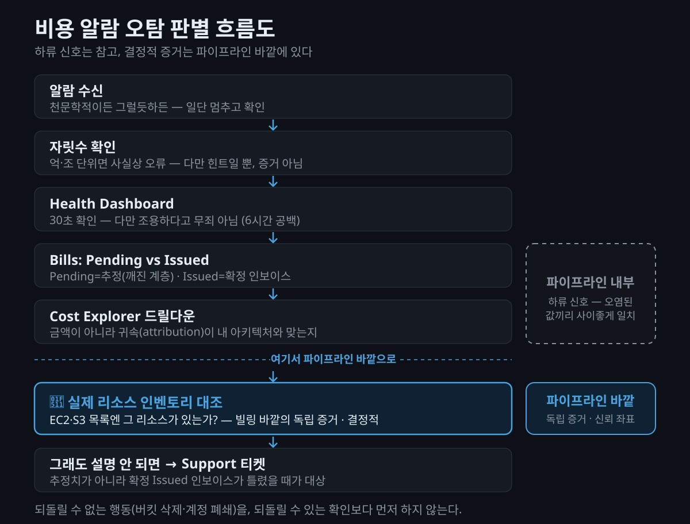

제가 직접 운용하는 회사 AWS 계정의 비용 알람을 받았습니다. 평소 월 4달러 남짓 쓰는 계정입니다. 그런데 예측 금액이 **조 단위**로 찍혀 있었습니다. 처음 든 생각은 "스팸인가?"였습니다.

그런데 발신자가 AWS **공식 메일**이었습니다. "그럼 발송 오류겠지" 싶어 콘솔의 비용 화면을 열었더니, **거기에도 같은 금액이 그대로 찍혀** 있었습니다. 이 지점에서부터 판별이 어려워졌습니다. 각 단계마다 "오류겠지"라는 제 짐작이 부정당했거든요 — 공식 메일이라서, 콘솔에도 있어서. 그래서 저는 서포트 케이스를 올리고 사용량을 추적하기 시작했습니다. 서포트 조사가 '역시 오류' 정황으로 기우는 걸 보고 나서야, 오픈톡방과 Reddit을 열었습니다. 다들 난리였습니다. 수천억 달러를 받은 사람도 있었습니다. 마지막으로 AWS 상태 페이지를 확인하고 나서야 — 식겁했던 마음이 가라앉았습니다.

커뮤니티는 이 사태를 곧 블랙유머로 소비했습니다 — "소프트웨어 역사상 가장 비싼 TODO 주석"이라는 농담이 돌 정도였죠(커뮤니티 농담). 실제 청구 피해 없이 지나간 **해프닝**처럼 보이는 사건입니다. 다만 뒤에서 보겠지만, 누군가에겐 해프닝이 아니었습니다.

이 글은 2026년 7월 17일 발생한 **AWS 비용 알람 오탐** 사건을 기록하면서, 그때 저와 많은 사람들을 실제로 구한 판별 기준 하나를 정리합니다. "얼마가 찍혔는지"를 구경하는 글은 아닙니다. **추정치 계층이 깨졌을 때, 실재하는 것과 표시되는 것을 어떻게 가르는가** — 이게 이 글의 주제입니다. 알람을 받고 패닉이 온 적 있는 분, 혹은 언젠가 그럴 분을 위한 절차입니다.

> **글 작성 시점 안내**: 이 글 갱신 시점(2026-07-18) 기준, AWS는 근본 원인을 완화하고 잘못된 추정 데이터를 재계산(백필)하는 중입니다. 완전 복구 예정 시각은 07-19 04:00 KST(07-18 12:00 PM PDT)로 안내됐고, 이 글 작성 시점엔 아직 도래 전입니다. 최종 복구 확인과 보상 여부는 미확인으로 남겨 둡니다.

## 무슨 일이 있었나? — 6시간의 공백

AWS Health Dashboard의 공개 이벤트 기록을 그대로 옮기면 이렇습니다. 이벤트 제목은 `Inaccurate Estimated Billing Data`, 서비스는 AWS Billing Console (Global)입니다. ([AWS Health Dashboard](https://health.aws.amazon.com/health/status))

| 시각 (KST) | 시각 (UTC) | 사건 |
|---|---|---|
| **07-17 11:38** | 07-17 02:38 | **문제 발생 시점** (사후 공지에서 역산 발표) |
| 07-17 15:34 | (제 계정) | **제 계정 월 예산 알림 3통** — 7월 예측 **약 1.5조 달러대** |
| 07-17 16:23 | (제 계정) | **제 계정 일별 예산 알림 1통** — **수백억 달러대** |
| **07-17 17:33** | 07-17 08:33 | AWS 최초 공지 — "We are investigating issues with Cost Explorer reflecting inaccurate estimated billing data." |
| 07-17 18:07 | 07-17 09:07 | "Beginning on July 16 7:38 PM PDT, we began displaying incorrect estimated billing data in the Billing and Cost Management Console." |
| 07-17 19:03 | 07-17 10:03 | **근본원인 발표** |
| 07-17 19:52 | 07-17 10:52 | **완화조치** — 추정 청구 계산 일시 중단 |
| 07-18 06:14 | 07-17 21:14 | **근본원인 완화·데이터 백필 시작** — 완전 복구 예정 07-19 04:00 KST(07-18 12:00 PM PDT) |

핵심은 발생 시점과 공지 시점 사이의 간격입니다. 발생은 11:38, AWS 최초 공지는 17:33. **약 6시간의 공백**이 있었습니다. 그 6시간 동안 전 세계 사용자는 아무 공식 정보 없이 천문학적 금액의 경보를 받았습니다. 저를 포함해서요. 제 계정에 알림이 온 15:34는 AWS가 공개적으로 인정하기 **약 2시간 전**이었습니다. 그 시점에 상태 페이지를 열어봤자 아무것도 없었다는 뜻입니다.

AWS가 공식적으로 인정한 내용은 다음 세 가지입니다. ([AWS Health Dashboard](https://health.aws.amazon.com/health/status))

- **근본원인**: *"we have identified the root cause as an issue with **unit pricing** within the estimated billing computation subsystem"* — 즉, 추정 청구 계산 서브시스템의 **단가(unit pricing)** 문제입니다. 보안 사고도, 계정 침해도, 실제 리소스 폭주도 아니었습니다.
- **영향 범위**: *"The displayed billing estimates **do not reflect actual usage and charges**. There are no customer actions required at this time."* — 표시된 추정치는 실제 사용량·요금을 반영하지 않으며, 고객이 취할 조치는 없다는 명시입니다.
- **완화조치**: 추정 청구 계산을 **일시 중단(paused)** 했습니다. 부풀려진 추정치를 보던 계정은 더 이상 값이 오르지 않고, 완전 복구까지 재계산에 수 시간(multiple hours)이 걸릴 것으로 안내했습니다.

깨진 것은 특정 화면 하나가 아니라 **예상(추정) 데이터 계층 전반**이었습니다. AWS가 영향받은 고객에게 보낸 공식 안내 메일은 영향 범위로 **Cost Explorer, AWS Budgets, Cost and Usage Report(CUR)** 를 명시했습니다. 즉 예상 비용·사용 데이터를 소비하는 경로가 한꺼번에 부풀려진 값을 받은 셈입니다.

터진 알림 경로는 주로 **AWS Budgets**였습니다. 제 계정에 온 것도 Budgets 예산 알림이었습니다 — 월 예산 3통에 7월 예측이 **약 1.5조 달러대**, 일별 예산 1통에 **수백억 달러대**. 평소 월 4달러 남짓 쓰는 계정에서 말이죠. 커뮤니티에 공개된 다른 원문을 보면 $100 임계값 예산에 예측 비용이 **약 1,840억 달러**로 통보된 사례, $18 예산에 3통 연속 경보에 콘솔은 $78,000,000이 찍힌 사례도 있었습니다. 이 커뮤니티 금액들은 전부 **개인이 공개 게시판에 올린 일화**이고, AWS는 어떤 금액도 공식 확인하지 않았습니다.

> **유의사항**: 오탐이 퍼진 경로는 Budgets만이 아니었습니다. 제 계정의 AWS 서포트 케이스 조사에서, AWS가 2026-07-16에 비용 이상(cost anomaly)을 공식 감지(이상 점수 0.95)했으나 **그 트리거가 실제 확정 청구액이 아니라 Budgets와 동일하게 부풀려진 예측(estimate) 데이터**였음이 확인됐습니다. 즉 **Cost Anomaly Detection도 같은 오염된 예측 데이터를 소비해 오탐을 냈습니다.** 이건 제 계정 1건의 정황만이 아닙니다 — AWS가 영향받은 고객에게 보낸 **공식 안내 메일에서 "부풀려진 추정치로 인해 트리거되는 AWS Budgets 또는 Cost Anomaly Detection 알림은 무시하셔도 됩니다"라고 두 채널을 직접 지목**했습니다. 대고객 공지로 두 경로를 못 박을 만큼 광범위했다는 뜻입니다(구체적인 영향 계정 수는 AWS가 공개하지 않았습니다). 한편 커뮤니티에 돌던 "vibe coding이 원인", "GB와 Bytes를 헷갈려 2^30배 오차" 같은 이야기는 **농담·추측**이고 AWS 발표에 근거가 없습니다.

## 왜 Budgets 알림이 그렇게 크게 튀었나?

메커니즘 자체는 공식 문서에 다 나와 있습니다. ([Best practices for AWS Budgets](https://docs.aws.amazon.com/cost-management/latest/userguide/budgets-best-practices.html))

- Budgets가 감시하는 빌링 데이터는 **하루 최소 1회 갱신**되고, 알림도 이 주기를 탑니다. 오염된 추정 데이터가 갱신되는 순간 그대로 이메일이 나간 것이죠.
- Budgets 알림에는 **실제(actual) 기준**과 **예측(forecast) 기준** 두 종류가 있습니다. Actual 알림은 예산 기간당 최초 1회지만, **Forecast 알림은 여러 번** 나갑니다. 임계값을 넘었다 내려갔다 다시 넘으면 또 옵니다. "새벽에 3연타를 맞았다"는 보고가 여기서 설명됩니다.
- 알림 하나당 **이메일 최대 10개 주소 + SNS 토픽 1개**를 붙일 수 있습니다. SNS를 쓰면 SMS까지 나갑니다.

정리하면, **오탐 하나가 10명에게 동시에 SMS로 가는 구조**입니다. 그리고 그 사이 어디에도 "1,840억 달러가 말이 되는 값인가?"를 묻는 현실성 검증(sanity check)은 없었습니다.

## 알람을 받았을 때, 무엇을 먼저 봐야 하나?

여기서부터가 알맹이입니다. 절차의 바탕에는 원리가 하나 있습니다.

> 이번에 깨진 것은 **"추정치(estimate)" 계층**이다. **"확정 인보이스" 계층**과 **"실제 리소스" 계층**은 별개다.

이 세 계층을 머리에 두고 아래를 읽으면, 순서를 외울 필요가 없습니다.

### 먼저 자릿수를 본다 — 다만 여기서 멈추면 안 된다

금액이 억·조 단위라면, 사실상 시스템 오류입니다. 30초짜리 스모크 테스트죠.

실제로 어떤 알림은 판별 단서를 제 몸에 품고 있었습니다. 한 사용자는 $2 임계값 예산에 예측 비용이 **약 6.5억 달러**로 찍혔는데, **같은 알림에 "Current usage: $1.70"이 나란히 표시**돼 있었다고 합니다(커뮤니티 보고). 부풀려진 예측과 실제 사용액이 한 화면에 같이 있었던 셈이죠 — 표시(6.5억 달러)와 실재($1.70)가 이미 거기서 갈리고 있었습니다.

문제는 **그럴듯한 금액**입니다. 이번 사건에서도 학생 계정이 $0에서 **$2,400**으로 표시돼 "충분히 있을 법해서" 더 무서웠다는 보고가 있었습니다(커뮤니티 보고). 커뮤니티에 이런 말이 있었는데, 저는 이게 이번 사건에서 가장 쓸모 있는 문장이었다고 봅니다 — *"이런 말도 안 되는 금액보다, 당신에게는 과하지만 일반적으로는 그럴듯해 보이는 추정 청구를 더 걱정하라."*

즉, **금액이 작다고 오류가 아닌 게 아닙니다.** 자릿수는 힌트일 뿐 증거가 아닙니다.

### Health Dashboard를 연다 — 그리고 그 한계를 안다

[AWS Health Dashboard 공개 상태 페이지](https://health.aws.amazon.com/health/status)는 로그인 없이 30초면 확인됩니다. 이번 건도 여기 올라왔습니다. 계정 전용 Health 페이지(<https://health.aws.amazon.com/health/home>)는 로그인이 필요하지만 **모든 고객에게 무료**로 제공되고 설정도 필요 없습니다. ([What is AWS Health?](https://docs.aws.amazon.com/health/latest/ug/what-is-aws-health.html))

여기서 이번 사건의 반직관적인 교훈이 나옵니다. **Health Dashboard가 조용하다고 해서 장애가 아닌 것은 아닙니다.** 6시간 동안 그 페이지는 아무 말도 하지 않았습니다. 제가 콘솔을 뒤지고 티켓까지 쓰는 동안 말이죠.

> **유의사항**: 대시보드와 EventBridge 연동은 무료지만, **AWS Health API로 프로그래매틱 통합**을 하려면 Business Support 이상 플랜이 필요합니다. ([AWS Health 문서](https://docs.aws.amazon.com/health/latest/ug/what-is-aws-health.html))

### Bills 페이지에서 `Pending`과 `Issued`를 가른다

이게 계층을 가르는 첫 공식 근거입니다. Bills 페이지의 청구 기간에는 두 가지 상태가 있습니다. ([Understanding your bill](https://docs.aws.amazon.com/awsaccountbilling/latest/aboutv2/getting-viewing-bill.html))

- **`Pending`** — 마감 안 된 현재 월. *"most recent estimated charges based on your AWS services metered to date"*, 즉 **추정치**입니다. ← **이번에 깨진 계층**
- **`Issued`** — 마감된 월. 실제 발행된 **인보이스**이고 PDF로 받을 수 있습니다.

공식 문서는 이렇게 선을 긋습니다. *"The summary isn't an invoice until the month's activity closes and AWS calculates the final charges."* 요약은 인보이스가 아니라는 뜻이죠.

**판별 포인트**: 경보 금액이 `Pending` 추정치에만 나타나고 지난달 `Issued` 인보이스는 정상이라면, 추정 계층 문제일 가능성이 큽니다.

다만 이번 사건에서는 콘솔 화면별로 표시가 엇갈렸다는 **상충된 커뮤니티 보고**가 있었습니다. "Bills 패널은 정상인데 Billing 첫 페이지는 엉터리 금액"이라는 관찰과, "아니다, amount due로 표시된다"는 반박이 같이 있었습니다. AWS 공식 확인이 없으므로 이 부분은 단정하지 않겠습니다.

### Cost Explorer로 드릴다운한다 — 목적은 금액이 아니라 귀속 검증

[Cost Explorer 데이터는 최대 24시간 지연](https://docs.aws.amazon.com/cost-management/latest/userguide/manage-ad.html)됩니다. 방금 전 사용량이 안 보이는 건 정상입니다.

여기서 볼 것은 금액이 아닙니다. **귀속(attribution)** 입니다. 서비스별·사용유형(usage type)별로 쪼개서, 그 분해 결과가 **내가 아는 아키텍처와 맞는지**를 봅니다. 안 맞으면 강한 오탐 신호입니다.

### 🔑 실제 리소스 인벤토리와 대조한다 — 이게 결정적 증거

이번 사건에서 사람들이 스스로 오류임을 확정한 방법은, 정확히 이거 하나였습니다. 그리고 제 계정이 바로 이 논리의 산 증거였습니다.

제 계정에는 예측이 **약 1.5조 달러대**로 찍혔지만, AWS 서포트 케이스 조사 결과 7월 1~17일 **실제 청구액은 2달러가 채 안 됐습니다.** 그 2달러 미만이 전부 어디서 나왔느냐 하면, **서울 리전(ap-northeast-2)의 Amazon S3 Glacier Deep Archive** 스토리지 비용이었습니다. 약 971GB를 저장하고 있었고, 그 요율로 계산한 금액이 **6월 지출 패턴(월 약 4달러)과 정확히 일치**했습니다. 서포트의 조사 취지도 같았습니다 — *"비용 분석 도구에 부풀려진 예측 금액이 표시되나 실제 청구 기록과 일치하지 않는다. 예측 데이터는 잠정치라 변경될 수 있고, 오직 실제 청구 기록만이 최종 청구서의 공식 출처다."*

정리하면 이렇습니다. **부풀려진 예측치(1.5조 달러)와 실재 리소스가 만든 실제 청구(2달러 미만, 6월 패턴과 일치)가 명확히 갈렸습니다.** Glacier에 넣어둔 971GB는 실제로 존재했고 그 비용은 정상이었습니다. 터진 것은 오직 예측 계층뿐이었습니다. 커뮤니티도 같은 논리로 판별했습니다. 보고 몇 개를 그대로 옮깁니다.

- "내 청구도 S3였고 일별 금액이 정확히 동일했다. 드릴다운해보니 **돌아가는 S3 앱 자체가 없었다.**"
- "지난달 34센트, 이번달 추정 210억 달러. 해킹당한 줄 알았는데 **인스턴스도 없고 생성된 것도 없었다.** 그때 버그임을 깨달았다."
- "**7개월 전에 닫은 계정**에 $16M 청구서가 왔다."

논리는 단순합니다.

> 청구는 **사용량**의 함수다. 사용량은 **실존하는 리소스**에서 나온다.
> **비용을 유발했다는 리소스가 실제로 존재하지 않는다면, 그 비용은 실재하지 않는다.**

이 대조가 결정적인 이유는 정확히 하나입니다. **빌링 파이프라인 바깥의 독립적인 증거**이기 때문입니다. 콘솔 금액도, Cost Explorer 그래프도, Budgets 알림도 전부 같은 오염된 파이프라인의 하류입니다. 하류를 아무리 비교해봐야 오염된 값끼리 사이좋게 일치할 뿐이죠. 반면 EC2 콘솔의 인스턴스 목록, S3 버킷 목록은 그 파이프라인과 무관하게 존재합니다. **빌링 시스템이 통째로 깨져도 신뢰할 수 있는 유일한 좌표**입니다.

확인 순서는 AWS 공식 체크리스트를 따르면 됩니다. ([Understanding unexpected charges](https://docs.aws.amazon.com/awsaccountbilling/latest/aboutv2/checklistforunwantedcharges.html))

1. 청구가 집중된 **서비스**를 특정합니다 (예: S3, EC2, Glacier).
2. 해당 서비스 콘솔에서 **리소스 목록을 직접 확인** — **모든 리전에 대해**. AWS 공식 문서도 *"make sure that you take the appropriate steps for every AWS Region you've allocated AWS resources"* 라고 경고합니다.
3. **다른 서비스가 띄운 리소스**도 봅니다. Elastic Beanstalk, ELB, OpsWorks는 리소스를 자동 생성·재시작하고, RDS 인스턴스도 내부적으로 EC2 위에서 돕니다.
4. 놓치기 쉬운 과금원을 훑습니다 — **EBS 볼륨·스냅샷**(인스턴스를 종료해도 남을 수 있음), **미사용 Elastic IP**(분리돼도 할당 상태면 과금), **비활성화한 리전에 남은 리소스**(끈 리전에서도 과금은 계속되는데 접근은 안 됨).
5. **금액과 리소스의 물리적 정합성**을 계산합니다. "이 스토리지 용량 × 이 단가 = 이 금액이 가능한가?" 이번 근본원인이 **단가** 오류였으니, 사용량은 맞는데 금액만 터무니없다면 그게 단가 계층 오류의 전형적인 지문입니다.

### 커뮤니티는 왜 실질적으로 가장 빨랐나

제 순서는 콘솔 → 티켓 → 커뮤니티였습니다. 그런데 답을 준 건 마지막이었습니다. 이건 저만의 실수가 아니라 구조적인 이야기입니다.

교차검증된 시각을 늘어놓으면 이렇습니다. 오염 시작 07-17 02:38 UTC → AWS Health 최초 게시 08:33 UTC → Hacker News 스레드 생성 09:42 UTC → AWS 근본원인 발표 10:03 UTC.

커뮤니티가 빨랐던 진짜 이유는 **속도가 아니라 상관관계(correlation)** 입니다. 개인은 자기 계정 하나만 봅니다. 그 안에서는 "내가 해킹당했나?"와 "AWS가 깨졌나?"를 구별할 수가 없어요. 그런데 **다른 사람도 같은 시각에 같은 증상을 겪는다는 사실을 아는 순간, 원인이 내 계정 바깥에 있다는 게 즉시 확정됩니다.** 이건 혼자서는 절대 얻을 수 없는 정보입니다.

> **유의사항**: 커뮤니티는 **가설**을 주지 **증거**를 주지 않습니다. "남들도 겪는다"는 강력한 신호지만, 내 계정에 진짜 침해가 동시에 일어나지 않았다는 보장은 아닙니다. 순서는 **커뮤니티로 안심 → Health로 확인 → 리소스로 확정**입니다.

### Support 티켓 — Basic 플랜에서도 빌링 문의는 무료입니다

이건 의외로 많이 오해되는 부분이라 짚어둡니다. [AWS Support Plans 공식 문서](https://docs.aws.amazon.com/awssupport/latest/user/aws-support-plans.html)는 이렇게 명시합니다. *"Basic Support offers assistance for **account and billing questions** and service quota increases."* 무료 Basic 플랜에도 **계정·빌링 질문에 대한 1:1 응답이 24x7로 포함**됩니다. 유료 플랜이 필요한 건 **기술 지원(technical support)** 케이스입니다.

그럼 언제 열어야 할까요.

- **이번처럼 Health에 이미 인정 공지가 올라왔고** *"There are no customer actions required at this time"* 이라고 적혀 있다면 → 티켓은 불필요하고, 오히려 지원 큐만 막습니다. (제가 그 큐를 막은 사람입니다.)
- **열어야 할 때**는 세 조건이 겹칠 때입니다. Health에 공지가 없고, 리소스 대조로도 설명이 안 되고, **확정된 `Issued` 인보이스**에 이상 금액이 있을 때. 추정치가 아니라 **확정 청구**가 틀렸을 때가 진짜 티켓 대상입니다.

참고로 제 케이스에서 AWS 서포트가 실제로 권장한 조치는 네 가지였는데, 앞서 이야기한 판별 절차와 정확히 같은 논리였습니다.

1. **Budgets 임계값을 점검**한다.
2. **의도치 않은 Glacier 스토리지**가 있으면 정리한다.
3. 불안하면 **CloudTrail(해당 리전, S3 API 기준)로 무단 접근 여부를 검토**한다. (제 계정은 검토 결과 무단 접근·비정상 활동 증거가 없었습니다.)
4. **예측(estimate)이 아니라 실제 요금(actual charges)** 을 Billing/Cost Management 대시보드로 추적한다.

결국 이 4단계도 **빌링 파이프라인 바깥의 독립 증거로 실재를 확인**하는 절차입니다. 제 케이스에서 이 절차가 "Glacier 971GB × 정상 요율 = 6월 패턴과 일치"를 실증해, 예측치 1.5조 달러가 허구임을 확정해줬습니다.

## "AWS 버그니까 내 돈은 안 나간다"가 항상 참일까?

아닙니다. 여기서 균형을 잡아야 합니다.

2025년 5월 1일, AWS는 ELB의 가용영역(AZ) 간 데이터 전송에 대한 **장기간 과소 청구(under-charging) 버그를 수정**했습니다. 그 결과 그동안 덜 청구되던 트래픽이 정상 요율로 붙기 시작했고, 한 고객은 5/1~5/14 사이 네트워킹 지출이 **49.65% 급등**($25.8K 증가)했습니다. **이건 버그가 아니라 정당한 청구였고, 소급 환불도 없었습니다.** ([LogicMonitor 분석](https://www.logicmonitor.com/blog/aws-elb-cost-spike-lm-envision-cost-optimization))

그리고 거액이라고 늘 오탐인 것도 아닙니다. 이번 사건의 한 실무자는 오히려 그래서 더 조심했다고 합니다 — 예전에 팀이 **공개된 S3 버킷에 자격증명을 남겨 30분 만에 실제로 약 50만 달러가 청구된** 경험이 있었기 때문입니다(커뮤니티 보고). 새벽에 1억(Million)과 10억(Billion)을 눈으로 구분하기 어려운 상태에서, 그 앞자리 기억 때문에 최악을 가정하고 움직였다는 것이죠. 침착함과 신중함은 충돌하지 않습니다 — 자릿수로 안심하되, 확인 절차는 그대로 밟는 겁니다.

즉, **빌링 버그의 수정이 오히려 요금을 올릴 수 있습니다.** "패닉 금지"는 "무시해도 된다"는 뜻이 아닙니다. 알람은 여전히 확인해야 하고, 확인의 결론이 항상 "오탐"인 것도 아닙니다. 이번 사건이 주는 건 안심이 아니라 **절차**입니다.

## 절대 하지 말아야 할 것 — 진짜 손실은 여기서 났다

이번 사건의 2차 피해는 실재했습니다. 모두 커뮤니티 보고입니다.

- **버킷을 지웠다** — "오류임을 깨닫기 전에 내 버킷을 전부 삭제했다." 되돌릴 수 없습니다.
- **S3·CloudFront 접근을 차단했다** — 프로덕션이었다면 자해적 장애입니다.
- **AWS 계정을 닫았다** — "너무 무섭고 막막해서 그냥 계정을 닫아버렸다."

특히 마지막은 효과도 없습니다. [AWS 공식 문서](https://docs.aws.amazon.com/awsaccountbilling/latest/aboutv2/checklistforunwantedcharges.html)에 따르면 계정을 닫아도 **폐쇄 전 사용분에 대한 최종 청구서**는 받게 되고, **Reserved Instance·Savings Plans·Marketplace 구독은 자동 취소되지 않습니다.** 도망이 안 되는 구조인데, 데이터만 잃는 셈이죠.

그리고 AWS가 영향받은 고객에게 보낸 공식 안내 메일은 이 점을 분명히 밝혔습니다 — *"실제 사용량과 청구서는 영향을 받지 않으며, 해당 알림에 표시된 금액에 대해서는 요금이 청구되지 않습니다."* 표시가 부풀려졌을 뿐, 청구는 일어나지 않는다는 것을 벤더가 직접 확인한 셈입니다.

여기서 이 사건의 결론이 나옵니다.

> **이번 사건에서 실제로 돈을 잃은 사람은 없습니다. 데이터를 잃은 사람은 있습니다.**
> 손실은 AWS의 버그가 아니라, **버그에 대한 패닉 반응**에서 나왔습니다.

원칙 하나로 압축하면 이렇습니다. **되돌릴 수 없는 행동을, 되돌릴 수 있는 확인보다 먼저 하지 않는다.** 버킷 삭제와 계정 폐쇄는 되돌릴 수 없고, Health 페이지 열기와 리소스 목록 확인은 30초짜리에 되돌릴 것도 없습니다. 순서가 뒤집히면 안 됩니다.

## 다음엔 어떻게 알람을 설계할까?

이번 사건이 드러낸 구조적 문제는 명확합니다. **Budgets 알림에는 현실성 검증이 없습니다.** 1,840억 달러라는 값도 그대로 이메일로 나갔습니다. 그러면 그 검증을 내 쪽에 두면 됩니다.

드러난 문제는 하나 더 있습니다. 오탐은 요란했지만 **정작 빠르지도 않았습니다.** 한 사용자는 이상 탐지(anomaly detection)까지 켜뒀는데도 "예산 알림보다 먼저 온 게 없었다"며, **진짜로 키가 유출됐다면 손쓰기 전에 이미 끝났을 것**이라고 지적했습니다(커뮤니티 보고). 오탐 사건이 역설적으로 "진짜 사고 때 알림이 너무 느리다"는 공백을 드러낸 셈입니다. 그래서 설계 대상은 알림에서 그치지 않습니다 — 사용량이 갑자기 평소의 수천 배로 튀면 **자동으로 리소스 생성을 막거나 쿼터를 죄는** 실질적 보호장치까지 함께 봐야 합니다.

1. **Health 이벤트를 빌링 알람과 같은 채널로 보냅니다.** 모든 고객이 [EventBridge로 AWS Health 이벤트를 무료로 수신](https://docs.aws.amazon.com/health/latest/ug/what-is-aws-health.html)할 수 있습니다. 빌링 경보와 Health 경보가 같은 Slack 채널에 뜨면, 경보를 보는 순간 "AWS 장애 중"이 나란히 보입니다. 이번 6시간 공백에서도 최소한 공지가 뜬 이후로는 사람이 안 찾아도 됐을 겁니다.
2. **상한선 sanity check를 내가 겁니다.** Budgets 알림을 SNS로 받아 Lambda를 태우고, 물리적으로 불가능한 금액(예: 월 예산의 1000배 초과)이면 "AWS 빌링 이상 의심"으로 라벨을 바꿔 전달하는 식입니다. AWS가 안 해주는 검증이니까요.
3. **임계값을 계층화합니다.** 단일 임계값은 "패닉 아니면 침묵" 두 상태만 만듭니다. 50%(정보) / 80%(주의) / 120%(경보) / **10,000%(시스템 오류 의심)** 처럼 나누면, 마지막 계층이 이번 같은 사건을 자동으로 분류해줍니다.
4. **actual과 forecast를 분리해서 받습니다.** [Forecast 알림은 한 기간에 여러 번 반복 발송](https://docs.aws.amazon.com/cost-management/latest/userguide/budgets-best-practices.html)될 수 있고, actual은 기간당 1회입니다. **깊은 밤 SMS는 actual 기준만**, forecast는 이메일·Slack으로 낮에 보는 식의 채널 분리가 현실적입니다.
5. **채널 다중화의 역설을 인지합니다.** 이메일 10개 + SNS 1개는 진짜 사고엔 좋지만 오탐 땐 피해 증폭기입니다. **1차 채널(조용함)과 에스컬레이션 채널(시끄러움)** 을 나누고, 에스컬레이션은 actual 기준 + 사람 확인 후에만 태우는 게 낫습니다.

## 마무리하며

빌링 시스템이 보여주는 숫자는 실재가 아니라 **표시**입니다. 표시가 깨졌을 때 실재를 확인하는 방법은 하나뿐이었습니다 — 그 비용을 유발했다는 리소스가 실제로 존재하는지, 빌링 파이프라인 **바깥에서** 확인하는 것.

지금 AWS 비용 알람을 운영하고 있다면, Health 이벤트를 빌링 알람과 같은 채널로 흘려보내는 것부터 해보시길 권합니다. EventBridge 연동은 무료이고, 다음번 6시간 공백에서 최소한 몇 시간은 벌어줍니다.

이번 일은 실제 청구 없이 지나간 해프닝으로 기록될 겁니다. 다만 패닉에 버킷을 지운 사람에게는 해프닝이 아니었습니다. 그 차이를 가른 건 침착함이 아니라 **확인의 순서**였습니다.

저는 티켓을 쓰기 전에 오픈챗을 먼저 열었어야 했습니다. 다음엔 그렇게 하려고 합니다.

#AWS #AWS비용 #AWSBudgets #빌링알람 #클라우드비용관리 #AWS장애 #비용알람오탐 #AWSHealthDashboard #CostExplorer #FinOps #AWS추정청구 #클라우드운영

## 참고 자료 (공식 출처)

**1차 — AWS 공식**
- [AWS Health Dashboard — Service health](https://health.aws.amazon.com/health/status) — 이벤트 `Inaccurate Estimated Billing Data` (AWS Billing Console, Global). 본문 타임라인·근본원인·완화조치 인용의 근거. **갱신 시점(2026-07-18) 근본원인 완화·백필 진행 중, 완전 복구 예정 07-19 04:00 KST**
- [AWS 계정별 Health 페이지](https://health.aws.amazon.com/health/home) — 로그인 필요, 전 고객 무료
- [What is AWS Health?](https://docs.aws.amazon.com/health/latest/ug/what-is-aws-health.html) — 대시보드·EventBridge 무료, Health API는 Business Support 이상
- [Understanding your bill](https://docs.aws.amazon.com/awsaccountbilling/latest/aboutv2/getting-viewing-bill.html) — `Pending`(추정) / `Issued`(확정 인보이스) 구분
- [Understanding unexpected charges](https://docs.aws.amazon.com/awsaccountbilling/latest/aboutv2/checklistforunwantedcharges.html) — 모든 리전 확인, EBS·Elastic IP 등 누락 과금원, 계정 폐쇄 후에도 남는 청구
- [Best practices for AWS Budgets](https://docs.aws.amazon.com/cost-management/latest/userguide/budgets-best-practices.html) — 갱신 주기, actual/forecast 알림 차이, 이메일 10개 + SNS 1개
- [Detecting unusual spend with AWS Cost Anomaly Detection](https://docs.aws.amazon.com/cost-management/latest/userguide/manage-ad.html) — Cost Explorer 데이터(최대 24h 지연) 사용
- [Create a billing alarm (CloudWatch `EstimatedCharges`)](https://docs.aws.amazon.com/AmazonCloudWatch/latest/monitoring/monitor_estimated_charges_with_cloudwatch.html)
- [AWS Support Plans](https://docs.aws.amazon.com/awssupport/latest/user/aws-support-plans.html) — Basic 플랜도 계정·빌링 질문 1:1 응답 24x7 포함
- [AWS Support 공식 X 공지](https://x.com/AWSSupport/status/2078037531036172430)

**1차 — 필자 본인 계정 자료**
- 2026-07-17 필자 실계정에 도착한 AWS Budgets 알림(월 예산 3통 15:34 KST / 일 예산 1통 16:23 KST, 예측 약 1.5조 달러대) 및 AWS Support 케이스 공식 응답(실제 청구 2달러 미만, 서울 리전 S3 Glacier Deep Archive 약 971GB, 6월 패턴 일치, CloudTrail상 무단 접근 증거 없음, 이상 감지 점수 0.95의 트리거가 부풀려진 예측 데이터임을 확인). 공개 웹 출처가 아닌 필자 1차 자료이며, 계정번호·이상 감지 식별자 등은 공개하지 않습니다.
- AWS가 영향받은 고객에게 발송한 **공식 안내 메일**(필자 오픈 케이스로 수신, 일반 대고객 발송이라 계정 식별정보 없음) — 영향 범위로 Cost Explorer·AWS Budgets·Cost and Usage Report 명시, *"부풀려진 추정치로 인해 트리거되는 AWS Budgets 또는 Cost Anomaly Detection 알림은 무시하셔도 됩니다"*, *"실제 사용량과 청구서는 영향을 받지 않으며, 해당 알림에 표시된 금액에 대해서는 요금이 청구되지 않습니다"*, 예상 요금 업데이트 일시 중지·정확한 예상 데이터로 복원 중, 고객 조치 불필요 안내.

**2차·3차 — 커뮤니티 및 사례 (개별 일화·의견, 하드 팩트 근거 아님)**
- [Hacker News 스레드](https://news.ycombinator.com/item?id=48945241) — 본문의 금액 보고·판별 원칙 인용 (커뮤니티 보고)
- [Reddit r/sysadmin — "AWS is having billing alert issues...don't panic."](https://www.reddit.com/r/sysadmin/comments/1uyvxxf/aws_is_having_billing_alert_issuesdont_panic/) — Budgets 알림 원문, 2차 피해 사례 (커뮤니티 보고)
- [Reddit r/theprimeagen — "Broken aws billing system today"](https://www.reddit.com/r/theprimeagen/comments/1uyuqkx/broken_aws_billing_system_today/) — 리소스 대조로 판별한 사례들 (커뮤니티 보고)
- [LogicMonitor — AWS ELB cost spike (2025-05-01)](https://www.logicmonitor.com/blog/aws-elb-cost-spike-lm-envision-cost-optimization) — 과소 청구 버그 수정으로 실제 요금 49.65% 급등한 반대 방향 사례 (벤더 블로그, 사실관계만 인용)
</content>
