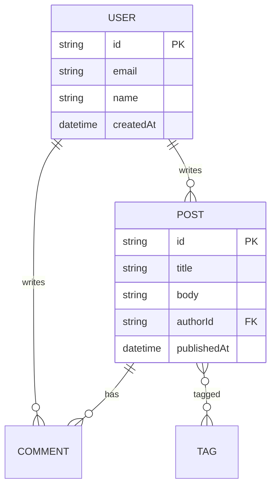

> [!note]
> **코드부터 시키지 마세요.**  
> 클로드 코드(Claude Code)에게 곧장 "로그인 기능 만들어줘"라고 하면, 그 순간의 빈약한
> 컨텍스트로 코드를 짜냅니다. 결과는 매번 달라지고, 뒤로 갈수록 앞뒤가 안 맞습니다.
>
>
> 해법은 단순합니다. **먼저 설계 문서를 만들게 하고, 그 문서를 기준(spec)으로 코드를 생성**하는 것.
> 요구사항 → ER 다이어그램 → 화면 정의서 → API 명세 → 테스트 명세서를 문서로 고정하면,
> LLM은 매번 같은 출처를 보고 일관된 코드를 냅니다. 이 글은 그 절차를 처음부터 끝까지 정리합니다.

## 1 왜 "문서 먼저"인가 — Spec-driven 개발

LLM은 **컨텍스트가 좋을수록 좋은 코드를 냅니다.** 반대로 컨텍스트가 비어 있으면
그럴듯하지만 일관성 없는 결과를 만듭니다. 그래서 "어떤 시스템인지"를 먼저 **문서로 고정**해 두고,
코드를 생성할 때마다 그 문서를 근거로 삼게 하는 것이 핵심입니다.

### 문서가 곧 컨텍스트다

- **일관성** — 모든 코드 생성이 같은 ER/API/화면 정의를 본다 → 앞뒤가 맞는다
- **재현성** — 세션이 바뀌어도 문서만 다시 읽히면 동일한 기준으로 작업한다
- **검증 가능** — 테스트 명세서가 있으면 "완료"의 정의가 명확해진다
- **리뷰 용이** — 코드보다 명세를 먼저 검토하므로 방향 오류를 일찍 잡는다

[설계 문서] [가드레일]
요구사항 → ER → 화면정의 → API명세 → 테스트명세 ESLint + lint
│ ↑
└──────────────→ CLAUDE.md (디렉토리별) ─────────┘
↓
Prisma 스키마 → 코드 생성 → 테스트 통과

> [!tip]
> **핵심 원칙**  
> "코드를 짜라"가 아니라 "이 문서를 기준으로 코드를 짜라"로 지시한다.
> 문서는 `docs/`에 두고, 각 단계 산출물을 다음 단계의 입력으로 넘긴다.

## 2 요구사항 정의 + ER 다이어그램

가장 먼저 **무엇을 만들 것인가**를 정리합니다. 기능 목록과 핵심 엔터티(데이터)를 뽑고,
엔터티 간 관계를 **ER 다이어그램**으로 그립니다. Mermaid로 그리면 마크다운에 그대로 박혀
깃에서 렌더링되고, 나중에 Prisma 스키마의 근거가 됩니다.

### 클로드 코드에 줄 프롬프트

Claude Code 프롬프트prompt

```
블로그 시스템을 만들 거야. 다음을 docs/requirements.md 에 작성해줘.

1. 기능 요구사항 — 사용자/관리자 시나리오 단위로 목록화
2. 핵심 엔터티와 속성 정의
3. 엔터티 관계를 Mermaid erDiagram 으로 작성

지금은 문서만 만들고 코드는 작성하지 마.
```

### 산출물 — ER 다이어그램 (Mermaid)

docs/requirements.mdmermaid

```

```

> [!tip]
> **"문서만"을 명시하라**  
> 설계 단계에서 코드까지 같이 쏟아내면 검토가 어려워집니다. 단계마다
> `코드는 작성하지 마`를 붙여 산출물을 한정하세요.

## 3 화면 정의서 (Markdown)

각 화면이 **어떤 데이터를 보여주고, 어떤 동작을 하며, 어떤 API를 호출하는지**를
마크다운으로 정의합니다. 화면 정의서는 프론트엔드 컴포넌트와 API 명세를 잇는 다리 역할을 합니다.

docs/screens/post-list.mdmarkdown

```
# 화면: 글 목록 (PostList)

## 경로 `/posts`

## 구성 요소
| 영역 | 내용 | 데이터 출처 |
|------|------|------------|
| 헤더 | 검색 입력, 태그 필터 | - |
| 목록 | 카드(제목·요약·작성자·날짜) | `GET /api/posts` |
| 페이지네이션 | 이전/다음 | `?page`, `?size` |

## 동작
- 카드 클릭 → `/posts/:id` 이동
- 태그 클릭 → `?tag=` 필터 적용

## 상태
- 로딩 / 빈 목록 / 에러 각각의 UI 정의
```

> [!note]
> **화면 ↔ API 연결을 표로**  
> "어떤 영역이 어떤 API를 쓰는지"를 표로 박아두면, 다음 단계인 API 명세 작성이
> 거의 기계적으로 진행됩니다. 빠진 API도 이 단계에서 드러납니다.

## 4 API 명세 (OpenAPI)

화면 정의서에서 끌어낸 엔드포인트를 **OpenAPI(Swagger)** 스펙으로 정리합니다.
OpenAPI는 사람이 읽기도 좋지만, 타입/클라이언트/목 서버를 자동 생성할 수 있어 표준으로 두기 좋습니다.

docs/openapi.yamlyaml

```
paths:
  /api/posts:
    get:
      summary: 글 목록 조회
      parameters:
        - name: page
          in: query
          schema: { type: integer, default: 1 }
      responses:
        '200':
          description: 목록
          content:
            application/json:
              schema:
                $ref: '#/components/schemas/PostList'
```

> [!tip]
> **스펙 → 타입 자동화**  
> OpenAPI가 있으면 `openapi-typescript` 같은 도구로 프론트 타입을 자동 생성할 수 있습니다.
> 명세와 코드가 어긋날 일이 줄어듭니다.

## 5 테스트 명세서

마지막 문서는 **테스트 명세서**입니다. "이 기능이 끝났다"의 정의를 케이스 단위로 적어두면,
클로드 코드가 이 명세를 보고 실제 테스트 코드(Vitest 등)를 작성하고, **통과를 완료 기준**으로 삼습니다.

docs/test-spec.mdmarkdown

```
## API: GET /api/posts

| ID | 케이스 | 입력 | 기대 결과 |
|----|--------|------|-----------|
| TC-01 | 기본 목록 | page 없음 | 200, 최신순 10건 |
| TC-02 | 페이지네이션 | `?page=2` | 200, 11~20번째 |
| TC-03 | 태그 필터 | `?tag=js` | 200, 해당 태그만 |
| TC-04 | 잘못된 page | `?page=-1` | 400 검증 에러 |

## 인증: POST /api/login
| ID | 케이스 | 입력 | 기대 결과 |
|----|--------|------|-----------|
| TC-10 | 성공 | 올바른 자격 | 200 + 토큰 |
| TC-11 | 비번 오류 | 틀린 비번 | 401 |
```

> [!note]
> **"완료"를 검증 가능하게**  
> "로그인 되게 해줘"는 약한 목표입니다. "TC-10/11이 통과하게 해줘"는 강한 목표입니다.
> 테스트 명세서가 있으면 클로드 코드가 스스로 통과할 때까지 반복(loop)할 수 있습니다.

## 6 CLAUDE.md — 디렉토리별로 쪼개기

`CLAUDE.md`는 클로드 코드가 작업할 때 자동으로 읽는 **프로젝트 지침서**입니다.
여기에 위에서 만든 문서들의 위치를 알려주면, 매번 같은 컨텍스트로 작업합니다.
그런데 **모든 규칙을 루트 한 파일에 몰아넣으면** 점점 비대해지고, 프론트 작업 중에
백엔드 규칙까지 통째로 읽히는 비효율이 생깁니다.

### 해법 — 각 디렉토리에 배치

소스 코드가 위치한 디렉토리마다 그 영역에 맞는 `CLAUDE.md`를 두면, 클로드 코드는
**해당 폴더에서 작업할 때 그 파일을 함께** 참고합니다. 프론트 작업엔 프론트 규칙만,
백엔드 작업엔 백엔드 규칙만 — 컨텍스트가 가벼워지고 관리가 쉬워집니다.

CLAUDE.md ← 공통 규칙 + 문서 위치(docs/) 안내
docs/
├ requirements.md 요구사항 + ER
├ screens/ 화면 정의서
├ openapi.yaml API 명세
└ test-spec.md 테스트 명세
apps/web/CLAUDE.md ← 프론트 규칙(컴포넌트·Tailwind·상태관리)
apps/api/CLAUDE.md ← 백엔드 규칙(라우팅·Prisma·검증)

CLAUDE.md (루트)markdown

```
# 프로젝트 지침

설계 문서는 docs/ 에 있다. 코드 작성 전 반드시 참고할 것.
- 요구사항·ER: `docs/requirements.md`
- 화면 정의서: `docs/screens/`
- API 명세: `docs/openapi.yaml`
- 테스트 명세: `docs/test-spec.md`

세부 규칙은 각 디렉토리의 CLAUDE.md 를 따른다.
```

apps/api/CLAUDE.mdmarkdown

```
# 백엔드 규칙

- DB 접근은 Prisma Client 로만. raw SQL 금지.
- 모든 입력은 zod 로 검증 후 처리.
- 응답 스키마는 `docs/openapi.yaml` 과 일치시킬 것.
- 새 엔드포인트는 `docs/test-spec.md` 케이스를 먼저 통과시킬 것.
```

> [!tip]
> **한 파일 vs 분산**  
> 규칙이 적을 땐 루트 한 파일로 충분합니다. 프론트/백엔드 규칙이 갈라지기 시작하면
> 디렉토리별로 쪼개세요. "그 폴더에서 일할 때 필요한 규칙만 읽힌다"가 핵심 이점입니다.

## 7 가드레일 — ESLint + Lint 체크

LLM이 생성한 코드는 **자동 검증 장치(가드레일)**로 한 번 걸러야 합니다.
가장 기본은 린터입니다. **ESLint 설정을 추가**하고, 작업이 끝날 때마다 lint 체크를
돌리게 하면 스타일 붕괴와 흔한 실수를 코드가 쌓이기 전에 잡습니다.

eslint.config.mjsjavascript

```
import js from '@eslint/js';
import ts from 'typescript-eslint';

export default [
  js.configs.recommended,
  ...ts.configs.recommended,
  {
    rules: {
      'no-unused-vars': 'error',
      'no-console': 'warn',
      '@typescript-eslint/no-explicit-any': 'error',
    },
  },
];
```

터미널bash

```
$ npm install -D eslint @eslint/js typescript-eslint
$ npx eslint . # 작업 후 매번 실행 → 0 errors 가 완료 조건
```

> [!warning]
> **린트는 "완료 조건"으로**  
> CLAUDE.md에 `작업을 마치면 npx eslint . 를 실행하고 에러가 0이어야 한다`고 적어두세요.
> 그러면 클로드 코드가 스스로 돌려보고, 걸린 부분을 고친 뒤에야 작업을 끝냅니다.
> 린트 + 타입체크 + 테스트, 이 셋이 LLM 코드의 기본 가드레일입니다.

## 8 ER → Prisma 스키마 (use context7)

2단계에서 만든 ER 다이어그램을 근거로 **Prisma 스키마**를 생성합니다.
ER이 이미 엔터티·관계를 정의해 두었으므로, 스키마 작성은 거의 번역에 가깝습니다.

### use context7 — 최신 문서를 끌어오기

라이브러리는 빠르게 바뀝니다. LLM의 학습 시점 지식은 종종 낡아 있어서, 옛 문법으로 스키마를
짜기도 합니다. **Context7**은 라이브러리의 **최신 공식 문서**를 그 자리에서
가져다주는 MCP 서버입니다. 프롬프트 끝에 `use context7`을 붙이면, 클로드 코드가
현재 버전의 Prisma 문법을 참고해 스키마를 만듭니다.

Claude Code 프롬프트prompt

```
docs/requirements.md 의 ER 다이어그램을 참고해서
prisma/schema.prisma 를 작성해줘.

- 관계(1:N, N:M)를 정확히 반영
- id 는 cuid, 타임스탬프 필드 포함
- 최신 Prisma 문법으로. use context7
```

prisma/schema.prismaprisma

```
model Post {
  id          String    @id @default(cuid())
  title       String
  body        String
  author      User      @relation(fields: [authorId], references: [id])
  authorId    String
  comments    Comment[]
  tags        Tag[]
  publishedAt DateTime?
  createdAt   DateTime  @default(now())
}
```

> [!note]
> **Context7이란?**  
> MCP(Model Context Protocol) 서버 중 하나로, 라이브러리 이름과 버전을 받아 최신 문서 스니펫을
> 주입해 줍니다. Prisma·Next.js·Tailwind처럼 버전에 민감한 도구를 다룰 때 특히 유용합니다.
> `use context7` 한 줄이면 "지금 버전" 기준으로 코드를 짜게 됩니다.

## 9 기술 스택을 문서로 박제하기

마지막으로, 프로젝트가 쓰는 기술을 **한 곳에 명시**합니다. 이걸 CLAUDE.md(또는
`docs/tech-stack.md`)에 적어두면, 클로드 코드가 임의의 다른 라이브러리를 끌어오지 않고
**정해진 스택 안에서** 일합니다.

| 영역 | 선택 | 비고 |
| --- | --- | --- |
| 언어 | `TypeScript` | 프론트·백엔드 공통 |
| 프레임워크 | `Next.js` / `Express` | 웹 / API |
| UI 컴포넌트 | `Tailwind CSS` | 유틸리티 우선 스타일 |
| API 스키마 | `OpenAPI` | 스펙 우선, 타입 자동생성 |
| DB 스키마 | `Prisma` | ER → schema.prisma |
| 테스트 | `Vitest` | 테스트 명세서 기반 |
| 가드레일 | `ESLint` | 완료 조건에 lint 포함 |
| 배포 | `Vercel` 등 | 프로젝트 상황에 맞게 |

> [!tip]
> **스택을 적어두면 일탈이 준다**  
> 명시가 없으면 LLM은 그때그때 다른 라이브러리를 끌어옵니다(상태관리 하나에 매번 다른 라이브러리…).
> "이 스택만 쓴다"를 박아두면 의존성이 깔끔하게 유지됩니다.

## 10 정리 — 전체 흐름 한눈에

클로드 코드로 시스템을 만드는 절차의 핵심은 **"문서로 컨텍스트를 고정하고, 가드레일로 검증한다"**입니다.

1. **요구사항 + ER 다이어그램**무엇을 만들지 정의하고 데이터 관계를 Mermaid로 그린다.
2. **화면 정의서 (Markdown)**각 화면의 구성·동작·호출 API를 표로 정리한다.
3. **API 명세 (OpenAPI)**화면이 부르는 엔드포인트를 스펙으로 고정한다.
4. **테스트 명세서**"완료"의 정의를 케이스로 적어 검증 가능하게 만든다.
5. **CLAUDE.md 분산 배치**문서 위치를 알리고, 프론트/백엔드 규칙은 각 디렉토리에 둔다.
6. **가드레일 (ESLint + lint)**린트·타입·테스트를 완료 조건으로 걸어 LLM 코드를 검증한다.
7. **ER → Prisma (use context7)**최신 문법으로 스키마를 생성한다.
8. **기술 스택 기록**언어·프레임워크·UI·API·DB·테스트·배포를 한 곳에 박제한다.

### ✓ 이 절차가 주는 것

- 세션이 바뀌어도 **같은 문서**를 보고 일관된 코드를 낸다
- 테스트 명세 + 린트가 **완료의 정의**를 명확히 한다
- CLAUDE.md 분산으로 **필요한 컨텍스트만** 읽혀 가볍다
- `use context7`로 **최신 라이브러리 문법**을 따른다

> [!tip]
> **요점**  
> 클로드 코드를 "코드 짜주는 도구"가 아니라 **"문서를 코드로 옮기고, 가드레일로 스스로 검증하는
> 파트너"**로 쓰는 것. 좋은 컨텍스트(문서)와 명확한 완료 조건(테스트·린트)을 갖추면, 시스템 구성이
> 훨씬 일관되고 재현 가능해집니다.
