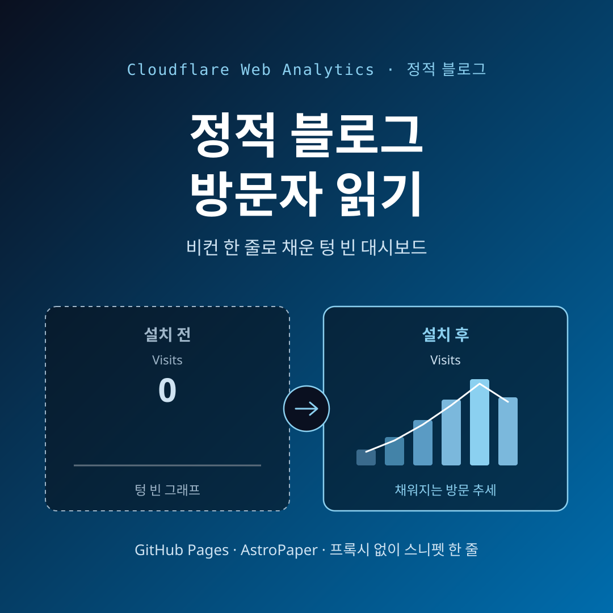
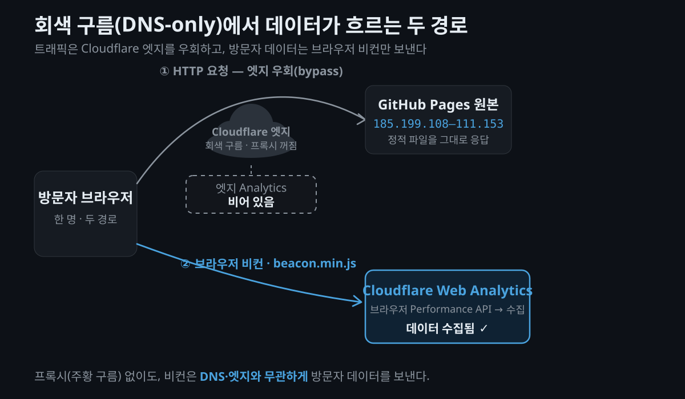
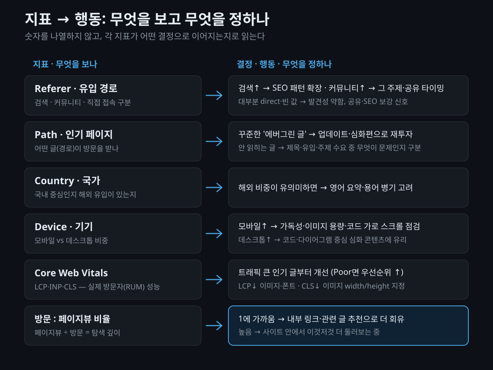

글은 계속 쓰는데, 정작 **누가 읽는지 전혀 모르는** 상태로 몇 달을 보냈습니다. 이 블로그(`blog.saegida.com`)는 AstroPaper v6 정적 사이트를 GitHub Pages에 올린 구조인데요. 방문자 수도, 어떤 글이 읽히는지도, 사람들이 어디서 흘러들어오는지도 깜깜했습니다. 그러다 **Cloudflare Web Analytics**를 직접 붙였고, 그제서야 대시보드에 방문 수가 잡히기 시작했습니다.

이 글은 설치 튜토리얼이 아닙니다. **왜** 개인 기술 블로그에까지 분석을 붙였는지, **Cloudflare Web Analytics로 실제로 무엇을 판단할 수 있는지**(인사이트), 그리고 **어떤 한계가 있는지**에 무게를 뒀습니다. 설치는 필요한 만큼만 짚고 지나갑니다.



## 왜 개인 기술 블로그에 분석을 붙이는가?

분석 도구라고 하면 마케팅·매출 이야기부터 떠오르지만, 개인 블로그에서 분석의 쓸모는 조금 다릅니다. 핵심은 하나입니다 — **"내가 쓴 글 중에서 무엇이 실제로 읽히는가"** 를 알아야 다음에 무엇을 더 쓸지 정할 수 있다는 것이죠.

분석이 없으면 모든 게 감(感)입니다. 공들여 쓴 글이 아무에게도 안 닿는데 혼자 만족하고 있는 건 아닌지, 반대로 대충 남긴 메모 같은 글이 꾸준히 유입을 만들고 있는 건 아닌지 — 감으로는 알 수 없습니다. 이건 남에게 보여주는 허영 지표가 아니라, **다음 글의 주제·형식을 정하는 판단 근거**입니다.

특히 이 블로그 같은 **정적 사이트 + GitHub Pages** 조합은 이 부분이 완전한 사각지대였습니다.

- **GitHub Pages는 방문자 분석을 주지 않습니다.** 저장소의 "Traffic" 인사이트가 있긴 한데, 그건 사이트 방문이 아니라 **저장소(repository) 조회·클론** 통계라 실제 독자와는 무관합니다.
- 서버가 없으니 서버 로그를 볼 수도 없습니다. 정적 파일을 CDN이 그냥 내려줄 뿐이죠.

즉, 글을 아무리 써도 **누가 읽는지 측정할 방법 자체가 없는** 상태였습니다.

## Cloudflare에 도메인이 있는데 왜 Analytics는 비어 있었을까?

여기서 이상한 점이 하나 있었습니다. 이 블로그의 도메인은 **Cloudflare에 등록**돼 있었거든요. Cloudflare에는 분명 Analytics 메뉴가 있는데, 열어 보면 **텅 비어 있었습니다.** 왜였을까요?

원인은 **"회색 구름(DNS-only)"** 상태였습니다. Cloudflare에서 도메인 레코드 옆의 구름 아이콘이 주황색(프록시 켜짐)이 아니라 회색(프록시 꺼짐)이면, 트래픽이 Cloudflare 엣지를 거치지 않고 원본 서버로 곧장 갑니다. `dig`로 확인해 보니 도메인이 **GitHub Pages IP(185.199.108–111.153)** 로 바로 향하고 있었습니다. 프록시를 거쳤다면 Cloudflare 대역(104.x 등)이 떴을 텐데 말이죠.

이 대목을 이해하려면 Cloudflare가 데이터를 모으는 **두 가지 경로**를 구분해야 합니다.

| 구분 | 엣지(서버) Analytics | Web Analytics(비컨) |
|---|---|---|
| 수집 위치 | Cloudflare 엣지(요청 로그) | 방문자 브라우저(Performance API) |
| **전제 조건** | 트래픽이 **프록시(주황 구름)를 통과**해야 함 | **프록시 불필요** — 계정 + 스니펫이면 끝 |
| 측정 대상 | 모든 HTTP 요청(**봇 포함**) | 사람이 연 HTML 페이지 중심(봇 제외 가능) |
| 차단 가능성 | 차단 불가(엣지에서 셈) | **광고 차단기가 비컨을 막으면 누락** |

엣지 Analytics는 트래픽이 **Cloudflare 프록시를 지나가야** 데이터가 쌓입니다. 그런데 이 블로그는 회색 구름이라 트래픽이 엣지를 안 지나가니, 엣지 Analytics는 **영원히 비어 있을 수밖에** 없었던 것이죠. [소스 4]

반면 **Web Analytics(비컨)** 방식은 방문자 브라우저에서 JavaScript 조각(비컨)이 직접 데이터를 보내는 구조라, **DNS 변경이나 프록시 없이도 동작**합니다. "Cloudflare 계정과 페이지에 넣을 작은 스니펫만 있으면 된다"는 게 공식 설명입니다. [소스 5][소스 8] 회색 구름을 유지하는 GitHub Pages 사이트에서는, 이 **비컨 방식이 사실상 방문자 데이터를 얻는 유일한 경로**였습니다.

> **유의사항**: GitHub Pages 앞에 Cloudflare 프록시(주황 구름)를 켜서 엣지 Analytics를 쓰는 대안도 있습니다. 다만 캐시·인증서·리다이렉트 설정이 얽혀 별개의 작업이 되므로, "일단 방문자부터 보자"는 목적엔 비컨이 훨씬 가볍습니다.



## 붙이는 법은 생각보다 간단합니다 (그리고 함정 하나)

설치 자체는 몇 분이면 끝납니다. 흐름만 짚으면 이렇습니다.

1. Cloudflare 대시보드에서 **Web Analytics → 사이트 추가**로 도메인을 등록하면 사이트별 **토큰**이 발급됩니다.
2. 프록시가 안 걸린 사이트(GitHub Pages 등)는 **자동 주입이 안 되므로 수동(manual) 스니펫** 경로를 씁니다. 대시보드 **Manage site**에서 JS 스니펫을 복사해 사이트 HTML에 직접 넣습니다. 공식 문서는 닫는 `</body>` 앞을 권장하지만, 렌더되는 위치라면 `<head>`에 넣어도 동작합니다. [소스 5]

스니펫은 이런 모양입니다(토큰은 반드시 본인 값으로).

```html
<script defer src="https://static.cloudflareinsights.com/beacon.min.js"
        data-cf-beacon='{"token": "YOUR_TOKEN", "spa": true}'></script>
```

여기서 이 블로그가 실제로 걸려 넘어진 **함정**이 하나 있었습니다. 바로 `"spa": true` 옵션입니다.

Astro는 기본적으로 여러 개의 HTML 페이지를 내려주는 정적 사이트(MPA)라, 원래는 페이지를 옮길 때마다 새 문서가 로드되어 페이지뷰가 자연히 잡힙니다. 그런데 AstroPaper는 **View Transitions(ClientRouter)** 를 켜 두어서, 글과 글 사이를 **클라이언트 사이드로 전환**합니다. 전체 리로드가 아니라 SPA(Single Page Application)처럼 부드럽게 넘어가는 것이죠.

문제는, 이렇게 클라이언트 라우팅으로 넘어간 내부 이동은 **새 페이지 로드로 잡히지 않는다**는 점입니다. 처음엔 이 옵션을 빠뜨렸는데, 그러면 방문자가 사이트 안에서 이 글 저 글 옮겨 다녀도 그 이동이 페이지뷰로 집계되지 않습니다. `data-cf-beacon`에 **`"spa": true`** 를 넣어 주자 라우트 전환도 정상적으로 잡히기 시작했습니다. [소스 5][소스 9]

> **유의사항**: "정적 사이트니까 SPA 옵션은 필요 없겠지"라고 넘기기 쉬운데, **정적 사이트라도 View Transitions 같은 클라이언트 라우팅을 켰다면** 내부 이동을 통째로 놓칠 수 있습니다. 정적이냐 아니냐가 아니라, **라우팅이 전체 리로드냐 아니냐**가 기준입니다.

마지막으로 배선 하나. 이 블로그는 AstroPaper base 레이아웃 `<head>`에 비컨을 넣되, **프로덕션 빌드에서·토큰이 있을 때만** 렌더하도록 config 필드(`cloudflareWebAnalyticsToken`)로 조건을 걸었습니다. 로컬 개발 중의 내 트래픽이 실제 데이터를 오염시키지 않게 막는 실전 팁입니다.

```astro
---
// base 레이아웃 <head> 내부 (개념 예시)
const token = CONFIG.cloudflareWebAnalyticsToken;
const enabled = import.meta.env.PROD && token;
---
{enabled && (
  <script defer src="https://static.cloudflareinsights.com/beacon.min.js"
          data-cf-beacon={JSON.stringify({ token, spa: true })}></script>
)}
```

## 그래서 무엇을 알 수 있나? (여기가 진짜 핵심)

붙였으면 이제 **무엇을 보고 무엇을 판단하느냐**가 남습니다. 지표를 나열하는 대신, 각 지표가 **어떤 결정으로 이어지는가**로 정리해 봤습니다. 이게 개인 블로그에서 분석을 쓰는 진짜 이유이기도 합니다.

먼저 대시보드가 보여주는 두 숫자의 뜻부터 짚어야 합니다.

- **Page views(페이지뷰)**: 페이지가 실제로 열린 총 횟수. [소스 1]
- **Visits(방문)**: 외부 링크나 직접 접속으로 **새로 유입된 세션**. Cloudflare는 "referer(참조 주소)가 사이트 호스트명과 다른 페이지뷰"를 방문으로 셉니다. 그래서 **한 번의 방문이 여러 페이지뷰로 이뤄질 수 있고**, 늘 `페이지뷰 ≥ 방문`입니다. [소스 1][소스 6]

이 둘의 차이를 알면, 아래 지표들이 각각 어떤 질문에 답하는지 보이기 시작합니다.



### 유입 경로(Referer) — 어떤 채널이 진짜 독자를 데려오나

방문이 **검색에서 오는지, Hacker News·레딧 같은 커뮤니티에서 오는지, 직접 접속인지**가 보입니다. [소스 2] 여기서 나오는 판단은 이렇습니다.

- **검색 유입이 크다** → 제목·메타·구조 같은 SEO가 먹히고 있다는 신호. 그 글의 패턴을 다른 글에도 적용해 봅니다.
- **특정 커뮤니티 유입이 크다** → 그 커뮤니티가 반응하는 주제를 더 쓰거나, 공유 타이밍을 조정합니다.
- **대부분 direct(직접)이거나 빈 값** → 발견성이 약하다는 뜻. 공유·SEO 보강이 필요하다는 신호로 읽습니다.

### 인기 페이지(Path) — 어떤 주제가 먹히나

사이트 안 **어떤 경로(글)** 가 방문을 받는지 보입니다. [소스 2] 튜토리얼이 잘 읽히는지 에세이가 잘 읽히는지, 특정 기술 스택 글에 수요가 있는지 — 감이 아니라 데이터로 확인됩니다.

- 롱테일로 **꾸준히 유입되는 "에버그린 글"** 을 찾으면 → 업데이트·심화편으로 재투자합니다.
- 공들였는데 아무도 안 보는 글은 → **제목·유입 경로 문제인지, 주제 수요 문제인지** 구분해 다음 기획에 반영합니다.

### 국가·기기(Country / Device) — 성능과 레이아웃의 우선순위

- **국가**: 한국 독자 중심인지 해외 유입이 있는지. 해외 비중이 유의미하면 영어 요약이나 용어 병기를 고려합니다. [소스 2]
- **기기**: 모바일 비중이 높으면 → 모바일 가독성, 이미지 용량, 코드블록 가로 스크롤을 먼저 점검합니다. 데스크톱 중심이면 코드·다이어그램 위주 심화 콘텐츠에 유리하죠. [소스 2]

### Core Web Vitals(LCP·INP·CLS) — 실제 방문자가 겪는 성능

개인적으로 가장 반가웠던 부분입니다. Web Analytics는 브라우저 **Performance API로 실제 방문자(RUM, Real User Monitoring)** 의 체감 성능, 즉 **Core Web Vitals**를 수집해서 보여줍니다. [소스 3][소스 7]

- **LCP(Largest Contentful Paint)**: 주요 콘텐츠가 뜨기까지 체감 로딩 속도.
- **INP(Interaction to Next Paint)**: 클릭·입력에 대한 반응성.
- **CLS(Cumulative Layout Shift)**: 로딩 중 레이아웃이 흔들리는 정도.

각 지표는 **Good / Needs improvement / Poor** 3단계로 평가되어 시각적으로 보입니다. [소스 3] Lighthouse 같은 합성(synthetic) 점수가 아니라 **실제 방문자가 겪은 값**이라는 게 핵심입니다. 그래서 판단이 명확해집니다 — **트래픽이 큰 인기 글부터** 손보면 됩니다. 인기 글의 LCP가 Poor면 그 글의 대표 이미지·폰트·스크립트부터 손보고, CLS가 나쁘면 이미지 width/height 지정이나 폰트 레이아웃 시프트를 점검합니다. 많이 읽히는 곳부터 고치는 게 투자 대비 효과가 가장 좋으니까요.

> **유의사항**: 각 단계를 나누는 구체적 임계값 수치는 Cloudflare 문서가 직접 명시하지 않고 업계 표준(구글 web.dev)을 따른다고만 언급합니다. [소스 3] 그러니 숫자 자체보다 **Good/Poor 분포와 그 추세**로 읽는 편이 안전합니다.

### 방문 대 페이지뷰의 비율 — 사람들이 얼마나 더 둘러보나

`페이지뷰 ÷ 방문` 비율은 **탐색 깊이**를 알려줍니다. 이 값이 1에 가까우면 대부분 한 글만 보고 떠난다는 뜻이라 → **내부 링크·관련 글 추천**으로 더 회유할 여지가 있습니다. 비율이 높으면 사이트 안에서 이것저것 더 돌아본다는 뜻이고요.

정리하면, 개인 블로그에서 이 도구의 올바른 사용법은 **절대 방문 수에 집착하는 게 아닙니다.** (뒤에서 볼 이유로 어차피 과소집계됩니다.) **"어떤 글이 / 어디서 / 어떤 기기로 읽히는가의 추세"** 를 보고 **다음 글의 주제·형식·성능 투자처**를 정하는 나침반으로 쓰는 것 — 그게 이 도구가 개인 블로그에 맞는 방식입니다.

## 프라이버시와 비용은 어떤가?

무게가 가벼운 것도 이 도구를 고른 이유였습니다. Cloudflare가 명시하는 프라이버시 설계는 이렇습니다.

- **쿠키·로컬스토리지를 쓰지 않습니다.** 비컨은 브라우저에 어떤 상태도 저장하지 않고 cookie/localStorage 등에 접근하지 않습니다. [소스 5][소스 8]
- **핑거프린팅을 하지 않습니다.** IP 주소·User Agent 같은 데이터로 개인을 식별하지 않고, IP는 **국가 수준 지오로케이션에만** 쓰고 저장하지 않습니다. [소스 5][소스 6]
- **크로스사이트 추적이 없습니다.** 방문을 "referer가 호스트명과 다른 페이지뷰"로 정의해, 지속적 식별자 없이 유입을 셉니다. [소스 6]
- **완전 무료.** 이미 Cloudflare 고객이 아니어도 누구나 쓸 수 있습니다. [소스 6]

쿠키나 클라이언트 저장, 개인 식별을 하지 않으니 **전형적인 쿠키 배너가 겨냥하는 추적 요소 자체가 없습니다.** 마찰이 적다는 뜻이죠.

> **유의사항**: 다만 "쿠키 동의 배너가 법적으로 불필요하다"까지 단정하지는 않겠습니다. 공식 문서·블로그도 그 부분을 법적 문구로 못 박지는 않습니다. "쿠키를 심지 않으니 전형적 쿠키 배너의 대상이 아니다" 선까지만 이해하고, 관할·법률 판단은 각자 확인하는 게 맞습니다.

## 한계는 무엇인가?

좋은 점만 있는 건 아닙니다. 오히려 이 한계들을 알아야 숫자를 잘못 신봉하지 않습니다.

- **광고 차단기로 과소집계됩니다.** adblock 계열, Brave, DuckDuckGo 등이 비컨을 차단하면 그 방문자는 집계에서 빠집니다. [소스 5] 특히 **개발자·기술 독자 비중이 높은 블로그일수록 차단율이 높아** 실제보다 방문이 적게 잡힙니다. 그래서 **절대값이 아니라 추세·상대 비교로** 읽어야 합니다.
- **원본 정밀 데이터는 최근 7일**입니다. 그 이후는 약 10% 수준으로 다운샘플되어 집계되고, 대시보드에서는 **최근 6개월**까지 과거 데이터에 접근할 수 있습니다. [소스 5] 매일·매주 들여다보는 운영과는 잘 맞지만, 장기 정밀 추세 분석용은 아닙니다.
- **사이트에 숫자를 박기엔 부적합합니다.** 데이터는 기본적으로 **대시보드용**입니다. 프로그램적 접근은 GraphQL Analytics API로 가능하지만, 샘플링·인증(계정 토큰) 문제로 "공개 페이지에 실시간 방문 카운터를 띄우는" 용도로는 번거롭습니다 — 공개 표시용으로 설계된 API가 아니거든요. [소스 8]

한 가지 덧붙이면, 예전 독립 리뷰(ctrl.blog, 6/10)에서 **데이터 보존이 짧다**는 비판과 함께, 거의 모든 페이지뷰를 루트 `/`로 잘못 집계하던 버그, 쿠키 관련 지적 등이 있었습니다. [소스 10] 다만 이는 **초기 버전 기준으로 보이며** 현재 공식 문서 동작(6개월 과거 접근, Path 차원 정상 제공)과는 상충합니다. 그러니 "초기엔 이런 지적이 있었다"는 맥락 정도로만 참고하고, 현재 동작은 공식 문서를 우선하는 게 맞습니다.

## 마무리하며

붙이기 전과 후의 차이는 결국 **"감으로 쓰던 글"이 "데이터로 검증되는 글"이 되었다**는 것입니다. 회색 구름이라 엣지 Analytics가 비어 있던 사각지대를, 비컨 한 줄과 `spa: true` 하나로 메웠고, 그제서야 어떤 글이 어디서 읽히는지가 보이기 시작했습니다.

정적 블로그를 운영하면서 방문자를 전혀 측정하지 못하고 있다면, Cloudflare Web Analytics는 가장 마찰이 적은 출발점입니다. 무료에 쿠키도 없고, 프록시 설정 없이 스니펫 한 줄로 시작할 수 있으니까요. 다만 붙이고 나서는 **절대 숫자에 일희일비하기보다, 인기 글·유입 경로·실제 성능의 추세로 다음 글을 정하는 나침반**으로 쓰는 편을 권합니다.

참고로, 이렇게 모은 방문자 수를 **사이트에 공개 숫자로 띄우는 것**은 또 다른 문제입니다. 대시보드용 데이터라 그대로 박기엔 번거롭거든요. 그건 별개의 결정으로 남겨 둡니다.

#CloudflareWebAnalytics #정적사이트 #GitHubPages #Astro #AstroPaper #웹분석 #CoreWebVitals #프라이버시분석 #기술블로그 #블로그SEO #ViewTransitions #SSG

## 참고 자료 (공식 출처)

- [High-level metrics · Cloudflare Web Analytics docs](https://developers.cloudflare.com/web-analytics/data-metrics/high-level-metrics/) — visits / page views 정의
- [Dimensions · Cloudflare Web Analytics docs](https://developers.cloudflare.com/web-analytics/data-metrics/dimensions/) — Country / Path / Referer / Device / Browser / OS / Exclude Bots
- [Core Web Vitals · Cloudflare Web Analytics docs](https://developers.cloudflare.com/web-analytics/data-metrics/core-web-vitals/) — LCP / INP / CLS, Good·Needs improvement·Poor 평가
- [Data and metrics · Cloudflare Web Analytics docs](https://developers.cloudflare.com/web-analytics/data-metrics/) — 엣지 vs 비컨 수집 경로
- [FAQs · Cloudflare Web Analytics docs](https://developers.cloudflare.com/web-analytics/faq/) — 데이터 보존(7일/6개월), 광고 차단, SPA, 수동 설정
- [Free, privacy-first analytics for a better web · The Cloudflare Blog](https://blog.cloudflare.com/free-privacy-first-analytics-for-a-better-web/) — 무료·쿠키 없음·핑거프린팅 없음·visit 정의
- [Data origin and collection · Cloudflare Web Analytics docs](https://developers.cloudflare.com/web-analytics/data-metrics/data-origin-and-collection/) — Performance API 수집(RUM)
- [About Cloudflare Web Analytics · docs](https://developers.cloudflare.com/web-analytics/about/) / [GraphQL Analytics API · docs](https://developers.cloudflare.com/analytics/graphql-api/) — 프록시/DNS 변경 불필요, GraphQL 접근
- [Cloudflare Web Analytics integration reference · cloudflare/skills (GitHub)](https://github.com/cloudflare/skills/blob/main/skills/cloudflare/references/web-analytics/integration.md) — beacon 스니펫, token/spa 옵션
- [A technical and privacy review of Cloudflare Web Analytics · Ctrl blog](https://www.ctrl.blog/entry/review-cloudflare-analytics.html) — 독립 리뷰(보조·시점 주의, 초기 버전 기준일 수 있음)
