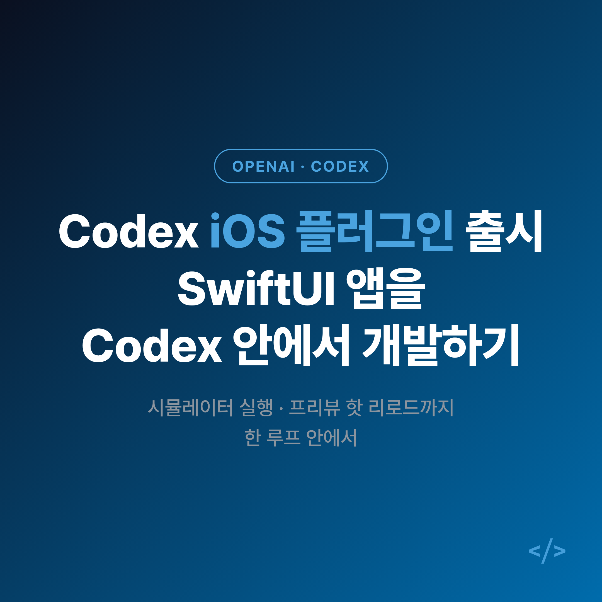
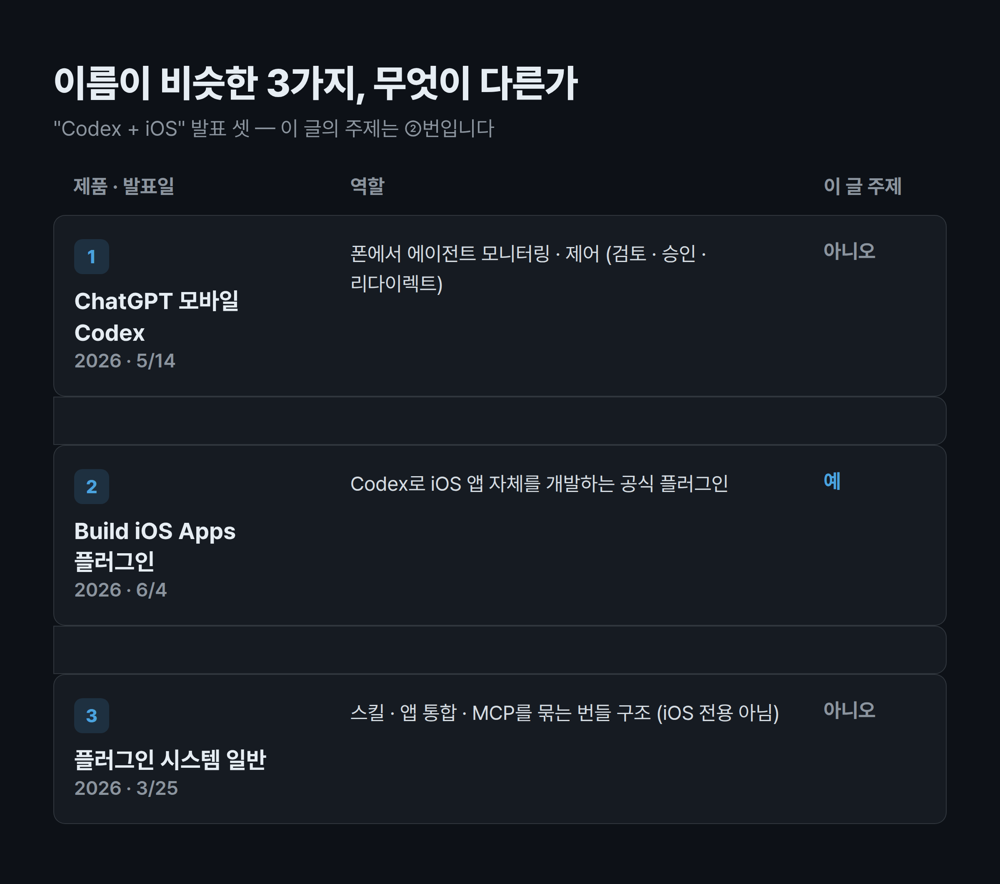
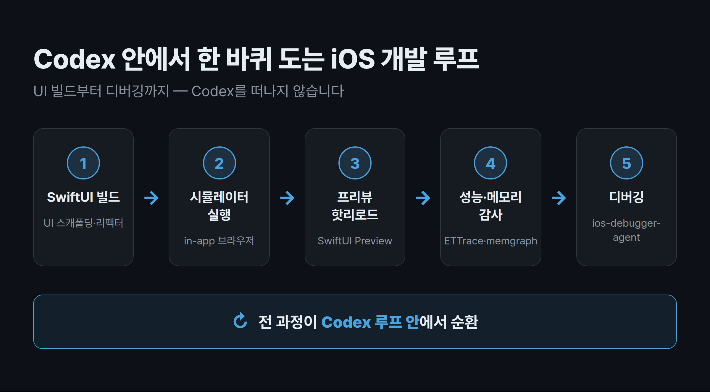

"코딩 에이전트로 iOS 앱을 만든다는데, 결국 코드만 뱉어주고 실행은 또 Xcode를 켜야 하는 거 아닌가요?" 한 번쯤 이런 의심을 해보셨을 겁니다. 그런데 이번에 나온 **Codex iOS 플러그인**은 그 의심에 정면으로 답합니다. 이 글에서는 2026년 6월 4일 OpenAI가 공개한 Codex용 공식 **"Build iOS Apps" 플러그인**이 무엇이고, 무엇을 해주며, 어떻게 동작하는지를 정리합니다. iOS 개발에 AI 에이전트를 붙여볼까 고민 중인 분이라면 전체 흐름을, 이미 Codex를 쓰고 계신 분이라면 핵심 차별점을 참고하실 수 있습니다.

## Codex iOS 플러그인, 정확히 어떤 제품인가요?

먼저 이름이 비슷한 것들부터 짚고 넘어가겠습니다. 최근 "Codex"와 "iOS"가 함께 묶인 발표가 짧은 기간에 여러 번 나오면서, 서로 다른 셋이 한 덩어리로 오해되기 쉽습니다. 이 글의 주제는 그중 **두 번째**입니다.

- **① ChatGPT 모바일 앱 속 Codex (2026년 5월 14일)** — iPhone·iPad·Android의 ChatGPT 앱에서 Codex 에이전트를 *모니터링·제어*(변경분 검토, 승인, 작업 리다이렉트)하는 기능입니다. 별도로 받는 앱이 아니라 ChatGPT 앱 안의 기능이죠.
- **② Build iOS Apps 플러그인 (2026년 6월 4일) — 바로 이 글의 주제.** Codex로 *iOS 앱 자체를 개발*하기 위한 공식 플러그인입니다.
- **③ Codex 플러그인 시스템 일반 (2026년 3월 25일 도입)** — 스킬·앱 통합·MCP 서버 설정을 묶어 설치하는 번들 구조입니다. 6월 2일 공개된 직무별(role) 플러그인 6종과도 별개이며, iOS 플러그인은 그 6종에 포함되지 않은 별도 발표입니다.

정리하면, "Codex iOS 공식 개발 플러그인"은 **②번 Build iOS Apps 플러그인**을 가리킵니다. 폰으로 에이전트를 *조종*하는 ①번과, iOS 앱을 *만드는* ②번을 헷갈리지 않는 것이 출발점입니다.

여기서 말하는 "Codex"는 OpenAI의 **코딩 에이전트**(2025~2026년의 에이전트형 Codex 제품 라인)를 뜻합니다. 2021년에 있던 옛 Codex 모델 API와는 다른 것으로, 이 점은 OpenAI 공식 출처로 확인된 사실입니다.

## 이 플러그인은 어떤 일을 해주나요?

공식 use-case 문서와 저장소 README를 보면, 단순 코드 생성을 넘어 iOS 개발의 여러 단계를 한 묶음으로 다룹니다. 주요 기능은 다음과 같습니다.

- **SwiftUI UI 빌드/리팩터링** — UI 스캐폴딩과 뷰 리팩터.
- **최신 iOS 패턴 적용** — iOS 26 이상의 **Liquid Glass** API 채택 지원.
- **런타임 성능 감사(performance audit)** 와 **ETTrace** 프로파일링.
- **메모리 누수 디버깅** — memgraph 기반.
- **시뮬레이터에서 빌드·실행·디버그** 워크플로.
- **App Intents / App Entities / App Shortcuts** 설계(시스템 표면용).

그리고 발표의 핵심은 이것입니다. 개발자가 **Codex를 떠나지 않고**, in-app 브라우저에서 앱을 띄워 테스트하고, **SwiftUI 프리뷰(Preview)** 를 열고, 편집한 내용을 **핫 리로드(Hot Reload)** 할 수 있다는 점입니다. 공식 발표 문구를 그대로 옮기면 *"view and test your iOS app in the in-app browser, open SwiftUI previews, and hot reload edits without leaving Codex"* 입니다.

이 기능들은 9개의 스킬로 패키징되어 있습니다(저장소 README 기준).

- `ios-debugger-agent`
- `ios-simulator-browser`
- `ios-ettrace-performance`
- `ios-memgraph-leaks`
- `ios-app-intents`
- `swiftui-liquid-glass`
- `swiftui-performance-audit`
- `swiftui-ui-patterns`
- `swiftui-view-refactor`

쉽게 얘기하면, "UI 만들기 → 시뮬레이터로 띄우기 → 프리뷰로 확인 → 성능·메모리 점검 → 디버깅"으로 이어지는 흐름이 **Codex 루프 안에서** 한 번에 돈다는 뜻입니다.

## Xcode 없이 프리뷰가 된다고요? — 동작 방식

가장 흥미로운 지점은 "어떻게 Codex 안에서 iOS 화면이 뜨느냐"입니다. 핵심 다리 역할은 **XcodeBuildMCP**가 맡습니다. `.mcp.json` 설정으로 연결되어 시뮬레이터의 build·run·debug 워크플로와 scheme·target·스크린샷·로그 자동화를 제공합니다. (Apple의 `xcodebuild` 또는 Tuist 기반의 CLI-first 개발을 전제로 합니다.)

in-app iOS 프리뷰와 스트리밍 시뮬레이터에는 두 개의 커뮤니티 오픈소스가 쓰인다고 보도됐습니다.

- **serve-sim** (Evan Bacon) — 스트리밍 시뮬레이터 기능을 담당.
- **SnapshotPreviews** (Sentry) — SwiftUI 프리뷰 데이터 추출을 담당.

즉, OpenAI가 모든 것을 새로 만든 게 아니라 이미 검증된 오픈소스를 엮어 "Xcode 창을 직접 거치지 않고 프리뷰를 보는" 경험을 구성한 셈입니다. 설치·사용은 Codex의 **스킬 시스템**을 통해 추가하며, 자세한 방법은 Codex skills 문서를 참조하도록 안내하고 있습니다.

> **유의사항** — 공식 저장소 README에는 Xcode·macOS 버전, 구체적인 설치 단계, 정식 버전번호가 **명시되어 있지 않습니다.** use-case 문서가 macOS와 Xcode(또는 Tuist), 그리고 XcodeBuildMCP를 전제로 하는 만큼 *macOS + Xcode 환경이 필요해 보이지만*, 정확한 최소 요구 버전은 공식적으로 밝혀진 바가 없습니다. 따라서 "어떤 버전 이상이어야 한다"고 단정하기보다는, 실제 설치 전 공식 문서를 확인하시길 권합니다.

## 도입 전, 무엇을 더 알아두면 좋을까요?

업계 반응부터 보겠습니다. iOS 개발자 **Oskar Groth**는 *"Apple is going to have a tough job next week convincing developers that Xcode is still relevant."* 라며, Xcode의 입지에 대한 경쟁 압박을 시사했습니다. 그만큼 "에이전트 안에서 iOS 개발이 완결된다"는 메시지가 가진 무게가 있다는 뜻이죠.

다만 평가가 일방적이지는 않습니다. 한 집계(digg)에서는 발표 반응이 **긍정 71.4% / 부정 28.6%** 로 나타났고, 부정 측에서는 "기대 이하다", "업데이트 주기가 느리다" 같은 비판이 있었습니다. 다만 이 수치는 소규모 집계치이므로 참고용으로만 보시는 편이 좋습니다.

정리하면, 이 플러그인의 진짜 차별점은 *코드를 잘 짠다*가 아니라 **시뮬레이터 실행·프리뷰·핫 리로드·성능/메모리 디버깅까지 한 루프 안에서 돈다**는 점입니다. 반대로 정식 버전·요구 사양·설치 절차가 아직 공식적으로 정리돼 있지 않은 점은 도입을 가늠할 때 감안할 부분입니다.

## 마무리하며

핵심은 하나입니다. **'코드 생성'에서 '개발 루프 전체'로** — Codex iOS 플러그인은 iOS 앱 개발의 무게중심을 에디터 밖 도구에서 에이전트 안쪽으로 끌어오려는 시도입니다.

SwiftUI로 새 앱을 시작하거나 프리뷰·디버깅 왕복에 지쳐 있다면, 작은 화면 하나로 시뮬레이터 실행과 프리뷰 핫 리로드가 실제 워크플로에 맞는지부터 확인해보면 좋습니다. 정확한 요구 버전과 설치 절차는 공식 문서로 확인하는 게 안전합니다.

이 글에서 잠깐 스친 **Codex Remote**(폰에서 Mac·Windows 호스트의 작업을 이어가는 방식)까지 놓고 보면, 결국 질문은 하나로 모입니다 — 개발 루프를 어디까지 에이전트에 맡길 것인가. 그 답은 설명서가 아니라 직접 한 번 돌려본 경험에서 더 또렷해집니다.

#Codex #CodexiOS플러그인 #iOS개발 #SwiftUI #OpenAI #XcodeBuildMCP #코딩에이전트 #LiquidGlass #AI코딩 #BuildiOSApps #시뮬레이터 #핫리로드
