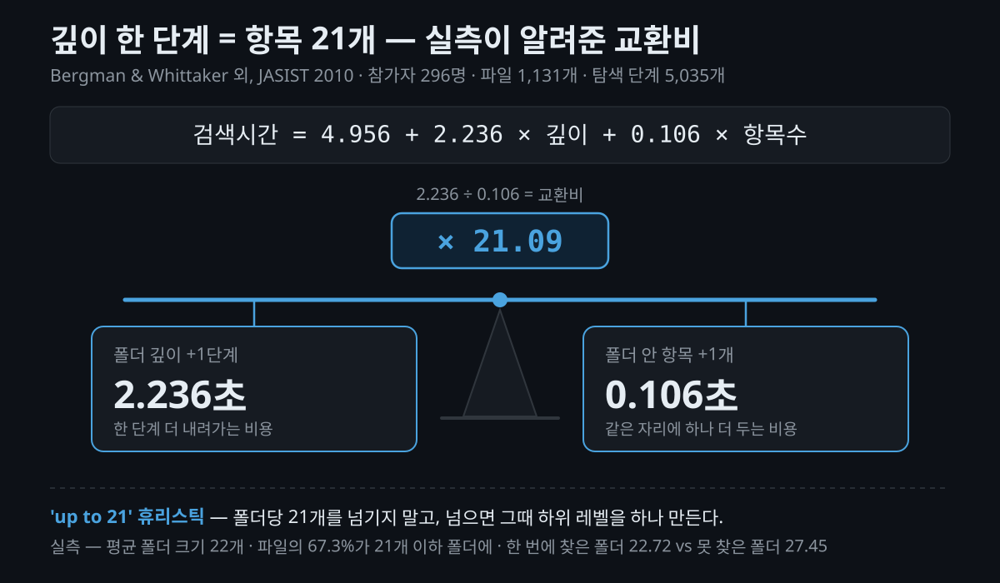

다운로드 폴더에 파일이 400개쯤 쌓여 있습니다. 바탕화면에는 `제안서_최종.docx`와 `제안서_최종_최종2.docx`가 나란히 놓여 있고요. 분명 어딘가 저장해 뒀는데, 그게 어느 폴더였는지 기억이 안 납니다.

**폴더 구조 정리**는 한 번 마음먹고 끝내는 일 같지만 대개 사흘이면 원래대로 돌아옵니다. 저도 몇 번 그랬고, 그래서 개인 PC와 업무 문서 저장소에 공통으로 쓸 규칙을 만들어 **열 개**로 줄였습니다. 이 글은 그 열 개를 순서대로 풀어 쓴 것입니다. 지금 막 정리를 시작하려는 분이라면 그대로 따라 하실 수 있고, 이미 자기 방식이 있는 분이라면 숫자의 근거만 골라 보셔도 됩니다.


## 정리는 왜 사흘 만에 무너질까요?

폴더가 많아서가 아닙니다. **파일 하나를 받을 때마다 "이건 어디에 넣지"를 다시 판단해야 하기 때문**입니다.

서랍장에 빗대면 분명해집니다. 칸을 아무리 예쁘게 나눠 놔도, 물건을 넣을 때마다 "이건 문구 칸인가 잡화 칸인가"를 고민해야 하면 결국 아무 데나 던져 넣게 되죠. 유명한 정리 방법론을 써 보다가 포기한 경험이 있다면 대개 여기서 걸립니다. [PARA](https://fortelabs.com/blog/para/)는 파일마다 "프로젝트인가 영역인가"를 묻고, [Johnny.Decimal](https://johnnydecimal.com/documentation/introduction)은 "어느 카테고리인가"를 묻습니다. **판단이 필요한 순간이 많을수록 규칙은 빨리 버려집니다.**

그래서 제 규칙 열 개는 판단 횟수를 줄이는 쪽으로 만들었습니다. 원류는 Jeff Su 방식(5레벨 · 레벨당 99개 · `99`는 아카이브)이고, 여기서 폭을 99에서 20으로 줄였습니다. 왜 하필 20인지부터 보겠습니다.

## 한 폴더에 몇 개까지 둬도 될까요?

**한 레벨의 형제 폴더는 20개까지**입니다. 넘으면 그 폴더에만 하위 레벨을 하나 더 만듭니다. 제 문서에서는 이 규칙을 `R1`이라고 부릅니다.

이 숫자에는 근거가 있습니다. 폴더를 한 단계 더 파고들어가는 부담은, 그 폴더 안에 항목을 **21개** 더 늘어놓는 것과 비슷합니다. [Bergman & Whittaker 연구](https://www.tau.ac.il/education/muse/publications/101.pdf)가 실제 개인 PC의 파일을 재서 얻은 숫자죠. 한 단계 파고들 바에는 20개쯤은 그냥 늘어놓는 편이 낫다는 뜻입니다. 재미있는 건 사람들이 이미 대체로 그렇게 쓰고 있었다는 점입니다.

같은 연구에서 **큰 폴더는 느리기만 한 게 아니라 틀리게** 만들었습니다. 파일을 못 찾은 경우의 폴더가 한 번에 찾은 경우보다 눈에 띄게 컸거든요. 서랍 하나에 물건을 잔뜩 넣으면 있는 줄 알면서도 못 보고 지나치는 것과 같습니다.



### "폴더는 7개 이하로" 는 왜 틀렸을까요?

흔히 나오는 조언인데, 밀러의 7±2에서 잘못 넘어온 이야기입니다. 밀러 본인이 정정했고, [실제 작업 기억 용량은 7보다 4에 가깝다](https://uxmyths.com/post/931925744/myth-23-choices-should-always-be-limited-to-seven)는 후속 연구도 있습니다. 무엇보다 **7±2는 외워야 하는 정보에 적용되는 규칙이지, 이미 화면에 보이는 목록에는 해당하지 않습니다.**

폴더 목록은 외워서 떠올리는 게 아니라 보고 알아보는 것입니다. [Nielsen Norman Group](https://www.nngroup.com/articles/recognition-and-recall/)의 표현대로 "메뉴는 재인(recognition) 기반 인터페이스의 가장 고전적인 예"죠. 그래서 최상위를 일곱 개로 줄이려고 `10_업무/` 같은 **묶음 폴더를 만들지 않습니다.** 묶음 폴더는 "이 주제가 어느 묶음이었지"라는 질문을 하나 더 만듭니다.

### 깊이 5레벨은 목표가 아니라 상한입니다

깊이는 파일 자신을 포함해 `L1/L2/L3/L4/파일.ext`까지, 즉 폴더는 네 단계까지입니다. 여기서 오해가 없어야 합니다 — **5는 "여기까지 파도 된다"가 아니라 "여기를 넘으면 손본다"는 선**입니다. 같은 연구에서 실제 사용자가 파일을 두는 깊이는 평균 3레벨 남짓이었고 대부분 4레벨 안에 있었습니다.

그렇다고 무조건 평평한 게 답도 아닙니다. [NN/g가 정리했듯](https://www.nngroup.com/articles/flat-vs-deep-hierarchy/) 극단 어느 쪽으로 가도 역효과가 납니다. 그래서 폭이 넘었는지는 숫자가 아니라 **"실제로 안 보이는지"로** 판단합니다. 20은 한번 살펴볼 시점이지 이동 명령이 아닙니다.

## 폴더 이름 앞에 번호를 붙이면 뭐가 달라질까요?

이름순으로 정렬해도 **자주 쓰는 게 위에 오게 됩니다.** 서랍에 라벨을 붙이되 순서까지 정해 두는 셈이죠. 형식은 `NN_이름` 하나입니다.

```
00 ~ 09   고정 구역 — 미리 정해진 용도만
10 ~ 98   자유 구역 — 아무 주제나
99        보관
```

| 번호 | 용도 |
|---|---|
| `00_` | 규칙·체계 — 그 폴더를 **쓰는 방법**(규칙·지침·스크립트) |
| `01_` | 서식 — 그 폴더에서 쓰는 **템플릿 파일 자체** |
| `09_` | 대장·색인 — 목록·기록 파일 |
| `99_` | 보관 — 그 폴더 내부 아카이브 |

지켜야 할 건 세 가지뿐입니다. ① 고정 구역에는 정해진 것만 ② 한 레벨 안에서 번호가 겹치지 않게 ③ `99`는 보관. **간격은 자유입니다.** `10·11·12`도 되고 `10·20·30`도 되고 결번도 괜찮습니다. 순서는 자주 여는 것을 낮은 번호에 두는 식으로 정하면 됩니다.

기억할 경계를 `10` 하나로 줄인 게 핵심입니다. 구간을 여럿으로 나누면 경계를 외워야 하고, 외운 규칙은 몇 달 뒤 폴더를 만드는 순간 떠오르지 않거든요.

`00`과 `01`의 차이는 한 줄로 정리됩니다. **서식이 명사라면 체계는 동사입니다.** 채워 넣는 양식 파일은 `01_서식/`, 그걸 어떻게 쓰는지 알려주는 것은 `00_체계/`. 물론 `README.md` 두세 줄로 충분하면 `00_체계/`를 아예 만들지 않습니다.


### 빈 폴더를 미리 만들어도 될까요?

**분류가 정해졌다면 만듭니다.** 빈 서랍에 라벨을 먼저 붙여 두면 물건이 도착했을 때 고민이 0이 되니까요. 기준은 "파일이 있느냐"가 아니라 **"분류가 정해졌느냐"입니다.** 아직 모르겠으면 폴더 대신 `README.md`에 예상 구조만 적어 둡니다.

다만 미리 만든 폴더의 상당수는 결국 안 쓰입니다. 이메일 폴더를 조사한 연구에서도 거의 쓰이지 않는 '실패 폴더'가 꽤 큰 비중을 차지했죠([Microsoft Research](https://www.microsoft.com/en-us/research/publication/revisiting-whittaker-sidners-email-overload-ten-years-later/)). 그래서 **두 분기 연속 비어 있으면 그 분류가 틀렸다는 신호**로 봅니다.

한 가지 더. **"진행 중"은 폴더가 아니라 파일입니다.** `02_진행/` 같은 폴더를 만들면 작업 중 파일과 나머지가 갈라지고, 끝날 때마다 옮기느라 링크가 깨집니다. 대신 `00_체계/09_대장/진행중.md`에 **항목 / 경로 / 시작일 / 다음 액션** 표를 다섯 줄까지만 둡니다. 파일은 처음부터 끝까지 제자리에 있죠.

## 파일 이름에 공백을 쓰면 뭐가 깨질까요?

셸(shell)이 깨집니다. 인용부호 없이 쓴 `my file.txt`는 **파일 하나가 아니라 인자 두 개**로 쪼개져서 스크립트가 엉뚱하게 돕니다. 이름 앞에 하이픈이 있으면 파일이 아니라 옵션으로 해석되고요([David A. Wheeler](https://dwheeler.com/essays/filenames-in-shell.html)). 그래서 제 패턴은 이렇습니다.

```
YYYY-MM-DD_주제-슬러그_v1.0.ext
```

`: | / \ ? * < > "` 아홉 개는 아예 쓰지 않습니다. 취향이 아니라 [Microsoft 공식 문서](https://learn.microsoft.com/en-us/windows/win32/fileio/naming-a-file)가 정한 **예약 문자 목록 그대로**입니다. `&`는 이 목록에 없지만 셸에서 인용이 필요하니 따로 피합니다.

> **유의사항** — 같은 문서에서 놓치기 쉬운 세 가지가 더 있습니다. `CON` `NUL` `COM1` 같은 **예약 장치명**은 확장자를 붙여도 파일명으로 못 씁니다. **이름을 공백이나 마침표로 끝내면** 안 됩니다(앞에 붙이는 `.temp`는 괜찮습니다). 그리고 경로 길이 **260자** 제한이 있어서, 5레벨에 한글 폴더명을 쓰면 실제로 닿을 수 있습니다.

날짜를 `YYYY-MM-DD`로 쓰는 이유는 두 가지입니다. `01/05/22`가 1월 5일인지 5월 1일인지 모르는 문제를 없애고([ISO 8601](https://www.iso.org/iso-8601-date-and-time-format.html)), 큰 단위부터 쓰니까 **이름순 정렬이 곧 날짜순 정렬**이 됩니다. 다만 하이픈 유무는 취향입니다 — [Harvard](https://datamanagement.hms.harvard.edu/plan-design/file-naming-conventions)는 `YYYYMMDD`를 권하고 [UBC](https://ubc-library-rc.github.io/rdm/content/01_file_naming.html)는 둘 다 허용합니다. 하나를 골라 일관되게 쓰면 됩니다. 반면 `202607`이나 `07.26`처럼 **자릿수가 흔들리는 표기**는 정렬과 해석 양쪽에서 깨지니 피해야 합니다.

날짜를 **붙일 것과 안 붙일 것**은 제가 나눠 쓰는 방식입니다. 기록·메모·수집 원본처럼 만든 시점이 곧 이름표인 자료에는 붙이고, 규칙·서식·가이드·README처럼 계속 고쳐 쓰는 정본에는 붙이지 않습니다. 갱신할 때마다 파일명이 거짓이 되니까요. 버전은 끝에 `_v1.0`으로 붙이고, "최종"·"최최종"은 쓰지 않습니다.

## 받은 파일은 일단 어디에 둘까요?

**가장 가까운 주제 폴더에 넣습니다.** 정확한 자리인지는 그때 따지지 않고, 정리할 때 한꺼번에 옮깁니다. 파일 하나 때문에 분류 체계를 고민하는 게 가장 비싼 일이거든요. 새 폴더는 **같은 주제가 몇 개 모였을 때** 만드는 편이 자연스럽습니다.

저장소 안에는 `inbox/` 같은 수집함을 따로 만들지 않습니다. 다만 이건 수집함이 나쁘다는 뜻이 아닙니다. 수집함이 쓰레기장이 되는 건 개념 때문이 아니라 **비우는 루틴이 없어서**라는 반론이 정당하고([Stephen Dolan](https://stephendolan.com/writing/common-inbox-misconceptions)), 저도 동의합니다. 쟁점은 수집함을 두느냐가 아니라 **어디에 두느냐**입니다.

그래서 저는 **OS의 다운로드 폴더를 완충지대로 씁니다.** 저장소 밖이라 트리를 어지럽히지 않죠. 대신 루틴을 정해 뒀습니다 — **주 1회 10분**, 다운로드 폴더 비우기와 루트 직속 파일 다섯 개 이하 유지. 서랍 앞 바구니는 있어도 되지만, 비우는 날이 정해져 있어야 바구니로 남습니다.

폴더가 늘면 무너지는 지점이 하나 더 있습니다. **비슷한 폴더 둘 중 어디에 넣을지 모를 때**죠. 그래서 폴더마다 `README.md`에 경계를 두 줄 적습니다.

```
담는 것: 운영 현황·비용·평가 문서
안 담는 것: 장애 회고(→ 15_지식), 발행본(→ 90_미러)
```

**"안 담는 것"이 "담는 것"보다 중요합니다.** 갈 곳까지 적어 두면 판단이 한 번에 끝납니다.

## 깊은 폴더를 매번 찾아 들어가야 한다면?

폴더를 옮기지 말고 **바로가기를 만듭니다.** 원본이 제자리에 있어야 링크와 스크립트가 안 깨지니까요.

```bash
ln -s "../12_프로젝트/데이터플랫폼" "_바로가기/데이터플랫폼"
```

상한은 다섯 개, **상대 경로**로 만듭니다(절대 경로는 저장소를 옮기는 순간 전부 깨집니다). 끝나면 링크만 지우면 되고요. 규칙이 요구하는 건 "다섯 단계 안에 **찾을 수 있게**"지 "다섯 단계 안에 있어야 한다"가 아닙니다.

그런데 이 심볼릭 링크(symbolic link)가 사고를 잘 칩니다. 확인해 보니 제가 처음 적어 둔 내용도 몇 군데 틀렸더군요.

> **유의사항 — 클라우드 동기화 폴더 안에는 두지 마세요.** 서비스마다 동작이 다릅니다. [Dropbox 공식 문서](https://help.dropbox.com/sync/symlinks)는 **Windows용 앱이 아예 지원하지 않는다**고 하고, macOS·Linux에서도 대상이 Dropbox 폴더 밖이면 그 파일은 동기화하지 않습니다. OneDrive는 공식적으로 미지원이고, iCloud Drive는 재부팅 후 링크가 사라진다는 보고가 있습니다. 즉 "복제된다"가 아니라 **"어떻게 될지 알 수 없다"가 정확합니다.** 그래서 `_바로가기/`는 앞에 언더스코어를 붙여 동기화·백업에서 제외합니다.

> **유의사항 — Obsidian을 쓴다면 이 규칙은 건너뛰세요.** [Obsidian 공식 문서](https://obsidian.md/help/symlinks)는 "심볼릭 링크 사용을 **강력히 권장하지 않는다**"고 말합니다. 데이터 손실, 앱 크래시, 파일 중복으로 인한 모호한 링크를 이유로 들고요. 제외 필터로 막으면 된다고 적어 뒀었는데, [그 설정이 심볼릭 링크에는 적용되지 않는다는 보고](https://forum.obsidian.md/t/can-i-stop-obsidian-from-following-symlinks-in-a-folder-it-opens-as-a-vault/73264)가 있어 해결책으로 보기 어렵습니다. vault 안이라면 링크 대신 경로 목록 문서로 대신하는 편이 안전합니다.

나머지는 알아 두면 편한 것들입니다. **`zip`은 기본적으로 링크를 따라가 대상 파일을 복사**하고(`-y`를 줘야 링크로 보존), `tar`는 반대로 기본이 링크 보존입니다. Windows에서 심볼릭 링크를 만들려면 관리자 권한이나 개발자 모드가 필요한데, **정션(`mklink /J`)은 일반 사용자도 만들 수 있어** 대안이 됩니다. [Git for Windows](https://gitforwindows.org/symbolic-links)는 심볼릭 링크가 기본 비활성이라 그 상태의 `ln -s`가 **조용히 복사본**을 만드니 주의해야 하고요.

검색 도구는 제가 반대로 알고 있던 부분입니다. **`find`와 `grep -r`은 기본적으로 심볼릭 링크를 따라가지 않습니다.** 따라가는 건 `grep -R`이죠. `--exclude-dir`을 챙겨야 한다고 적어 뒀었는데, 매뉴얼을 열어 보니 그럴 필요가 없었습니다.

## 규칙을 적용하면 안 되는 곳은 어디일까요?

규칙보다 중요한 게 **적용 범위**입니다. 세 종류는 아예 예외로 둡니다.

**첫째, 도구가 위치를 정한 것.** 옮기면 그 도구가 멈춥니다. `CLAUDE.md`·`AGENTS.md`는 루트에서 자동으로 읽히고, `.obsidian/`·`.vscode/`는 루트가 바뀌면 인식되지 않으며, `.idea/modules.xml`은 `.iml` 파일을 경로로 참조합니다. `.git/`·`node_modules/`도 마찬가지고요. 이런 것들은 번호·깊이·폭 계산에서 **전부 제외**하고, 정리가 필요하면 이동이 아니라 **동기화 제외 설정이나 삭제**로 처리합니다.

git 저장소 루트도 비슷합니다. IDE 최근 프로젝트, 셸 기록, 스크립트의 하드코딩된 경로가 위치를 기억하고 있죠. 옮기기 전에 ① 참조를 `grep`으로 세어 보고 ② IDE에서 다시 열어 보고 ③ 빌드를 한 번 돌려 봅니다. 셋 중 하나라도 부담스러우면 **제자리가 정답**입니다.

**둘째, 시점으로 찾는 트리.** 사진·회의록·월간 리포트처럼 중요도가 아니라 날짜로 찾는 것은 `2026/` `2026-07/` 식으로 씁니다. 연도가 곧 번호인 셈이죠.

**셋째, 외부 시스템을 복제한 미러.** 원본이 바뀌면 따라가야 하니 내 규칙을 강제할 수 없습니다. `90_미러/`에 단독으로 두고 번호·폭 규칙을 면제합니다.

그리고 **언더스코어 접두는 "동기화·검색에서 빼는 것"만 뜻합니다.** `_cache/`(재생성되는 것)와 `_바로가기/`가 여기 해당하고, 개별 50MB가 넘는 원본은 저장소 밖에 두고 경로만 적습니다. 정렬을 위해 `_서식/`처럼 정본 폴더에 붙이면 의미가 둘로 갈려서, 제외 설정을 짤 때마다 하나씩 확인해야 합니다. 위로 올리고 싶으면 **낮은 번호**를 쓰면 되고요.

정리하면 최상위는 이 정도 모양이 됩니다.

```
/home/<user>/docs/
├── 00_체계/       구조 규칙 · 01_서식/ · 09_대장/
├── 10_인프라/
├── 11_보안/
├── 12_프로젝트/
├── 20_매뉴얼/
├── 80_코드/       문서와 한 몸인 저장소만
├── 90_미러/       외부 시스템 구조 복제 (규칙 면제)
├── 99_보관/
└── _cache/  _바로가기/     동기화·검색 제외
```

## 규모가 규칙보다 먼저입니다

여기가 가장 정직해야 하는 부분입니다.

폴더를 옮기는 이유는 네 가지로 제한합니다. **폭 초과**(최상위가 44개라 활성 폴더가 안 보인다), **합칠 이유**(한 건 처리에 폴더 세 개를 다 연다), **깊이 초과**(파일이 6~7레벨에 있다), **동기화 방해**(대용량 원본이 백업을 막는다). 해당하지 않으면 **제자리에 둡니다.** 이름이 규칙과 달라도, 번호가 비어도 그대로 두고 다음에 그 폴더로 일할 때 고칩니다. 규칙을 바꿀 때도 한 번에 하나만 바꿉니다. 전면 재편은 대개 중단되고, 중단된 재편은 이전보다 나쁘거든요.

그리고 가장 중요한 한 줄.

> **규모가 규칙보다 먼저다.** 파일이 수십 개인 저장소에 열 개를 전부 적용하면 관리 비용만 생긴다. **네 개만** 지키고, 나머지는 필요해졌을 때 도입한다.

지금 정리를 시작하는 단계라면 이 네 개면 충분합니다.

1. **R1** — 한 레벨 20개, 깊이는 5를 넘지 않기
2. **R3** — 파일명에 금지 문자·공백 없이, 날짜는 `YYYY-MM-DD`
3. **R4** — 받은 파일은 가까운 폴더에, 정리는 주 1회
4. **R5** — 폴더마다 담는 것 / 안 담는 것 두 줄

대장도, 미러 분리도, 바로가기도 나중 이야기입니다. **규칙이 파일 수보다 많으면 그 자체가 판단 비용**이니까요.


### 규칙 10개 한눈에

| # | 규칙 | 한 줄 |
|---|---|---|
| **R1** | 크기 | 깊이 5레벨(폴더는 네 단계) · 한 레벨의 폭 20개 |
| **R2** | 번호 | `NN_이름`. `00~09` 고정 · `10~98` 자유 · `99` 보관 |
| **R3** | 파일명 | `YYYY-MM-DD_슬러그_v1.0.ext`. 공백·금지 문자 없이 |
| **R4** | 유입물 | 완충 폴더를 만들지 않고 가까운 폴더에. 정리는 주 1회 |
| **R5** | 경계 | 폴더마다 담는 것 / 안 담는 것 두 줄 |
| **R6** | 바로가기 | 옮기지 말고 `_바로가기/`에 링크. 다섯 개까지 |
| **R7** | 정렬축 | 시간축은 `YYYY-MM`, 외부 미러는 원본 체계 — 면제 |
| **R8** | 시스템 경로 | 도구가 위치를 정한 것은 이동 금지, 계산에서 제외 |
| **R9** | 동기화 | 재생성물은 `_cache/`, 대용량 원본은 저장소 밖 |
| **R10** | 이동 | 이유가 있을 때만. **규모가 규칙보다 먼저** |

## 마무리하며

폴더 구조 정리에서 가장 비싼 것은 폴더를 옮기는 시간이 아니라, **파일 하나를 받을 때마다 "이건 어디에 넣지"를 다시 판단하는 시간**입니다. 규칙 열 개를 만든 이유도 결국 그 판단 횟수를 줄이려는 것이었고, 그래서 마지막 규칙이 "규칙을 다 쓰지 마라"가 되었습니다.

직접 만든 규칙이라도 근거는 따로 확인해야 하더군요. 폭 20개는 실측 연구가 얻은 숫자와 거의 같아 근거가 단단했지만, 깊이 5레벨은 "목표"가 아니라 "상한"이라고 고쳐 적어야 했고, `grep -r`에 대한 설명은 매뉴얼을 열어 보니 그냥 틀린 문장이었습니다.

정리를 시작하려는 분이라면, 트리를 새로 짜기 전에 **한 레벨의 형제 폴더 수부터 세어 보시길 권합니다.** 20을 넘는 폴더가 하나도 없다면 지금 구조는 아직 문제가 아니고, 넘는 폴더가 있다면 손댈 곳은 거기 하나입니다.

#폴더구조정리 #디렉토리구조 #파일정리 #파일네이밍 #ISO8601 #심볼릭링크 #PARA #JohnnyDecimal #문서관리 #Obsidian #파일관리 #생산성 #폴더정리방법

## 참고 자료 (공식 출처)

- [The Effect of Folder Structure on Personal File Navigation · Bergman, Whittaker et al., JASIST 2010](https://www.tau.ac.il/education/muse/publications/101.pdf) — 폭 21 교환비, 실제 사용자의 폴더 깊이와 크기
- [Naming Files, Paths, and Namespaces · Microsoft Learn](https://learn.microsoft.com/en-us/windows/win32/fileio/naming-a-file) — 예약 문자 9개, 예약 장치명, 260자 경로 제한
- [ISO 8601 — Date and time format · ISO](https://www.iso.org/iso-8601-date-and-time-format.html) — 날짜 해석 모호성과 정렬
- [File Naming Conventions · Harvard Medical School](https://datamanagement.hms.harvard.edu/plan-design/file-naming-conventions) · [File Naming · UBC Library Research Commons](https://ubc-library-rc.github.io/rdm/content/01_file_naming.html) — 기관 파일명 가이드
- [Fixing Unix/Linux/POSIX Filenames · David A. Wheeler](https://dwheeler.com/essays/filenames-in-shell.html) — 공백·선행 하이픈이 셸에서 깨지는 이유
- [Memory Recognition and Recall in User Interfaces](https://www.nngroup.com/articles/recognition-and-recall/) · [Flat vs. Deep Website Hierarchies · Nielsen Norman Group](https://www.nngroup.com/articles/flat-vs-deep-hierarchy/) — 재인 기반 UI, 평평함과 깊음의 균형
- [Myth #23: Choices should always be limited to 7+/-2 · UX Myths](https://uxmyths.com/post/931925744/myth-23-choices-should-always-be-limited-to-seven) — 밀러 본인의 정정
- [Can Dropbox sync symbolic links? · Dropbox Help](https://help.dropbox.com/sync/symlinks) · [Symbolic Links · Git for Windows](https://gitforwindows.org/symbolic-links) — 심볼릭 링크의 플랫폼별 동작
- [Symlinks · Obsidian Help](https://obsidian.md/help/symlinks) · [Excluded Files 미적용 보고 · Obsidian Forum](https://forum.obsidian.md/t/can-i-stop-obsidian-from-following-symlinks-in-a-folder-it-opens-as-a-vault/73264)
- [The PARA Method · Tiago Forte](https://fortelabs.com/blog/para/) · [Johnny.Decimal Documentation](https://johnnydecimal.com/documentation/introduction) — 기존 방법론
- [Revisiting Whittaker & Sidner's Email Overload Ten Years Later · Microsoft Research](https://www.microsoft.com/en-us/research/publication/revisiting-whittaker-sidners-email-overload-ten-years-later/) — 쓰이지 않는 '실패 폴더'
- [Common GTD Inbox Misconceptions · Stephen Dolan](https://stephendolan.com/writing/common-inbox-misconceptions) — 수집함 옹호 측 논지
