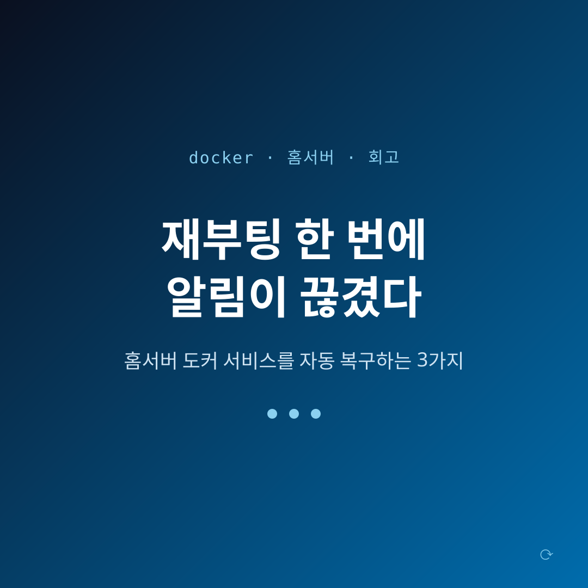
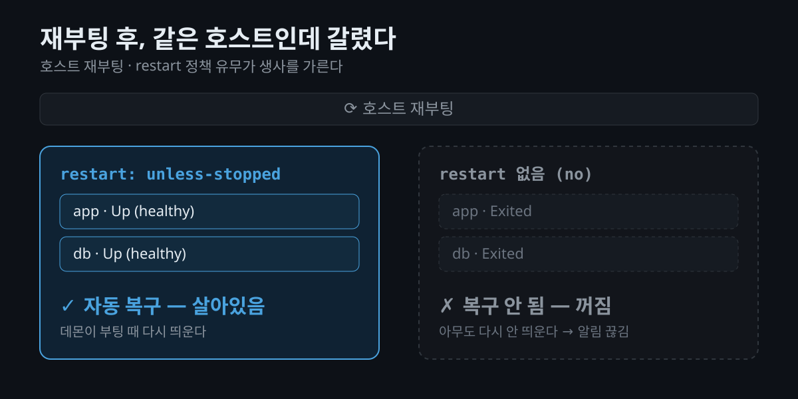
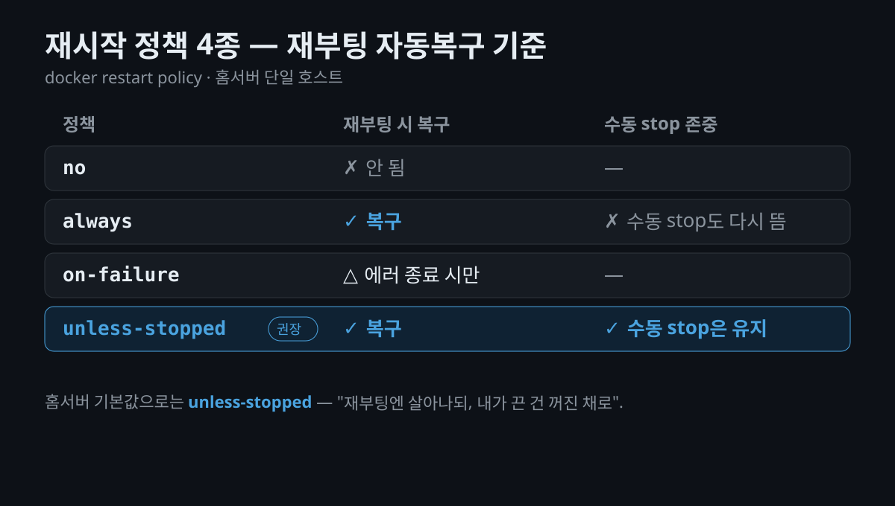

서버를 한 번 재부팅했더니, 늘 오던 알림이 **조용히 멈춘** 적 있으신가요? 눈에 띄는 에러도 없고, 그냥 어느 순간부터 아무 소식이 없는 상태 말입니다. 홈서버나 개인 PC에서 docker로 뭔가를 상시 돌리고 있다면 한 번쯤 겪게 되는 일인데요, 이 글은 바로 그 상황을 **직접 겪고 고친 기록**입니다.

정리해 둘 핵심은 하나입니다 — 홈서버 같은 **단일 호스트**에서 컨테이너가 "재부팅해도 알아서 다시 뜨게" 만드는 건 결국 **세 가지**로 요약됩니다. 재시작 정책, 기동 순서(헬스체크), 상태 영속. 순서대로 짚어보겠습니다.

## 알림은 왜 조용히 멈췄을까요?

상황은 이랬습니다. 홈서버에서 **매일 정해진 시각에 작업을 돌리고, 끝나면 디스코드로 알림을 보내는 개인 서비스**를 docker로 운영하고 있었습니다. 그런데 어느 날 그 정기 알림이 오지 않았죠. 로그를 열어보기 전에 먼저 확인한 건 **호스트 상태**였는데, `uptime`을 보니 **전날 밤에 재부팅**이 있었습니다.

여기서 이상한 점이 하나 있었습니다. 같은 호스트에 올려둔 **다른 스택은 멀쩡히 살아있었거든요.** 똑같이 재부팅을 겪었는데 어떤 건 살고 어떤 건 죽었다 — 이 **대조**가 원인을 정확히 가리키고 있었습니다.



## 원인은 하나가 아니었습니다

파고들어 보니 문제는 두 겹이었습니다.

- **재시작 정책이 없었다.** 죽어 있던 데이터베이스 컨테이너는 `restart` 옵션이 아예 없었습니다. docker에서 이건 기본값 `no` — 즉 **어떤 경우에도 자동으로 다시 띄우지 않는다**는 뜻입니다. 반대로 살아남은 스택은 `restart: unless-stopped`가 걸려 있었죠. 차이는 딱 이 한 줄이었습니다.
- **자동으로 띄워줄 주체가 없었다.** 알림을 실제로 쏘는 앱은 컨테이너가 아니라 터미널에서 **수동으로 실행**해 두고 있었습니다. 재부팅되면 그 프로세스를 **다시 띄워줄 사람이 없으니**, DB가 살아났더라도 알림은 여전히 안 왔을 겁니다.

즉 "재부팅 후 알림이 끊긴" 건 버그가 아니라 **설정의 공백**이었습니다. 그럼 이 공백을 세 가지 원칙으로 메워보겠습니다.

## 원칙 1 — 재시작 정책: 재부팅해도 살아있게

가장 먼저, 컨테이너에 **재시작 정책(restart policy)** 을 준다. docker가 제공하는 값은 네 가지입니다. ([소스 1])

- **`no`** — 기본값. 죽어도 다시 안 띄웁니다.
- **`always`** — 항상 다시 띄웁니다.
- **`on-failure[:횟수]`** — 비정상 종료(에러 코드)일 때만, 지정 횟수까지 재시도.
- **`unless-stopped`** — 내가 **명시적으로 멈추기 전까지는** 항상 다시 띄웁니다.

핵심은 **재부팅했을 때의 동작**입니다. `always`와 `unless-stopped`는 **둘 다 Docker 데몬이 시작될 때 컨테이너를 다시 띄웁니다.** 리눅스에서 docker 서비스가 부팅과 함께 자동 시작되도록 돼 있으면, 이 정책이 걸린 컨테이너는 재부팅 후 알아서 복구됩니다. ([소스 1])

그럼 둘 중 뭘 쓰면 될까요? 차이는 **"내가 일부러 꺼둔 컨테이너"** 를 어떻게 대하느냐입니다. `unless-stopped`는 수동으로 멈춰둔 컨테이너라면 **데몬이 재시작돼도 다시 띄우지 않습니다.** 반면 `always`는 수동으로 꺼뒀어도 데몬 재시작 때 다시 살아나죠. ([소스 1]) 홈서버에서는 "내가 점검하려고 끈 건 꺼진 채로 두는" 쪽이 대체로 편하니, **실무 기본값으로는 `unless-stopped`** 가 무난합니다.

compose라면 서비스에 한 줄이면 됩니다.

```yaml
services:
  db:
    image: postgres:16
    restart: unless-stopped   # ← 재부팅해도 자동 복구
```

이미 **돌아가고 있는** 컨테이너라면, 다시 만들지 않고도 정책만 바꿔 끼울 수 있습니다.

```bash
# 무중단으로 재시작 정책만 변경
docker update --restart unless-stopped <컨테이너>

# 잘 걸렸는지 확인
docker inspect -f '{{.HostConfig.RestartPolicy.Name}}' <컨테이너>
```

> **유의사항 1.** 재시작 정책은 **docker 데몬 자체가 부팅 시 시작돼야** 의미가 있습니다. 데몬이 안 떠 있으면 컨테이너도 못 뜨겠죠. `sudo systemctl enable docker`로 부팅 자동시작을 켜 두세요.
>
> **유의사항 2.** docker는 무한 재시작을 막으려고, 컨테이너가 **최소 10초 이상 실행**돼야 안정 상태로 봅니다. 시작하자마자 죽는 컨테이너가 정책 때문에 계속 재시작을 도는 상황을 방지하는 장치죠. ([소스 1])



## 원칙 2 — 기동 순서와 헬스체크: 준비된 다음에

재시작 정책만으로 끝이 아닙니다. 재부팅 뒤 여러 컨테이너가 **동시에** 살아나면, 앱이 **DB가 미처 준비되기 전에** 접속을 시도해 실패할 수 있거든요. "컨테이너는 떴는데 안의 프로세스는 아직 준비 안 됨" 상태에 물리는 겁니다.

그래서 **헬스체크(healthcheck)** 와 **기동 순서**를 함께 겁니다. compose의 `depends_on`에 `condition: service_healthy`를 주면, 의존 서비스가 **healthy 판정을 받은 뒤에** 다음 서비스가 시작됩니다. ([소스 2])

```yaml
services:
  db:
    image: postgres:16
    restart: unless-stopped
    healthcheck:
      test: ["CMD-SHELL", "pg_isready -U app -d app"]
      interval: 5s
      timeout: 3s
      retries: 10

  app:
    build: .
    restart: unless-stopped
    depends_on:
      db:
        condition: service_healthy   # ← DB가 준비된 다음 기동
    env_file: [.env]
```

> **유의사항.** `depends_on`은 **시작 순서**만 보장합니다. 서비스가 **돌아가는 도중에** 의존 대상이 잠깐 죽는 경우까지 막아주지는 않아요. ([소스 2]) 그러니 앱은 "DB 연결이 끊기면 잠시 뒤 다시 붙는" **재연결**을 스스로 견디도록 짜 두는 게 안전합니다.

## 원칙 3 — 상태는 컨테이너 밖에

마지막은 제가 실제로 발을 헛디딘 지점입니다. 컨테이너 파일시스템은 **다시 만들면 사라집니다.** 그래서 유지해야 할 상태(데이터·설정·플래그)는 **컨테이너 밖**에 둬야 하죠. 방법은 두 가지입니다. ([소스 3])

- **named volume** — docker가 알아서 관리합니다. 호스트 경로를 신경 쓸 필요가 없죠. 데이터베이스 데이터처럼 "docker가 들고 있으면 되는" 것에 잘 맞습니다.
- **bind mount** — 호스트의 **특정 경로**를 컨테이너에 그대로 연결합니다. 호스트에서 바로 열어보고 편집할 수 있어서, **이미 호스트에 있던 파일/디렉터리를 이어 쓸 때** 자연스럽습니다.

제가 겪은 함정이 바로 여기였습니다. 앱의 동작을 켜고 끄는 **상태 플래그 파일**이 있었는데, 이미지를 만들 때 이 파일이 든 폴더를 **일부러 제외**해 버렸거든요. 그랬더니 컨테이너 안에서는 그 파일이 **아예 없는 것**으로 취급됐고, 앱은 "기능이 꺼져 있다"고 읽어버렸습니다. 겉으로는 잘 떴는데 **정작 하는 일이 없는** 상태였죠.

해결은 간단했습니다. 그 상태 폴더를 **호스트에서 bind mount**로 물려, 컨테이너가 재생성돼도 상태가 그대로 유지되게 했습니다.

```yaml
  app:
    # ...
    volumes:
      - ./state:/app/state   # 런타임 상태(플래그 등)를 호스트에 영속
```

> **유의사항.** "이미지에는 굽지 않고 마운트로만 제공되는 파일"은, 마운트를 **깜빡 빠뜨리면** 없는 것으로 취급됩니다. 상태 파일을 마운트에 의존한다면, 그 마운트가 **항상 함께 붙는지** 꼭 확인하세요.

## 그래서, 세 가지 설정이면 됩니다

세 원칙을 한 compose에 모으면 대략 이런 모양이 됩니다. (값은 모두 예시용 더미입니다.)

```yaml
services:
  db:
    image: postgres:16
    restart: unless-stopped
    healthcheck:
      test: ["CMD-SHELL", "pg_isready -U app -d app"]
      interval: 5s
      timeout: 3s
      retries: 10
    volumes:
      - db_data:/var/lib/postgresql/data

  app:
    build: .
    restart: unless-stopped
    depends_on:
      db:
        condition: service_healthy
    env_file: [.env]
    volumes:
      - ./state:/app/state

volumes:
  db_data:
```

과장 없이, 재부팅 자동복구를 가르는 건 사실상 이 **세 가지 설정**입니다 — `restart` 정책 · `depends_on`+`healthcheck` · `volumes`(상태 영속). 걸어두고 나면, 다음 명령으로 실제 정책이 붙었는지 **재부팅 없이** 확인할 수 있습니다.

```bash
docker inspect -f '{{.HostConfig.RestartPolicy.Name}}' <컨테이너>   # unless-stopped
docker ps   # 상태(Up/healthy) 확인
```

## 마무리

돌아보면 이번 장애의 교훈은 담백합니다 — **개인 프로젝트도 "자동으로 다시 뜨는가"는 이 세 가지 설정에서 갈린다.** 평소엔 티가 안 나다가, 재부팅 한 번에 조용히 드러나는 종류의 빈틈이죠.

지금 홈서버에서 뭔가를 상시 돌리고 있다면, 거창한 점검 말고 딱 하나만 해보면 좋습니다. `docker inspect`로 **각 컨테이너의 재시작 정책부터** 확인해 보세요. `no`가 하나라도 보이면, 그게 다음 재부팅에 조용히 사라질 후보입니다.

## 참고 자료 (공식 출처)

재시작 정책·헬스체크·마운트의 동작은 Docker 공식 문서를 근거로 확인했습니다.

- [Start containers automatically — Docker Docs](https://docs.docker.com/engine/containers/start-containers-automatically/) (재시작 정책, 데몬 시작 시 동작, 10초 규칙)
- [Control startup and shutdown order in Compose — Docker Docs](https://docs.docker.com/compose/how-tos/startup-order/) (`depends_on` + `condition: service_healthy`)
- [Bind mounts — Docker Docs](https://docs.docker.com/engine/storage/bind-mounts/) (bind mount vs volume, 상태 영속)
- [Define services in Docker Compose — Docker Docs](https://docs.docker.com/reference/compose-file/services/) (`restart` 값과 compose 스키마)
