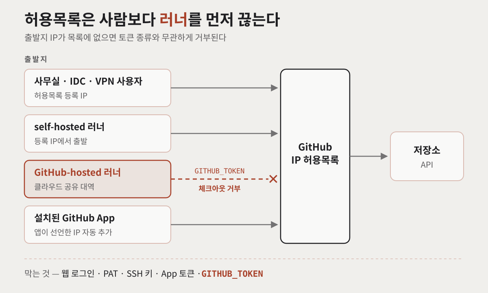
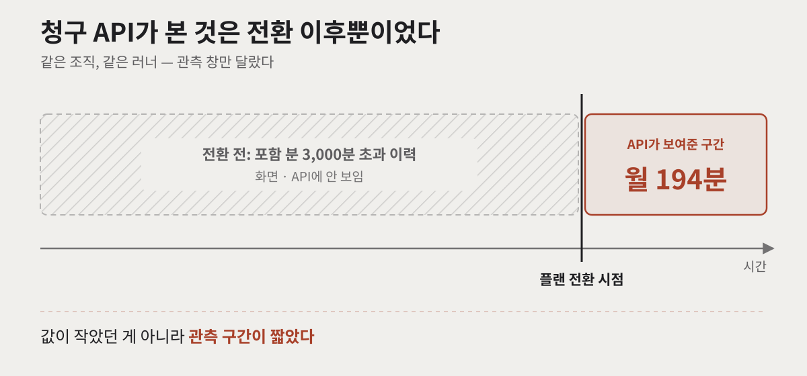
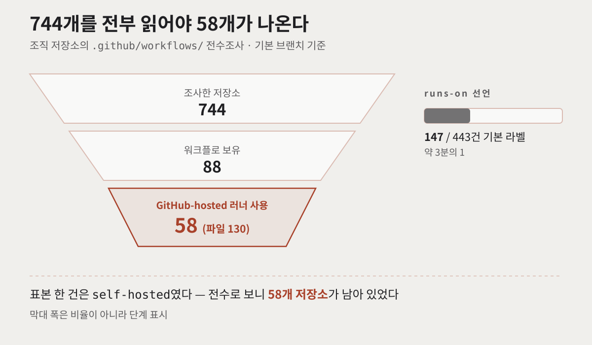
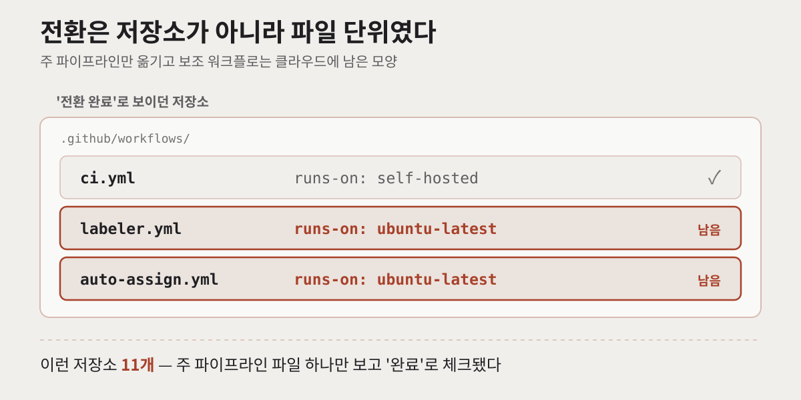
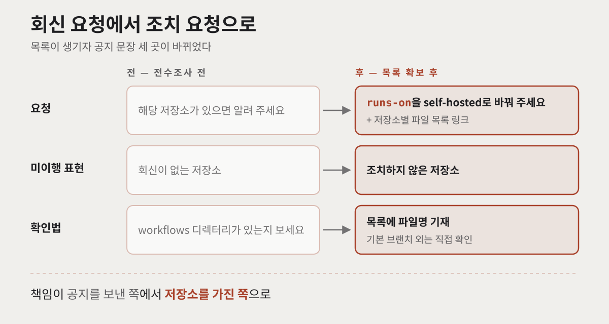

보안 점검에서 접근통제 결함이 하나 나왔습니다. 코드 호스팅에 출발지 IP 제한이 없다는 지적이었습니다. 해법은 정해져 있었습니다. **GitHub IP 허용목록(IP allow list)**을 켜서 목록에 없는 곳에서 오는 접근을 전부 끊는 것입니다.

그런데 끊기는 대상이 사람만이 아닙니다. **GitHub-hosted 러너가 통째로 끊깁니다.** 적용일이 오면 그 러너를 쓰는 워크플로는 전부 실패합니다.

이 글은 허용목록을 켜기 전에 조직 저장소 744개의 워크플로를 전수조사한 기록입니다. 그 과정에서 두 번 잘못 판단했고, 공지 문장을 한 번 뒤집었습니다. 허용목록 적용을 앞두고 있거나, "우리는 러너를 거의 안 쓴다"고 생각하고 계신다면 참고하실 수 있습니다.


## 왜 GitHub IP 허용목록이 러너까지 끊을까?

허용목록은 웹 화면 로그인만 막는 게 아닙니다. GitHub 문서에 따르면 개인 액세스 토큰(PAT), OAuth 앱 토큰, SSH 키, GitHub App 설치 토큰, 그리고 **GitHub Actions의 `GITHUB_TOKEN`까지** 막습니다([GitHub Docs — 조직 IP 허용목록](https://docs.github.com/en/enterprise-cloud@latest/organizations/keeping-your-organization-secure/managing-security-settings-for-your-organization/managing-allowed-ip-addresses-for-your-organization)).

러너가 끊기는 이유가 여기 있습니다. 러너는 `GITHUB_TOKEN`으로 저장소를 체크아웃하고 API를 호출합니다. 그런데 GitHub-hosted 러너는 GitHub이 빌려 쓰는 클라우드 대역에서 뜹니다. 그 출발지가 목록에 없으니 첫 체크아웃부터 거부됩니다.

문서는 이 관계를 한 문장으로 정리합니다.

> "If you use an IP allow list and would also like to use GitHub Actions, you must use self-hosted runners or GitHub-hosted larger runners with static IP address ranges."

즉, 허용목록을 켠 조직에서 Actions를 계속 쓰려면 길은 둘뿐입니다. **self-hosted 러너**, 또는 **고정 IP를 받은 대형 러너(larger runner)**. 참고로 허용목록 자체가 GitHub Enterprise Cloud 전용 기능이라, 이 작업은 플랜 전환과 함께 진행됐습니다.



같이 챙겨야 할 옵션이 하나 있습니다. **"Enable IP allow list configuration for installed GitHub Apps"**입니다. 켜면 조직에 설치된 앱이 선언한 IP가 허용목록에 자동으로 추가되고, 앱 제작자가 IP를 바꾸면 목록도 따라 갱신됩니다. 이렇게 들어온 항목은 관리자가 수정하거나 지울 수 없습니다. 이 옵션을 빼먹으면 외부 SaaS 연동이 러너와 함께 조용히 끊깁니다.

## 청구 화면의 194분은 무엇을 말해주고 있었나?

처음에는 영향이 작다고 봤습니다. 청구 화면에 찍힌 러너 사용량이 **월 194분**이었거든요. 클라우드 러너는 사실상 안 쓰는 조직처럼 보였습니다.

아니었습니다. 플랜 전환 전에는 포함 분(월 3,000분)을 넘겨 초과 결제한 이력이 있었습니다.

제가 본 청구 사용량 API는 **플랜을 전환한 이후의 데이터만** 돌려주고 있었습니다. 전환 직후에 조회했으니 무엇을 물어도 0에 가까운 값이 나온 것이죠. 지표의 관측 구간을 확인하지 않고 값만 읽은 것이 첫 번째 실수였습니다.

> **유의사항** — 이것은 제 조직에서 관측한 현상이지, 문서에 적힌 규칙은 아닙니다. 문서로 확인되는 것은 한 단계 좁습니다. 신규 청구 플랫폼(enhanced billing platform)으로 옮기면 전환 이전 사용량은 새 화면에 나오지 않고, 보고서를 내려받아야 볼 수 있다는 것까지입니다([GitHub Changelog, 2025-02-24](https://github.blog/changelog/2025-02-24-migration-of-github-team-plan-organizations-to-the-enhanced-billing-platform/)). 어느 쪽이든 교훈은 같습니다. **숫자를 읽기 전에 그 숫자가 어느 기간을 보고 있는지부터** 확인해야 합니다.



## 실행 이력 한 건으로 판단하면 무엇을 놓칠까?

두 번째 판단도 비슷한 모양으로 틀렸습니다. 실행 이력을 한 건 열어보니 `self-hosted` 라벨이었습니다. "전환은 이미 끝났구나" 싶었죠.

**표본 한 건으로 모집단을 판단한 것**입니다. 게다가 하필 주 파이프라인만 옮겨 둔 저장소였습니다.

그래서 전수로 봤습니다. 조직 저장소 744개의 `.github/workflows/` 아래 파일을 전부 읽어 `runs-on` 값을 분류했습니다.

| 단계 | 수 |
|---|---|
| 조사한 저장소 | 744개 |
| 워크플로가 있는 저장소 | 88개 |
| GitHub-hosted 러너를 쓰는 저장소 | **58개** (파일 130개) |
| `runs-on` 선언 중 기본 라벨 | 443건 중 **147건** (약 3분의 1) |

표본 한 건으로 내린 "전환 끝"이라는 판단은 결과적으로 하나도 맞지 않았습니다.



### 전환은 저장소 단위가 아니라 파일 단위였습니다

더 흥미로운 건 남아 있던 모양입니다. **주 파이프라인은 self-hosted인데 라벨러, 리뷰어 자동 배정 같은 보조 워크플로만 GitHub-hosted 러너로 남은 저장소가 11개**였습니다.

누군가 "이 저장소는 전환 완료"라고 체크했다면, 그건 주 파이프라인 파일 하나를 보고 한 판단이었을 겁니다. 전환은 저장소 단위가 아니라 **파일 단위**로 진행돼 있었습니다.



같은 파일명이 여러 저장소에 복사돼 있다는 것도 드러났습니다. 라벨러류가 9개, 7개 저장소에, CI·브랜치 동기화·자동 배정류가 각각 5개 저장소에 퍼져 있었습니다. 이런 건 저장소별로 붙잡을 게 아니라 한 번에 처리할 수 있습니다.

### 전 저장소 워크플로를 한 번에 읽는 방법

GraphQL의 `object(expression: "HEAD:.github/workflows")`를 쓰면 저장소마다 기본 브랜치의 워크플로 디렉터리를 트리째 읽을 수 있습니다.

```graphql
query($org: String!, $cursor: String) {
  organization(login: $org) {
    repositories(first: 50, after: $cursor) {
      pageInfo { hasNextPage endCursor }
      nodes {
        name
        pushedAt
        object(expression: "HEAD:.github/workflows") {
          ... on Tree { entries { name object { ... on Blob { text } } } }
        }
      }
    }
  }
}
```

받아온 `text`에서 `runs-on` 줄을 뽑아 `{repo, file, runs_on}` 형태로 정리한 뒤, 표준 라벨만 골라냅니다.

```bash
jq -r '.[] | select(.runs_on | test("^(ubuntu|windows|macos)-"))
       | "\(.repo)\t\(.file)\t\(.runs_on)"' workflows.json | sort
```

`pushedAt`은 최근 푸시일 기준으로 우선순위를 3단계로 나누는 데 썼습니다.

> **유의사항** — 이 방식에는 한계가 둘 있습니다. 첫째, **기본 브랜치 HEAD만** 봅니다. 다른 브랜치의 워크플로는 직접 확인해야 합니다. 둘째, 위 정규식은 `ubuntu-latest`, `windows-2022` 같은 문자열 라벨만 잡습니다. `runs-on: ${{ matrix.os }}` 같은 표현식이나 `[self-hosted, linux]` 같은 배열 형태는 빠질 수 있으니, 해당 줄은 따로 눈으로 확인하는 편이 안전합니다.

## 러너 IP 대역을 통째로 등록하면 안 될까?

전수조사와 별개로 가장 먼저 떠오르는 우회로가 있습니다. GitHub은 러너 IP 대역을 공개합니다. REST `GET /meta` 응답의 `actions` 키입니다. 이걸 허용목록에 다 넣으면 러너를 바꾸지 않아도 되지 않을까요?

규모부터 보겠습니다. **2026년 8월 조사 당시 IPv4만 5,658개 대역, 약 2,790만 주소**였습니다. 전 세계 IPv4 주소 공간의 **0.65%**입니다. 글을 정리하며 2026년 9월 24일에 다시 재보니 IPv4 5,859개 대역, 약 2,819만 주소(약 0.66%)로 한 달 사이 200개 가까이 늘어 있었습니다. 목록은 주 1회 갱신되니, 등록하는 순간부터 낡기 시작합니다.

GitHub 스스로도 이 용도를 권하지 않습니다. 러너 문서는 이 대역을 내부 리소스의 허용목록으로 쓰는 것을 "we do not recommend"라고 적고, 대신 고정 IP 대형 러너나 self-hosted 러너를 쓰라고 안내합니다([GitHub Docs — GitHub-hosted runners](https://docs.github.com/en/actions/reference/runners/github-hosted-runners)).

커뮤니티 선례도 찾아봤습니다.

- **2020년** — AWS에서 Actions IP로 역할 위임을 제한하려다 "AWS trust policies have a size limit"에 걸린 사례. 같은 스레드에 2025년 "5 years and still no solution :(" 댓글이 달렸고, 2026년에는 배포 단계를 자체 러너로 옮겼다는 답이 이어집니다([Discussion #26884](https://github.com/orgs/community/discussions/26884)).
- **2021년** — Enterprise Cloud로 옮겨 허용목록을 켰더니 GitHub-hosted 러너가 체크아웃에서 403으로 실패한 사례. 이 글과 가장 가까운 선례입니다([Discussion #27106](https://github.com/orgs/community/discussions/27106)).
- **2025년** — Azure VM의 네트워크 보안 그룹에 4,000개 대역까지 넣다가 규칙 한도에 걸린 사례([Discussion #177686](https://github.com/orgs/community/discussions/177686)).

제가 찾은 범위에서는 대역 전량 등록으로 문제를 끝낸 사례가 없었습니다. 답글에는 배포 직전에 현재 IP를 방화벽에 동적으로 넣는 방법이나 artifact 저장소 우회 같은 제안도 있었지만, **결론으로 가장 많이 확인된 해법은 self-hosted 러너**였습니다. 게다가 그 우회들은 자기 쪽 클라우드 방화벽을 여는 이야기입니다. 이번처럼 GitHub 자체의 허용목록에 러너를 넣는 문제라면, 문서가 인정하는 길은 앞에서 본 두 가지뿐입니다.

'공개된 값이 있다고 해서 쓸 수 있는 값은 아니다' — 이 조사에서 가장 오래 남은 문장입니다.

## 고정 IP 대형 러너는 답이 될까?

그렇다면 두 번째 공식 경로는 어떨까요? 작업 당시에는 "포함 분이 적용된다면 147건을 그대로 두고 IP 하나만 등록하면 끝난다"는 기대를 품고 벤더 확인 항목으로 남겨 뒀습니다. 이 부분은 공식 문서에 답이 있었습니다.

- **포함 분이 적용되지 않습니다.** 대형 러너는 "always be billed at the per-minute rate"이고, 공개 저장소에서 쓰거나 플랜 포함 분이 남아 있어도 항상 과금됩니다([Larger runners](https://docs.github.com/en/actions/concepts/runners/larger-runners), [Actions billing](https://docs.github.com/en/billing/concepts/product-billing/github-actions)).
- **`runs-on`을 바꿔야 합니다.** 대형 러너는 `ubuntu-latest` 같은 표준 라벨이 아니라 따로 만든 러너로 지정합니다([Running jobs on larger runners](https://docs.github.com/en/actions/how-tos/manage-runners/larger-runners/use-larger-runners)). "그대로 두고"는 애초에 성립하지 않습니다.
- **조건이 붙습니다.** Enterprise Cloud 전용이고, 고정 IP는 Linux·Windows 대형 러너만 받을 수 있으며 macOS는 안 됩니다. 기본으로 계정당 대형 러너 풀 10개까지 고정 IP를 받을 수 있습니다([Managing larger runners](https://docs.github.com/en/actions/how-tos/manage-runners/larger-runners/manage-larger-runners)).

반면 self-hosted 러너 사용은 과금 대상이 아닙니다. 어차피 147건의 `runs-on`을 고쳐야 한다면, 고치는 방향은 self-hosted 쪽이 자연스러웠습니다.

## 우리 쪽 출발지는 어떻게 모았나?

러너를 옮기는 것과 함께, 허용목록에 넣을 우리 쪽 출발지도 모아야 했습니다. 사무실 4건, IDC 2건, 호스팅 1건, 클라우드 NAT 20건. 모두 27건이었습니다.

모은 값을 그대로 쓰지는 않았습니다.

1. **오타 3건을 고쳤습니다.** 두 건이 `22.x`로 시작하게 적혀 있었는데, `22.0.0.0/8`은 국내 회선에 배정될 수 없는 대역입니다.
2. **인터페이스 마스크로 적힌 `/24`를 `/32`로 좁혔습니다.** 그대로 등록하면 같은 호스팅 업체의 다른 고객 대역까지 허용됩니다.
3. **VPN 트래픽을 사무실 공인 IP로 모았습니다.** 방화벽에 원격 접속 터널 정책을 추가해, 재택 중인 사용자도 사무실 IP로 출발하게 만들었습니다.

반대로 IDC는 일부러 넓게 열었습니다. 실제로 쓰는 주소는 20개뿐이라 존별 `/30` 5건으로 좁힐 수도 있었습니다. 하지만 첫 등록에서 하나라도 빠뜨리면 관리자가 잠길 수 있습니다. 문서도 허용목록을 켜기 전에 현재 IP를 반드시 넣으라고, 그렇지 않으면 "getting locked out"될 수 있다고 경고합니다. 그래서 1차는 `/25` 한 건으로 등록하고, 좁히는 작업은 분기 점검 과제로 넘겼습니다.

이번에는 쓰지 않았지만, 좁히는 작업에 쓸 만한 도구도 문서에 있습니다. 엔터프라이즈 설정의 **"Check IP address"** 기능으로, 특정 주소가 허용되는지 미리 확인할 수 있습니다([GitHub Docs — 엔터프라이즈 IP 허용목록](https://docs.github.com/en/enterprise-cloud@latest/admin/configuring-settings/hardening-security-for-your-enterprise/restricting-network-traffic-to-your-enterprise-with-an-ip-allow-list)). `/25`를 `/30`으로 좁힐 때 빠지는 주소가 없는지 확인하는 데 쓸 수 있습니다. 조직 수준 설정에도 같은 기능이 있는지는 확인하지 못했습니다.

## 공지는 왜 '회신 요청'에서 '조치 요청'으로 바꿨나?

전수조사 전에 써 둔 공지 문구는 이랬습니다. "해당 저장소가 있으면 알려 주세요."

목록이 생기고 나니 회신을 기다릴 이유가 없어졌습니다. 누가 해당하는지 이미 알고 있으니까요. 그래서 문구를 **"`runs-on`을 self-hosted로 바꿔 주세요"**로 바꾸고, 저장소별 워크플로 파일명을 전부 적은 목록을 링크했습니다.

같이 바꾼 문장이 둘 더 있습니다.

- **"회신이 없는 저장소" → "조치하지 않은 저장소".** 앞의 문장은 책임이 공지를 보낸 쪽에 남고, 뒤의 문장은 저장소를 가진 쪽에 남습니다.
- **"해당 여부 확인법".** 처음에는 `.github/workflows/` 디렉터리가 있는지 보라고 썼습니다. 목록이 생긴 뒤에는 파일명이 목록에 다 있다고 쓰고, 대신 조사 범위의 한계(기본 브랜치 기준이라 다른 브랜치는 직접 확인)를 적었습니다.

회신 요청과 조치 요청은 다른 문서입니다. 전자는 "우리가 모르니 알려 달라"이고, 후자는 "우리가 아니 고쳐 달라"입니다. 전수조사가 바꾼 건 숫자보다 이 문서의 성격이었습니다.



## 결과와 남은 숙제

적용일에 맞춰 허용목록 22건을 등록하고 켰습니다. 설치된 앱에 대한 허용목록 옵션도 함께 켰습니다.

| 항목 | 결과 |
|---|---|
| 등록 대상 출발지 | 27건 중 22건 적용, 5건 보류 |
| 전환 대상 | 58개 저장소, 워크플로 파일 130개 |
| 러너 대역 전량 등록안 | 채택 안 함 (2026-08 기준 IPv4의 0.65%) |
| IDC 대역 | `/25` 일괄 등록, `/30` 분할은 분기 과제 |

숙제는 둘 남았습니다.

- **저장소별 담당자 매핑이 없습니다.** 누구에게 요청해야 하는지 문서로 알 수 없어서, 조치가 공지 도달률에 기대고 있습니다.
- **개발·QC 환경 NAT 5건을 등록하지 못했습니다.** 그 환경에서 CI나 배치가 실제로 나가는지 먼저 확인해야 합니다. 등록하지 않은 동안 그쪽 트래픽은 차단됩니다.

## 마무리하며

이번에 두 번 틀린 판단은 모양이 같았습니다. 청구 화면의 194분도, 실행 이력 한 건도 거짓말을 하지는 않았습니다. 보고 있는 범위가 좁았을 뿐입니다. **값을 믿기 전에, 그 값이 무엇을 얼마나 보고 있는지부터** 확인해야 했습니다.

허용목록 적용을 앞두고 있다면 공지부터 쓰기보다 `runs-on` 전수조사를 먼저 돌려보시길 권합니다. 목록이 손에 있으면 공지는 저절로 조치 요청이 됩니다.

## 참고 자료 (공식 출처)

- [Managing allowed IP addresses for your organization](https://docs.github.com/en/enterprise-cloud@latest/organizations/keeping-your-organization-secure/managing-security-settings-for-your-organization/managing-allowed-ip-addresses-for-your-organization) — 허용목록이 막는 인증 수단(`GITHUB_TOKEN` 포함), Actions 사용 조건, 설치된 앱 옵션, 잠김 경고
- [Restricting network traffic to your enterprise with an IP allow list](https://docs.github.com/en/enterprise-cloud@latest/admin/configuring-settings/hardening-security-for-your-enterprise/restricting-network-traffic-to-your-enterprise-with-an-ip-allow-list) — 엔터프라이즈 허용목록, "Check IP address"
- [GitHub-hosted runners reference](https://docs.github.com/en/actions/reference/runners/github-hosted-runners) — 러너 IP 대역을 허용목록으로 쓰지 말라는 권고, 주 1회 갱신
- [REST API endpoints for meta](https://docs.github.com/en/rest/meta/meta?apiVersion=2022-11-28) — `actions` 키
- [Larger runners](https://docs.github.com/en/actions/concepts/runners/larger-runners) — 포함 분 미적용, 항상 분당 과금, macOS 고정 IP 불가
- [Managing larger runners](https://docs.github.com/en/actions/how-tos/manage-runners/larger-runners/manage-larger-runners) — 고정 IP 조건(Enterprise Cloud, 기본 10개 풀)
- [Running jobs on larger runners](https://docs.github.com/en/actions/how-tos/manage-runners/larger-runners/use-larger-runners) — `runs-on`에서 러너 이름 라벨·러너 그룹으로 지정
- [GitHub Actions billing](https://docs.github.com/en/billing/concepts/product-billing/github-actions) — 플랜별 포함 분, 대형 러너 과금, self-hosted 무료
- [Migration of GitHub Team plan organizations to the enhanced billing platform](https://github.blog/changelog/2025-02-24-migration-of-github-team-plan-organizations-to-the-enhanced-billing-platform/) — 전환 이전 사용량은 보고서 다운로드로 확인
- 커뮤니티 사례(하드 팩트 근거 아님): [#26884](https://github.com/orgs/community/discussions/26884), [#27106](https://github.com/orgs/community/discussions/27106), [#177686](https://github.com/orgs/community/discussions/177686)
- 러너 대역 수치: 2026-08 필자 조사, 2026-09-24 `https://api.github.com/meta` 직접 조회

#GitHub #IP허용목록 #GitHubActions #selfhosted러너 #GitHubEnterpriseCloud #runs_on #CICD #접근통제 #GraphQL #보안점검 #트러블슈팅
