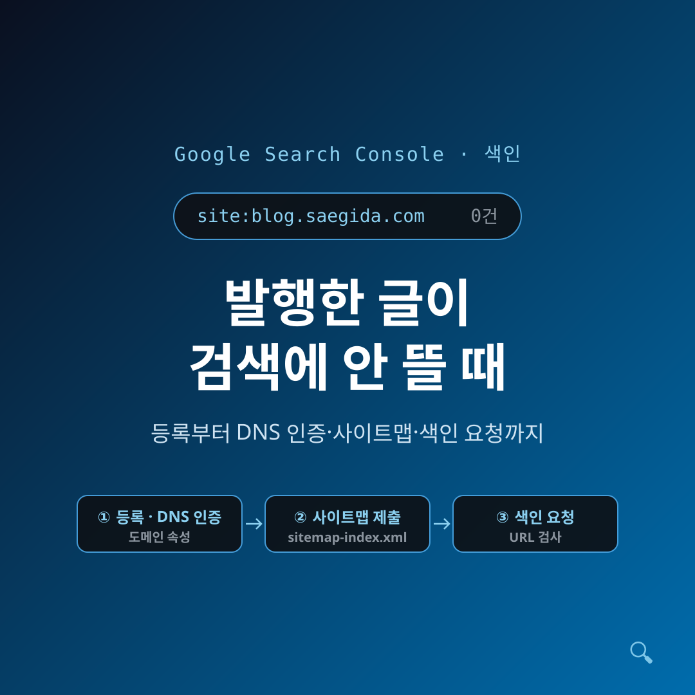
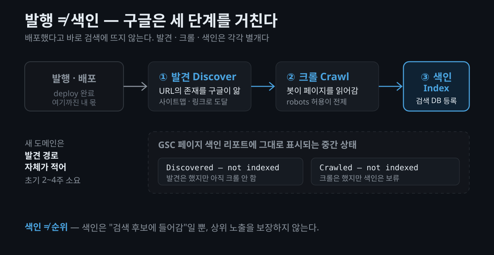
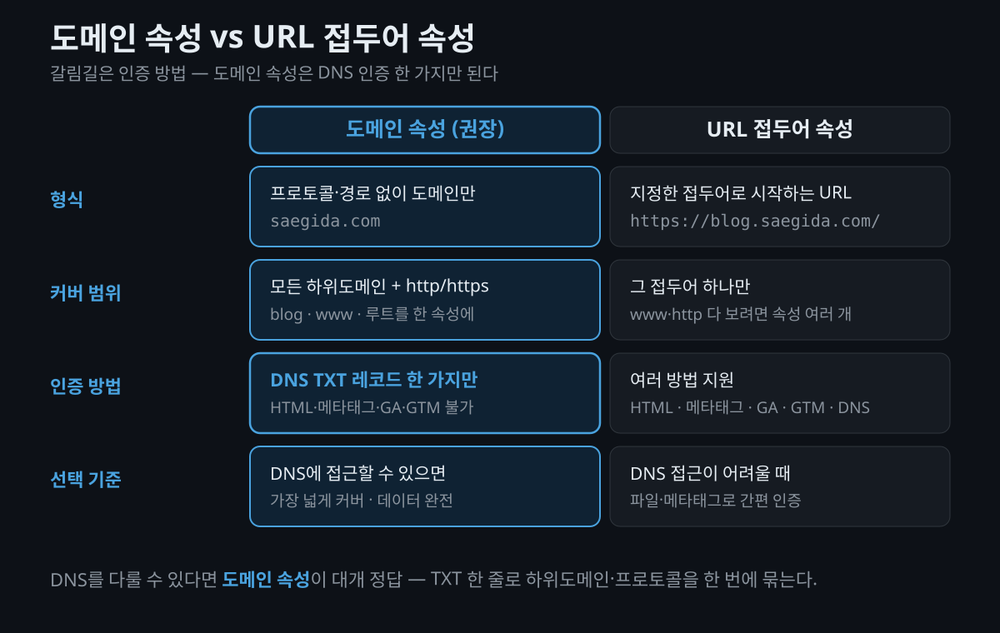

글을 열심히 써서 발행했는데, 정작 구글에 그 글 제목을 검색하면 아무것도 안 나옵니다. 저도 그랬습니다. `site:blog.saegida.com` 으로 검색해 봤더니 결과가 **0건**이었죠. 이 글은 그때 제가 한 일 — **Google Search Console(구글 서치 콘솔, 이하 GSC) 등록**부터 사이트맵 제출과 색인 요청까지 — 을, "왜 이 선택을 하는가"까지 곁들여 정리한 기록입니다. 저처럼 새 도메인에 정적 블로그(Astro, GitHub Pages 등)를 막 올린 분이라면 그대로 따라 하실 수 있습니다.

## 발행했는데 왜 구글에 안 뜰까요?

가장 먼저 깨야 할 오해가 있습니다. **배포(deploy)했다고 구글 검색에 자동으로 뜨는 게 아닙니다.** 검색 결과에 나오려면 구글이 세 단계를 거쳐야 합니다.

1. **발견(Discover)** — 그런 URL이 있다는 걸 구글이 알게 되는 단계
2. **크롤(Crawl)** — 구글 봇이 실제로 그 페이지를 읽어가는 단계
3. **색인(Index)** — 읽은 내용을 검색 데이터베이스에 등록하는 단계

이 셋은 각각 별개입니다. 실제로 GSC의 페이지 색인 리포트를 보면 "Discovered – currently not indexed"(발견은 했지만 아직 크롤 안 함), "Crawled – currently not indexed"(크롤은 했지만 색인은 안 하기로 함) 같은 **중간 상태**가 그대로 표시됩니다. ([Google 공식 — Page indexing report](https://support.google.com/webmasters/answer/7440203?hl=en))

문제는 **새 도메인**이라는 데 있습니다. 아무도 링크하지 않는 신생 도메인은 구글이 "발견"할 경로 자체가 거의 없습니다. 그래서 브랜드 신규 사이트는 초기 색인까지 통상 **2~4주**가 걸리기도 합니다. 반대로 이미 권위 있는 사이트의 새 글은 24~72시간 안에 색인되기도 하죠. ([Alev Digital — Request Indexing 정리](https://alevdigital.com/blog/google-search-console-request-indexing/))

### "SEO를 뭔가 잘못한 걸까?" — 아니었습니다

여기서 제가 처음 한 실수는 방향을 잘못 잡은 것이었습니다. "설정을 뭘 빠뜨렸나" 하고 robots.txt부터 뒤지기 시작했거든요. 그런데 하나씩 확인해 보니 **기술적 SEO는 이미 다 정상**이었습니다.

- `robots.txt` 가 `User-agent: *` + `Allow: /` 로 크롤을 허용하고, 사이트맵 위치도 명시돼 있었습니다. (AstroPaper는 이 파일을 `src/pages/robots.txt.ts`로 자동 생성합니다.)
- `sitemap-index.xml` 이 정상 존재하고, 페이지에 `noindex` 도 없고, canonical(대표 URL 지정)도 자기 자신을 잘 가리키고 있었습니다.

즉, **설정 문제가 아니라 "새 도메인이라 아직 구글이 안 왔다"** 가 원인이었습니다. 이게 이 글의 핵심입니다. 필요한 건 SEO 재설정이 아니라, **구글에게 "여기 사이트가 있어요" 하고 존재를 알리는 것** — 그게 바로 GSC 등록입니다.

> **유의사항** — 반대로 robots.txt가 크롤을 막고 있거나 페이지에 `noindex`가 붙어 있으면, GSC에 아무리 색인을 요청해도 색인되지 않습니다. GSC 등록은 "크롤 가능한 상태"가 전제일 때만 의미가 있습니다. 다행히 AstroPaper는 이 셋(robots.txt, 사이트맵, canonical)을 기본 제공해서, 제 경우는 "설정이 아니라 시간이 문제"인 케이스였습니다.

## 도메인 속성 vs URL 접두어, 뭘 골라야 할까요?

GSC에서 속성(Property)을 추가하면 두 가지 유형 중에 고르라고 나옵니다. 여기서 잠깐 멈춰서 "왜 이걸 고르는가"를 짚고 갈 필요가 있습니다.

- **도메인 속성(Domain property)**: 프로토콜(http/https)과 경로 없이 **도메인만**으로 정의합니다. 이 하나로 **모든 하위도메인 + http/https 전부**를 커버합니다. 예를 들어 `saegida.com` 하나면 `blog.saegida.com`, `www.saegida.com`, http/https가 전부 한 속성에 들어옵니다. ([Google 공식 — Domain property](https://support.google.com/webmasters/answer/10431861?hl=en))
- **URL 접두어 속성(URL prefix property)**: 프로토콜을 포함해 **지정한 접두어로 시작하는 URL만** 추적합니다. www와 non-www, http와 https를 다 보려면 속성을 여러 개 만들어야 하죠.

### 핵심은 인증 방법이 다르다는 점

두 유형은 **소유권 인증 방법**이 다릅니다. 이게 선택의 실질적인 갈림길입니다.

- **도메인 속성 → DNS 레코드 인증만 가능합니다.** 도메인 레벨 소유권은 DNS TXT 레코드 한 가지 방법으로만 검증됩니다. HTML 파일 업로드, `<head>` 메타태그, Google Analytics, Google Tag Manager 방식은 **도메인 속성에는 쓸 수 없습니다.** ([Google 공식 — Verify your site ownership](https://support.google.com/webmasters/answer/9008080?hl=en))
- **URL 접두어 속성 → 여러 방법 지원**: HTML 파일, 메타태그, GA, GTM, DNS까지 다양하게 됩니다.

정리하면 이렇습니다. **DNS에 접근할 수 있으면 대부분 도메인 속성이 권장됩니다.** 가장 넓게 커버하고 데이터도 완전하니까요. 저는 도메인 DNS가 마침 Cloudflare에 있었고, GitHub Pages + Cloudflare 조합에서는 blog 하위도메인과 루트 도메인, 프로토콜을 한 번에 묶는 게 자연스러워서 **도메인 속성(`saegida.com`)** 을 골랐습니다.

## DNS TXT 인증은 어떻게 하나요?

도메인 속성을 고르면 GSC가 **고유한 TXT 검증 문자열**을 하나 줍니다. `google-site-verification=XXXXXXXX...` 형태죠. (실제 값은 계정마다 다르고, 공개하면 안 되는 값이라 여기서는 `google-site-verification=<YOUR_TOKEN>` 로 표기하겠습니다.) 이 값을 도메인의 DNS에 TXT 레코드로 한 줄 추가하면 됩니다.

DNS가 Cloudflare에 있는 경우, 절차는 이렇습니다.

1. Cloudflare 로그인 → 대상 사이트 선택 → 상단 **DNS** 메뉴로 들어갑니다. A/MX/TXT 등 기존 레코드 목록이 보입니다.
2. **레코드 추가** → 타입을 기본 A가 아니라 **TXT**로 바꿉니다.
3. **Name(이름)** 에는 루트면 `@`, **Content(내용)** 에는 GSC가 준 값(`google-site-verification=<YOUR_TOKEN>`)을 붙여넣고, **TTL은 Automatic**으로 둡니다.
4. 저장한 뒤 GSC로 돌아와 **[확인 / Verify]** 를 누릅니다.

([Google 공식 — 인증 절차](https://support.google.com/webmasters/answer/9008080?hl=en) / [Cloudflare TXT 추가 예시](https://bertey.com/verifying-a-google-search-console-domain-property-with-cloudflare/))

저는 DNS가 Cloudflare에 있어서 **TXT 한 줄 추가로 인증이 끝났습니다.** 참고로 이 블로그는 Cloudflare 프록시가 꺼진 DNS-only(회색 구름) 상태인데, TXT 인증 자체는 프록시 여부와 무관하게 동작합니다.

> **유의사항** — DNS 전파에는 시간이 걸릴 수 있습니다. 공식 문서는 최대 **2~3일**까지 걸릴 수 있다고 안내하지만, 실제로는 수 분~수십 분인 경우가 많습니다. 확인이 안 되면 잠시 뒤 다시 시도하면 됩니다. 그리고 이 **TXT 레코드는 지우면 안 됩니다.** 구글이 주기적으로 존재를 재확인하기 때문에, 삭제하면 인증이 풀립니다.

## 사이트맵 제출과 색인 요청은 어떻게 하나요?

인증이 끝났으면 이제 두 가지를 합니다.

### 1. 사이트맵 제출

GSC 좌측 메뉴의 **Sitemaps(사이트맵)** 에서 사이트맵 URL을 넣어 제출합니다. 저는 `https://blog.saegida.com/sitemap-index.xml` 을 제출했습니다. AstroPaper가 자동 생성해 주는 파일이라 별도로 만들 필요는 없었습니다. 여기서 구글 봇이 사이트맵에 언제 접근했는지, 처리 오류는 없는지 모니터링할 수 있습니다.

다만 중요한 사실 하나. **사이트맵 제출은 "힌트"일 뿐 보장이 아닙니다.** 공식 문구를 그대로 옮기면 이렇습니다.

> "submitting a sitemap is merely a hint: it doesn't guarantee that Google will download the sitemap or use the sitemap for crawling URLs on the site."
> (사이트맵 제출은 단지 힌트일 뿐, 구글이 그것을 내려받거나 크롤에 사용한다고 보장하지 않는다.)

([Google 공식 — Build and submit a sitemap](https://developers.google.com/search/docs/crawling-indexing/sitemaps/build-sitemap))

### 2. URL 검사 → 색인 생성 요청

새로 올린 홈과 글 몇 개는 **URL 검사(URL Inspection)** 도구에 URL을 넣어 상태를 확인하고, **[색인 생성 요청 / Request indexing]** 버튼으로 크롤·색인을 요청할 수 있습니다. 저는 홈과 글 2개, 이렇게 소수 URL에만 눌렀습니다.

이것도 보장은 아닙니다. 공식 문구는 이렇습니다.

> "Submitting a request does not guarantee that the page will appear in the Google Index."
> (요청을 제출한다고 해당 페이지가 구글 색인에 나타난다고 보장하지 않는다.)

([Google 공식 — URL Inspection tool](https://support.google.com/webmasters/answer/9012289?hl=en))

> **유의사항** — 색인 요청에는 **일일 한도**가 있습니다. 정확한 수치는 구글이 공개하지 않지만, 관찰상 **하루 10여 개 URL** 수준으로 알려져 있습니다. 그리고 **여러 번 눌러도 빨라지지 않습니다** — 이미 대기열에 들어간 URL을 다시 요청해도 순서가 앞당겨지지 않습니다. 그래서 개별 색인 요청은 홈과 새 글 몇 개 같은 **소수 URL에만** 쓰고, 나머지 대량 페이지는 사이트맵에 맡기는 게 맞습니다.

(곁가지로, 저는 루트 `saegida.com` 과 `www` 를 `blog.saegida.com` 으로 301 리다이렉트해서 신호를 한곳으로 모았습니다.)

## 얼마나 기다려야 하고, 뭘 기대할 수 있을까요?

여기가 가장 정직하게 말해야 하는 부분입니다. 등록하고 요청까지 다 눌러도 **바로 뜨지는 않습니다.**

- **색인은 즉시가 아닙니다.** URL 검사 도구 자체가 *"Indexing can take up to a week or two"*(색인은 1~2주가 걸릴 수 있음), *"can take much longer in some cases"*(경우에 따라 훨씬 오래 걸릴 수 있음) 라고 안내합니다. 신규 도메인은 초기 색인에 **2~4주**가 걸리는 경우가 흔합니다. ([URL Inspection tool](https://support.google.com/webmasters/answer/9012289?hl=en) / [Alev Digital](https://alevdigital.com/blog/google-search-console-request-indexing/))
- **크롤 ≠ 색인.** 구글이 크롤하고도 색인하지 않기로 할 수 있습니다("Crawled – currently not indexed"). 얇거나 중복된 콘텐츠는 제외될 수 있습니다.
- **색인 ≠ 순위.** 색인됐다는 건 "검색 후보에 들어갔다"는 뜻일 뿐, 상위에 뜬다는 보장은 아닙니다. 순위는 또 별개의 문제입니다.

그러니 조급해할 필요가 없습니다. 할 수 있는 정당한 일 — 사이트맵 제출, 소수 URL 색인 요청, 새 글을 사이트 안에서 잘 링크해 두기, 전반적인 글 품질 유지 — 을 해두고 기다리면 됩니다.

### 모니터링은 이렇게

- **페이지 색인 리포트(Page indexing)**: 색인됨/제외됨과 그 사유(Discovered·Crawled not indexed, redirect, duplicate 등)를 확인합니다.
- **`site:도메인` 검색**: 0건이면 아직 미색인, 결과가 뜨기 시작하면 색인이 진행 중이라는 간이 신호입니다. 며칠 간격으로 가볍게 확인하면 충분합니다.

(선택 사항으로, Bing Webmaster Tools는 **GSC에서 검증된 사이트를 그대로 가져오기(Import)** 할 수 있어서, 재인증 없이 5분이면 Bing 쪽도 등록됩니다.)

## 마무리하며

발행은 색인이 아닙니다. 새 도메인의 글이 검색에 안 뜨는 건 대개 SEO를 잘못해서가 아니라, 구글이 아직 그 존재를 모르기 때문입니다. GSC는 그 존재를 알리고, 상태를 눈으로 보게 해주고, 색인을 조금 앞당겨 주는 창구일 뿐 — **색인을 보장하는 버튼은 어디에도 없습니다.**

새로 만든 정적 블로그가 검색에 안 보인다면, robots.txt와 사이트맵부터 뒤지기 전에 `site:도메인` 으로 색인 여부부터 확인해 보시길 권합니다. 0건이면 설정을 의심하기보다, 도메인 속성으로 GSC에 등록하고 사이트맵을 낸 뒤 차분히 기다리는 편이 대개 정답입니다.

#GoogleSearchConsole #GSC #구글SEO #색인 #사이트맵 #DNS인증 #Cloudflare #Astro #GitHubPages #정적사이트 #기술블로그 #블로그SEO

## 참고 자료 (공식 출처)

- [Domain property · Google Search Console Help](https://support.google.com/webmasters/answer/10431861?hl=en) — 도메인 속성 정의·하위도메인 커버
- [Verify your site ownership · Google Search Console Help](https://support.google.com/webmasters/answer/9008080?hl=en) — 인증 방법, 도메인 속성=DNS, TXT 절차·전파 시간
- [URL Inspection tool · Google Search Console Help](https://support.google.com/webmasters/answer/9012289?hl=en) — 색인 요청 동작·한도·보장 없음·소요 시간 공식 문구
- [Page indexing report · Google Search Console Help](https://support.google.com/webmasters/answer/7440203?hl=en) — Discovered/Crawled not indexed, 모니터링
- [Build and submit a sitemap · Google Search Central](https://developers.google.com/search/docs/crawling-indexing/sitemaps/build-sitemap) — 사이트맵 제출, "merely a hint" 문구
- [Google Says GSC Sitemap Uploads Don't Guarantee Immediate Crawls · Search Engine Journal](https://www.searchenginejournal.com/google-says-gsc-sitemap-uploads-dont-guarantee-immediate-crawls/554747/) — 재크롤 보장·시점 없음
- [Request Indexing: Limits, Time, Steps & Fixes (2026) · Alev Digital](https://alevdigital.com/blog/google-search-console-request-indexing/) — 신규 도메인 2~4주, 일일 한도 관찰치
- [Verifying a Google Search Console Domain Property with Cloudflare · Bertey](https://bertey.com/verifying-a-google-search-console-domain-property-with-cloudflare/) — Cloudflare TXT 추가 단계
