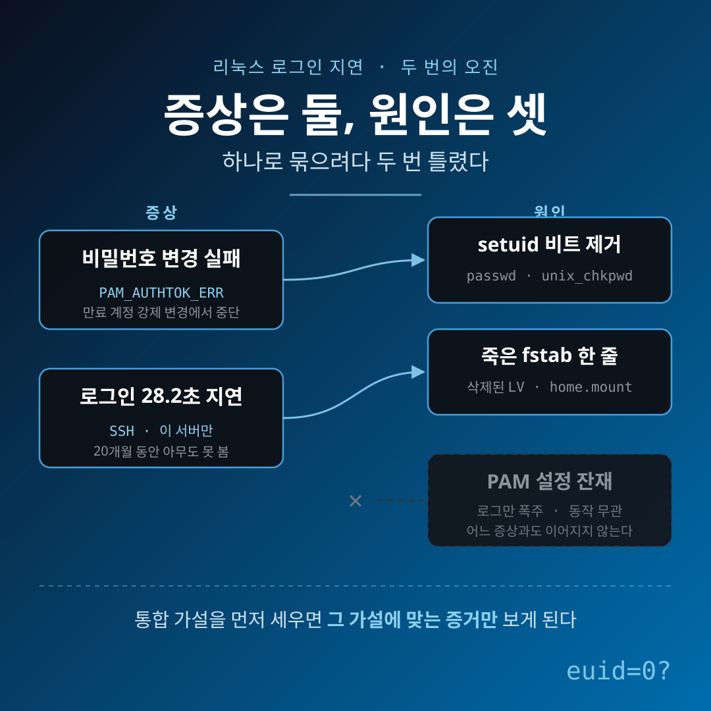
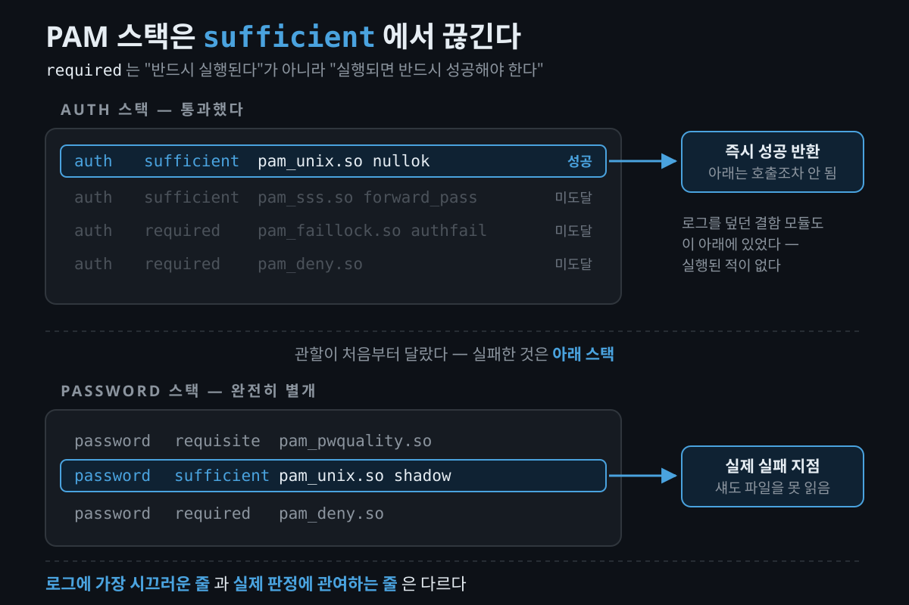
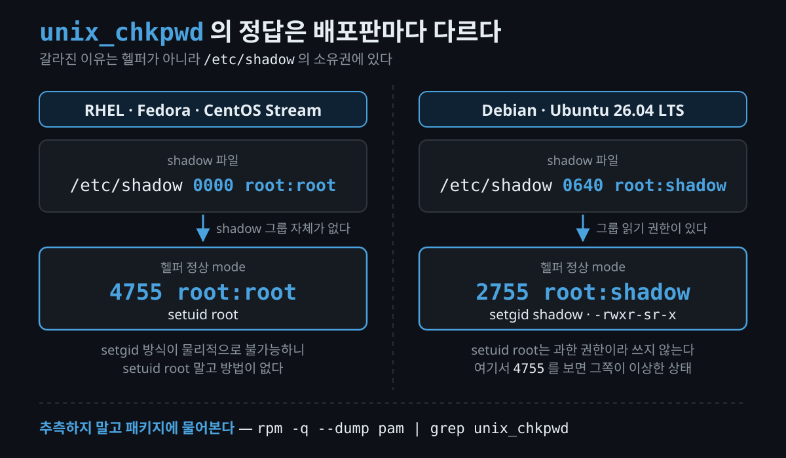
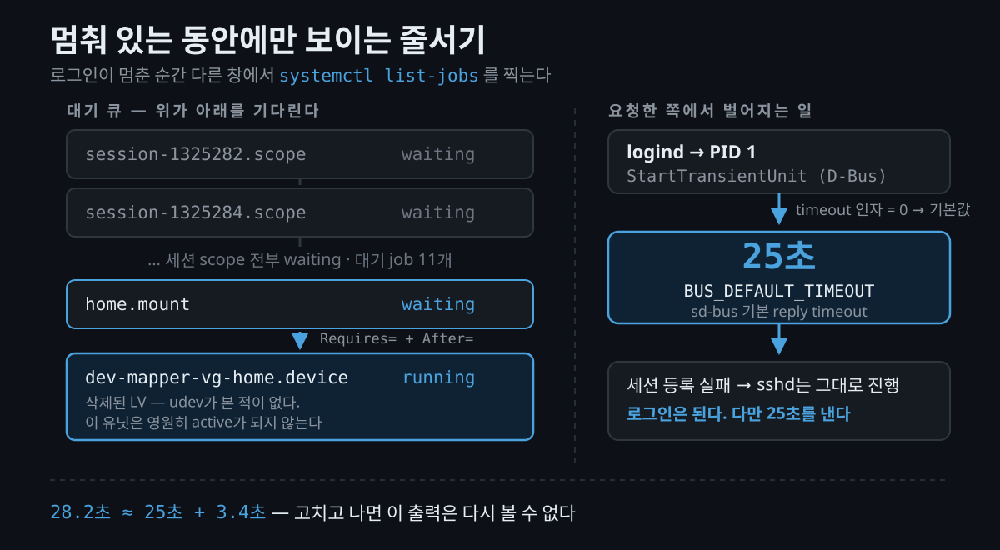
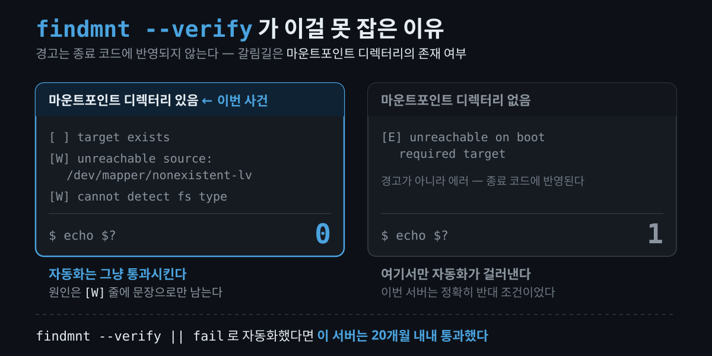
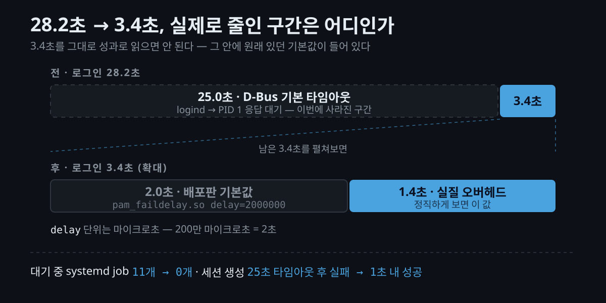

운영 서버 한 대에서 두 가지가 동시에 이상했습니다. 만료된 계정의 비밀번호를 바꿀 수 없었고, **리눅스 로그인 지연**이 있었습니다. SSH 접속에 28.2초가 걸렸습니다.

증상 두 개를 원인 하나로 묶으려다 두 번 틀렸습니다. 실제 원인은 셋이었습니다.

이 글은 무엇을 고쳤는지보다 진단 순서를 정리한 기록입니다. `Authentication token manipulation error` 를 만나본 적이 있거나, 원인 모를 로그인 지연을 안고 있다면 참고하실 수 있습니다.



## `Authentication token manipulation error` 는 무엇을 말해주나?

이 메시지의 정보량은 사실상 0입니다.

```
Changing password for user <user>.
Current password:
passwd: Authentication token manipulation error
```

`PAM_AUTHTOK_ERR` 라는 반환값을 사람이 읽는 문장으로 바꾼 것뿐입니다. "비밀번호 변경 단계가 실패했다"는 뜻이고, 왜 실패했는지는 말하지 않습니다.

같은 값을 내는 경로도 여러 개입니다. `pam_unix` 안에서만 변경 최소 간격 미달, 새 비밀번호 정책 위반, 재사용, 그리고 **섀도 파일을 읽지 못하는 경우**가 전부 같은 문장을 냅니다. 문구가 같다고 원인이 같지 않습니다.

첫 가설은 전형적인 것이었습니다. 만료됐는데 변경도 거부되면 보통 aging 교착입니다. 변경 최소 간격이 최대 간격보다 크게 잡힌 경우죠. 아니었습니다.

```bash
chage -l <user>               # 최소 1일 / 최대 90일 — 교착 조건 아님
lsattr /etc/shadow            # 불변 속성 없음
mount | grep ' / '            # 읽기전용 아님
faillock --user <user>        # 잠금 카운터 없음
```

여기까지가 배제 단계입니다. 전부 통과하면 다음 단계가 진단의 본체가 됩니다.

> **유의사항** — 진단 중에 만료를 먼저 풀어버린 것은 순서를 잘못 잡은 선택이었습니다. 접속은 즉시 복구됐지만, 만료 상태 자체가 재현 조건이었습니다. 그것을 없애자 이후 검증이 한 단계 번거로워졌습니다.

## 로그에서 가장 시끄러운 줄이 왜 범인이 아니었나?

인증 로그에는 매 로그인마다 같은 줄이 찍혀 있었습니다. 구버전 배포판의 계정 잠금 모듈이 설정 파일에만 남아 `dlopen` 이 실패하고 있었습니다. 흔한 마이그레이션 잔재입니다.

로그를 덮고 있으니 범인처럼 보였습니다. 그런데 **그 줄은 실행조차 되지 않았습니다.**

이유는 두 가지입니다. 첫째, 위치입니다. 문제의 줄은 `auth sufficient pam_unix.so` 뒤에 있었습니다. [`pam.conf(5)`](https://man7.org/linux/man-pages/man5/pam.conf.5.html) 는 `sufficient` 모듈이 성공하면 "스택의 이후 모듈을 호출하지 않고" 성공을 반환한다고 정의합니다. 정리하면 `required` 는 "반드시 실행된다"가 아니라 "실행되면 반드시 성공해야 한다"는 뜻입니다.

둘째, 관할이 달랐습니다. 그 줄은 `auth` 스택에 있었고, 실패한 것은 `password` 스택이었습니다. 둘은 물리적으로 나뉘어 있습니다.

```
auth      sufficient  pam_unix.so nullok               ← 여기서 성공하면
auth      required    pam_faildelay.so delay=2000000   ← 아래는 전부 미도달
auth      required    pam_deny.so

password  requisite   pam_pwquality.so
password  sufficient  pam_unix.so shadow use_authtok   ← 실패한 건 이 스택
```



결정적 증거는 로그 전체에서 딱 한 줄이었습니다.

```
passwd[...]: pam_unix(passwd:chauthtok): authentication failure; logname=<user> uid=1002 euid=1002
```

`passwd` 는 setuid root로 설치되므로 `euid` 는 0이어야 합니다. **0이 아니라는 것은 setuid 비트가 없다는 뜻**이고, 그러면 섀도 파일을 읽는 경로가 통째로 막힙니다.

## setuid 정상값은 배포판마다 다릅니다

당시 메모에 "`unix_chkpwd` 는 `4755` 여야 한다"고 적어뒀는데, 이건 RHEL 계열에서만 참입니다.

| 배포판 | `/usr/sbin/unix_chkpwd` 정상 mode |
|---|---|
| Fedora / RHEL 9·10 / CentOS Stream | `4755 root:root` (setuid root) |
| Ubuntu 26.04 LTS / Debian | `2755 root:shadow` (setgid shadow) |

갈라진 원인은 헬퍼가 아니라 `/etc/shadow` 의 소유권입니다. RHEL 계열은 `/etc/shadow` 를 [`%attr(0000,root,root)`](https://src.fedoraproject.org/rpms/setup/raw/rawhide/f/setup.spec) 로 배포하고 `shadow` 그룹 자체가 없습니다. setgid 방식이 불가능하니 setuid root 말고 방법이 없습니다. Debian 계열은 `0640 root:shadow` 라 setgid shadow만으로 읽기 권한이 나옵니다. [`unix_chkpwd(8)`](https://www.man7.org/linux/man-pages/man8/unix_chkpwd.8.html) 도 "typically installed setuid root or setgid shadow" 두 가지만 병기합니다.



애초에 Linux-PAM 업스트림은 이 헬퍼에 특수 비트를 걸지 않습니다. **특수 비트는 배포판 패키징 결정**이라는 뜻입니다. 그러니 추측하지 말고 패키지에 물어봅니다.

```bash
ls -l /usr/bin/passwd /usr/sbin/unix_chkpwd   # s 가 소유자 자리인지 그룹 자리인지
rpm -q --dump pam | grep unix_chkpwd          # 5번째 필드가 mode
rpm -V passwd shadow-utils pam                # .M....... 이 mode 변조
```

복구는 패키지 단위 일괄로 하지 않았습니다. `rpm -Va` 가 뱉은 mode 드리프트 25건에 고장과 의도된 하드닝이 섞여 있었기 때문입니다. `/etc/cron.*` 의 권한 축소는 CIS 벤치마크가 요구한 것인데 `.M.......` 로 똑같이 잡힙니다. CIS 자신이 `rpm -Va` 를 쓰는 6.1.14 항목에서 "이 벤치마크의 권고들이 감사 대상 파일의 상태를 바꾼다"고 경고합니다. 그래서 `/etc` 를 제외하고 파일 단위로, 기대 mode를 패키지 메타데이터에서 뽑아 `chmod` 명령을 생성만 한 뒤 사람이 검토했습니다.

덧붙이면 CIS는 setuid 비트를 걷으라고 하지 않습니다. 6.1.13은 제목부터 "SUID/SGID 파일을 검토하라"이고 목록만 만듭니다. 실제로 걷는 것은 [Kicksecure의 SUID Disabler](https://www.kicksecure.com/wiki/SUID_Disabler_and_Permission_Hardener) 같은 별도 하드닝 도구입니다. 화이트리스트에 없는 바이너리에서 setuid를 제거하고, 대상에 `passwd` 와 `unix_chkpwd` 가 들어 있습니다. 이번 서버의 증상과 같은 모양입니다.

## 증상이 둘이면 원인도 하나일까?

앞의 두 오진은 같은 상위 가설 위에 서 있었습니다. "증상은 둘이지만 원인은 하나일 것이다."

시나리오도 그럴듯했습니다. 계정 조회가 도달 불가한 원격 디렉터리 서버를 물고 있으면 조회마다 타임아웃이 나서 로그인이 느려지고, 인증 스택도 실패합니다. 하나로 묶으면 설명이 깔끔하고 조치도 한 번에 끝납니다.

실제로는 완전히 무관한 두 원인이었습니다. 하나는 실행 파일 권한, 하나는 마운트 설정입니다.

**우아함은 증거가 아닙니다.** 증거를 따로 모으기 전에 통합 가설을 세우면 그 가설에 맞는 증거만 찾게 됩니다. 가설을 버리고 증상별로 증거를 모으자 둘 다 30분 안에 풀렸습니다.

곁다리로 하나 더 틀렸습니다. 세션 카운터가 132만까지 올라가 있어 누수를 의심했는데, 분당 1.5개씩 20개월 쌓인 숫자였습니다. 누적값은 가동 시간으로 나눠봐야 합니다.

## 리눅스 로그인 지연 — 멈춘 동안에만 볼 수 있는 증거

로그인 지연을 별건으로 분리하고 나서 쓴 도구가 이번 진단의 핵심입니다. 창을 두 개 띄우고, 한쪽에서 로그인이 멈춰 있는 동안 다른 쪽에서 찍습니다.

```bash
systemctl list-jobs
```

출력이 원인을 그대로 말해줬습니다.

```
     JOB UNIT                          TYPE  STATE
20340352 home.mount                    start waiting
20340353 dev-mapper-<vg>\x2dhome.device start running   ← 장치가 나타나지 않음
20340410 session-1325282.scope         start waiting
20340598 session-1325284.scope         start waiting
```

발단은 서버 구축 당일이었습니다. 논리 볼륨 하나를 삭제해 상위 파일시스템 용량을 늘렸는데, `/etc/fstab` 의 `/home` 줄은 정리하지 않았습니다. 데이터는 상위 파일시스템에 그대로 있었으니 아무도 이상을 느끼지 못했습니다.

그 뒤로는 systemd의 정상 동작입니다. [`systemd.mount(5)`](https://github.com/systemd/systemd/blob/main/man/systemd.mount.xml) 는 블록 장치 기반 파일시스템이 장치 유닛에 `Requires=` 와 `After=` 의존성을 자동으로 얻는다고 설명합니다. 삭제된 볼륨을 가리키는 `.device` 유닛은 udev가 그 장치를 본 적이 없으니 영원히 active가 되지 않습니다. `home.mount` 는 `waiting` 에서 빠져나오지 못하고, 세션 scope들이 그 뒤에 줄을 섭니다.

세션 scope 생성이 큐에 걸리면 요청한 쪽이 타임아웃을 냅니다. 정확히는 **logind가 PID 1에 `StartTransientUnit` 을 호출하는 D-Bus 요청**입니다. logind는 timeout 인자를 `0` 으로 넘기고, 그러면 sd-bus 기본값이 적용됩니다.

```c
/* src/libsystemd/sd-bus/bus-internal.h */
/* For method calls we timeout at 25s, like in the D-Bus reference implementation */
#define BUS_DEFAULT_TIMEOUT ((usec_t) (25 * USEC_PER_SEC))
```

D-Bus 레퍼런스 구현의 기본 reply timeout입니다. 유닛 타임아웃 기본값(`DefaultTimeoutStartSec`, 90초)과는 무관합니다. 25초가 지나면 세션 등록이 실패하고, SSH 데몬은 세션 등록 없이 로그인을 진행시킵니다. 28.2초 ≈ 25초 + 실제 로그인 3.4초라는 산수가 여기서 맞아떨어집니다.



수정은 fstab 한 줄을 걷어내는 것으로 끝났습니다. 왜 지웠는지를 같은 줄에 남깁니다.

```bash
cp -a /etc/fstab /root/fstab.bak.$(date +%F)
sed -i '/^\/dev\/mapper\/<vg>-home/s|^|# removed: LV deleted <날짜>, /home is on root LV — |' /etc/fstab
systemctl daemon-reload
```

이 상태는 20개월 잠복했습니다. 구축 체크리스트에 `findmnt --verify` 가 있었다면 당일에 잡혔을까요. 절반만 맞습니다. util-linux 소스 주석은 "도달 불가한 소스를 에러로 해석해서는 안 되고, 예외는 `NAME=value` 뿐"이라고 설계 의도를 밝힙니다. `/dev/mapper/...` 같은 직접 경로가 없으면 경고에 그치고, 경고는 종료 코드에 반영되지 않습니다.

```
$ findmnt --verify --verbose --tab-file fstab.test
0 parse errors, 0 errors, 2 warnings
   [W] unreachable source: /dev/mapper/nonexistent-lv: No such file or directory
$ echo $?
0
```

마운트포인트 디렉터리가 없을 때만 에러가 뜨고 종료 코드가 1이 됩니다. 이번은 정확히 반대 조건이었습니다. `/home` 은 상위 파일시스템 위의 디렉터리로 멀쩡히 존재했습니다. **`findmnt --verify || fail` 로 자동화했다면 이 서버는 그냥 통과했습니다.**



> **유의사항** — fstab이나 PAM을 편집할 때는 현재 root 세션을 열어둔 채 새 창에서 검증합니다. 로그인·권한 상승·비밀번호 변경 셋을 확인하고, 깨졌으면 열려 있는 세션으로 되돌립니다. PAM 편집 실수는 전 계정 락아웃이고, fstab 편집 실수는 부팅 실패입니다.

## 결과 — 원인은 셋이었습니다

| 증상 | 원인 |
|---|---|
| 비밀번호 변경 실패 | 비밀번호 관련 실행 파일의 setuid 비트 제거. 섀도 파일을 읽지 못함 |
| 로그인 28초 지연 | 삭제된 논리 볼륨을 가리키는 fstab 한 줄. 세션 생성 job이 그 뒤에 큐 대기 |
| 로그 폭주 | 구버전 계정 잠금 모듈 설정 잔재. 동작에는 무관 |

| 항목 | 전 | 후 |
|---|---|---|
| 로그인 시간 | 28.2초 | 3.4초 |
| 대기 중 systemd job | 11개 | 0개 |
| 세션 슬롯 못 받은 유령 세션 | 8개 | 0개 |

3.4초를 그대로 성과로 읽으면 안 됩니다. 이 중 2초는 원래 있던 배포판 기본값입니다. RHEL 기본 PAM 스택의 `pam_faildelay.so delay=2000000` 인데, [`delay` 는 마이크로초 단위](https://man7.org/linux/man-pages/man8/pam_faildelay.8.html)라 2초입니다. 실질 오버헤드는 **1.4초**로 보는 게 정직합니다.



아직 모르는 것도 남았습니다. setuid를 걷어낸 하드닝 스크립트의 출처를 찾지 못했습니다. 재실행되면 그대로 재발합니다. 남은 권한 복구는 순서가 문제입니다. 권한을 되돌리면 지금 실패 루프에 빠져 있는 진단 데몬이 되살아나면서, 별건인 감사 로그 폭주와 맞물릴 수 있습니다. 최소 변경 간격 1일을 정책상 유지할지도 검토 중입니다.

## 마무리하며

이번에 버린 휴리스틱은 두 개입니다. "증상이 둘이면 원인도 하나"와 "로그에 가장 많이 찍히는 것이 원인". 둘 다 진단을 빠르게 만들어주는 것처럼 보이지만, 이번에는 반대 방향으로 끌고 갔습니다.

증거를 따로 모으기 전에 세운 통합 가설은, 그 가설에 맞는 증거만 보게 만듭니다.

작게 시작할 지점 하나만 남겨둡니다. 운영 중인 서버에서 `findmnt --verify --verbose` 를 한 번 돌리고, 종료 코드가 아니라 `[W]` 줄까지 눈으로 읽어보는 것입니다. 20개월짜리 잠복은 대개 그렇게 조용히 통과합니다.

## 참고 자료 (공식 출처)

- [`pam.conf(5)` man page](https://man7.org/linux/man-pages/man5/pam.conf.5.html) — `required` / `sufficient` control flag 정의
- [`unix_chkpwd(8)` man page](https://www.man7.org/linux/man-pages/man8/unix_chkpwd.8.html) — "typically installed setuid root or setgid shadow"
- [Fedora `setup.spec`](https://src.fedoraproject.org/rpms/setup/raw/rawhide/f/setup.spec) — `/etc/shadow` 를 `%attr(0000,root,root)` 로 배포
- [systemd `bus-internal.h`](https://github.com/systemd/systemd/blob/main/src/libsystemd/sd-bus/bus-internal.h) — `BUS_DEFAULT_TIMEOUT` 25초
- [`systemd.mount(5)`](https://github.com/systemd/systemd/blob/main/man/systemd.mount.xml) — Implicit Dependencies, `nofail`
- [util-linux `findmnt-verify.c`](https://github.com/util-linux/util-linux/blob/master/misc-utils/findmnt-verify.c) — unreachable source를 경고로 처리하는 설계
- [`pam_faildelay(8)` man page](https://man7.org/linux/man-pages/man8/pam_faildelay.8.html) — `delay=` 는 마이크로초 단위
- [Kicksecure SUID Disabler and Permission Hardener](https://www.kicksecure.com/wiki/SUID_Disabler_and_Permission_Hardener) — `passwd`/`unix_chkpwd` setuid 제거

#리눅스 #PAM #systemd #setuid #fstab #로그인지연 #장애진단 #서버운영 #unix_chkpwd #트러블슈팅
