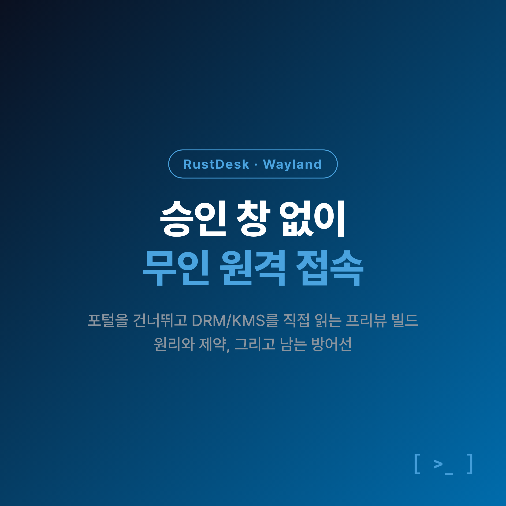
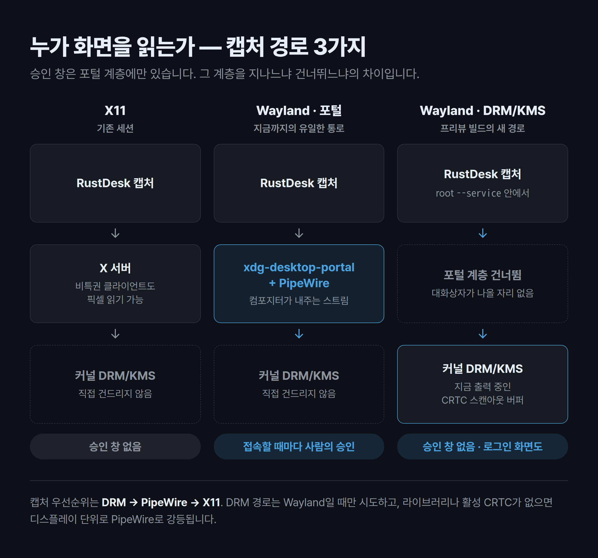
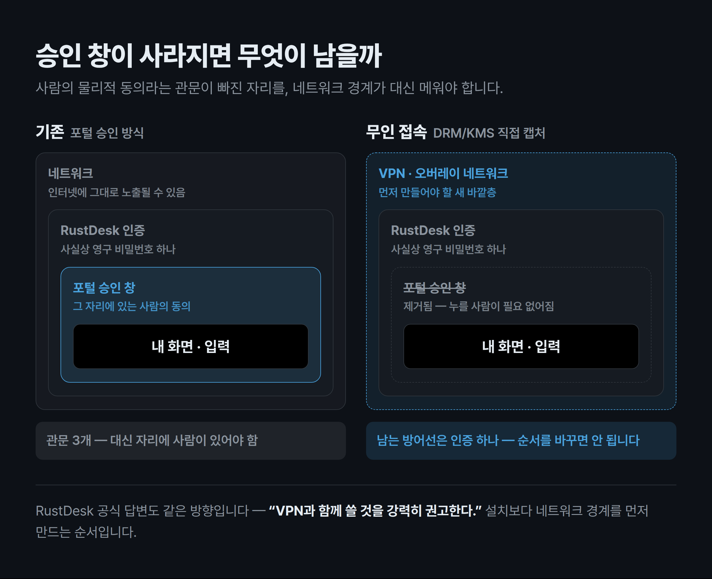

원격 접속을 하는 이유는 대부분 하나입니다. **내가 그 자리에 없어서.**

그런데 Ubuntu 데스크탑을 Wayland 세션으로 쓰면서 RustDesk로 접속할 때마다, 저는 정확히 반대 상황에 놓였습니다. 휴대폰으로 데스크탑에 연결을 걸면 데스크탑 화면에 '어떤 화면을 공유할까요?' 하는 승인 창이 뜨고, 그걸 누를 때까지 화면이 오지 않습니다. 누가 눌러야 할까요. 그 자리에 있는 사람이 눌러야 합니다. 급할 때는 데스크탑에 상주시켜 둔 AI 에이전트에게 "화면 공유 버튼 좀 눌러줘"라고 부탁하는, 스스로도 우스운 우회책까지 썼습니다.

**'원격 접속을 하려면 그 자리에 사람이 있어야 한다'** — 이 모순이 이 글을 관통하는 문제입니다. 2026년 8월 14일, RustDesk가 [공식 블로그](https://rustdesk.com/blog/unattended-remote-access-wayland/)를 통해 이 모순을 걷어낸 **Wayland 무인 원격 접속(Unattended Remote Access)** 프리뷰 빌드를 공개했습니다. 이 글에서는 왜 이 모순이 생겼는지, RustDesk가 어떤 방식으로 우회했는지, 그리고 **정식 릴리스가 아닌 프리뷰를 지금 깔아도 되는지**를 순서대로 짚어보겠습니다. 리눅스 데스크탑을 원격으로 쓰는 분이라면 마지막 보안 섹션까지 함께 보시길 권합니다.



## 나만 겪는 문제였을까?

아닙니다. RustDesk 이슈 트래커의 [#14997](https://github.com/rustdesk/rustdesk/issues/14997)에 거의 같은 문장이 남아 있습니다.

> "I was sitting on my desk and able to select the whole monitor **but what if I wasn't?** Isn't this a remote desktop software?"
> — 책상 앞에 앉아 있었으니 모니터 전체를 고를 수 있었지만, 만약 앉아 있지 않았다면? 이거 원격 데스크톱 소프트웨어 아닌가?

흥미로운 건 이 신고자의 환경입니다. Fedora Linux 44에 KDE Plasma, 저는 Ubuntu에 GNOME입니다. 배포판도 데스크탑 환경도 다른데 증상은 똑같습니다. **즉, 배포판이나 데스크탑 환경의 문제가 아니라 Wayland라는 구조의 문제**라는 뜻입니다.

RustDesk 개발자가 정리한 설계 문서([Discussion #15417](https://github.com/rustdesk/rustdesk/discussions/15417))는 이 이슈를 아예 *"the unattended problem verbatim"*, 즉 '무인 접속 문제를 그대로 말한 문장'이라고 인용하며 문제 정의로 채택했습니다. 같은 문서에는 성격이 같은 이슈 8건이 표로 정리돼 있습니다 — 몇 분마다 승인 창이 다시 뜨는 [#4276](https://github.com/rustdesk/rustdesk/issues/4276), 포털 토큰이 유지되지 않는 [#6741](https://github.com/rustdesk/rustdesk/issues/6741), 로그인 화면에서 멈추는 [#3865](https://github.com/rustdesk/rustdesk/issues/3865) 등입니다.

설계 문서의 결론은 담백합니다. *"All of these trace back to the same architectural constraint"* — 전부 같은 구조적 제약 하나로 되돌아온다는 것입니다.

## 왜 Wayland에서는 접속할 때마다 승인 창이 떴을까?

### 포털이 유일한 통로였습니다

X11에서는 아무 클라이언트나 다른 창의 픽셀을 읽을 수 있었습니다. 편했지만 위험했죠. Wayland는 이걸 뒤집어서 **설계상 비특권 화면 캡처를 금지**합니다. libdrmtap 저장소의 문제 정의 문장 그대로, *"Wayland prevents unprivileged screen capture by design"* 입니다.

그래서 Wayland에서 화면을 캡처하려면 컴포지터(Compositor)가 `xdg-desktop-portal`을 통해 내주는 PipeWire 스트림을 받아야 합니다. 문제는 이 통로가 **정의상 사람의 인터랙티브한 동의를 요구**한다는 점입니다. 설계 문서의 표현으로는 접속할 때마다(per connect) 동의 대화상자와 모니터 선택기가 뜨고, 그 화면 공유는 **활성화된 사용자 세션 안에서만 존재**합니다.

### 한 번 기억시키면 되지 않나요?

포털에도 세션을 기억하는 `restore_token`과 persist 모드가 있습니다. 그런데 설계 문서는 그 한계를 이렇게 정리합니다.

> `restore_token`은 **사람이 최소 한 번은 직접 승인한 뒤에** 재프롬프트를 줄여줄 뿐이다.

여기에 두 가지가 겹칩니다. 첫째, 어쨌든 최초 1회는 사람이 눌러야 합니다. 둘째, 컴포지터·포털 구현에 따라 그 토큰이 유지되지 않는 버그가 잦았습니다. 실제로 그 실패가 이슈 #6741, #9435, #14009로 반복 보고돼 있습니다. '분명히 기억하게 했는데 또 뜬다'는 경험은 착각이 아니었던 셈입니다.

### 로그인 화면은 아예 불가능했습니다

재부팅 뒤 로그인 화면(GDM)에 원격으로 접속하는 건 더 근본적으로 막혀 있었습니다. 포털은 **사용자 세션 버스 위에서** 동작하는데, 로그인 전에는 그 세션 자체가 없기 때문입니다. RustDesk [공식 리눅스 문서](https://rustdesk.com/docs/en/client/linux/)가 지금도 "로그인 화면에 접근하려면 `/etc/gdm3/custom.conf`에서 `WaylandEnable=false`로 X11로 바꾸라"고 안내하는 이유입니다.

정리하면, 앞서 본 모순은 버그가 아니라 **설계의 귀결**이었습니다. 설계 문서의 문장이 가장 정확합니다 — *"Unattended machines / servers can't be controlled — nobody is there to click 'Allow'."* 아무도 없는 기계는 조종할 수 없다, '허용'을 누를 사람이 없으니까요.

## RustDesk는 이 모순을 어떻게 풀었을까?

해법은 우아하기보다 과감합니다. **승인 창이 존재하는 계층을 통째로 건너뛰는 것**입니다.

컴포지터 위에서 포털에 화면을 달라고 요청하는 대신, 컴포지터 **아래**로 내려가 커널의 DRM/KMS 서브시스템에서 지금 실제로 화면에 출력 중인 버퍼(CRTC 스캔아웃)를 직접 읽습니다. 포털을 거치지 않으니 대화상자도, 모니터 선택기도 나올 자리가 없습니다. 그리고 사용자 세션에 의존하지 않으니 로그인 화면도 읽힙니다.



기술적 흐름은 이렇습니다.

- **캡처**: 커널이 내주는 프레임버퍼를 읽으려면 특권이 필요합니다. RustDesk의 `--service`는 이미 root로 도는 systemd 시스템 유닛이므로, 캡처를 **그 root 서비스 프로세스 안에서** 수행합니다.
- **전달**: 캡처한 프레임은 전용 인가 IPC 채널(`_drm`)을 통해 비특권 `--server` 프로세스로 넘어갑니다. 연결마다 UID와 `/proc/<pid>/exe` 신원을 확인해 인가합니다.
- **변환**: GPU가 내보내는 스캔아웃은 압축·타일드(tiled) 포맷이라 리니어 RGBA로 바꿔야 인코딩할 수 있습니다. 이 EGL 디타일링(detiling)은 **특권 없는 `--server` 쪽에서** 수행합니다. PR은 root `--service`가 libEGL/libGLESv2를 0개 매핑한다는 걸 실제 프로세스 맵으로 확인했습니다.
- **입력**: Wayland에는 원격 입력을 주입하는 표준 경로가 없어서, 커널 `uinput`으로 가상 키보드·마우스를 만들어 씁니다.

여기서 **오해하기 쉬운 지점**이 하나 있습니다. 처음 설계 제안(2026년 6월)에는 `CAP_SYS_ADMIN`을 든 별도 특권 헬퍼 바이너리, 설치 시 `setcap`, seccomp 허용목록 같은 구조가 들어 있었습니다. 그런데 리뷰를 거치며 **그 모델은 폐기됐습니다.** 실제로 머지된 [PR #15420](https://github.com/rustdesk/rustdesk/pull/15420)의 소제목이 *"Architecture (reworked per review — no privileged helper)"* 입니다. PR 본문 표현으로는 *"별도 특권 헬퍼 바이너리도, `setcap`도, 권한을 지닌 파일도 없다"* 는 구조입니다. 실제 배포된 `.deb`의 유지보수 스크립트에도 `setcap` 호출이 없습니다.

또 하나. 캡처 백엔드로 쓰이는 `libdrmtap`은 외부 크레이트를 통째로 끌어오는 게 아니라, **RustDesk가 통제하는 포크에서 커밋 SHA를 고정해** CI로 빌드합니다. 특권 코드가 불투명한 외부 바이너리가 되지 않도록 한 선택입니다.

마지막으로 **폴백(fallback)** 설계가 꽤 안전합니다. 캡처 우선순위는 `DRM → PipeWire → X11` 순이고, DRM 경로는 Wayland일 때만 시도합니다. 라이브러리가 없거나 활성 CRTC가 없거나 캡처가 실패하면 **디스플레이 단위로** PipeWire로 강등되며, 사유를 로그에 남기고 쿨다운 후 복구할 수 있습니다. X11 사용자에게는 아예 해당 사항이 없습니다.

## 지금 설치할 수 있는 건 정확히 무엇일까?

여기가 가장 오해하기 쉬운 부분이라 또박또박 짚겠습니다.

**이건 정식 릴리스가 아닙니다.** 공식 블로그도 *"we are releasing this as a separate preview build"* 라고 표현합니다. 내려받는 파일은 [릴리스 페이지](https://github.com/rustdesk/rustdesk/releases)의 `nightly` 태그에 올라온 `rustdesk-unattended-wayland-1.4.9-x86_64.deb`이고, `nightly` 태그는 프리릴리스(prerelease)입니다.

파일 이름에 `1.4.9`가 붙어 있어서 정식 1.4.9인 것처럼 보이지만 아닙니다. 정식 1.4.9는 2026년 7월 6일자이고, DRM 캡처 PR이 master에 머지된 건 8월 6일입니다. 애초에 들어갈 수가 없었죠. 실제로 정식 1.4.9 릴리스의 에셋 목록에는 `wayland`가 들어간 파일이 하나도 없습니다. **파일명의 버전은 nightly master의 버전 문자열일 뿐입니다.**

두 번째로, 이건 **기존 RustDesk를 대체하는 설치**입니다. 패키지 메타데이터를 직접 열어보면 이렇게 돼 있습니다.

```
Package: rustdesk-unattended-wayland
Conflicts: rustdesk
Replaces: rustdesk
Provides: rustdesk
Architecture: amd64
```

`Conflicts`와 `Replaces`가 걸려 있으니 **기존 `rustdesk`와 나란히 설치할 수 없습니다.** 둘 중 하나만 남습니다. PR은 이 패키지 이름 자체를 동의 절차로 봅니다 — *"whose name is the informed consent"*, 이름이 곧 고지된 동의라는 뜻입니다.

> **유의사항 · 되돌리는 법**
> 되돌리기는 단순합니다. 이 패키지를 제거하고 **기존 stock `rustdesk` `.deb`를 다시 설치**하면 원래 상태로 돌아옵니다. 서로를 대체하는 관계이므로 재설치가 곧 롤백입니다. 다만 프리뷰를 얹기 전에 기존 설정과 접속 정보를 확인해 두는 편이 마음이 편합니다.

세 번째로, **범위가 좁습니다.** x86_64 Debian/Ubuntu 계열 한정입니다. RustDesk는 향후 Fedora와 Arch Linux로 확대하고 최종적으로는 정식 릴리스에 포함하겠다고 밝혔지만, 현재 빌드 스크립트는 `--drm` 옵션을 deb 패키징 경로에서만 허용하고 다른 배포판 분기에서는 명시적으로 거부합니다. 코드 레벨에서도 아직 준비 단계라는 뜻입니다.

참고로 공식 리눅스 문서는 조사 시점 기준 여전히 "Wayland 지원은 실험적", "로그인 화면 원격 접속에는 X11이 필요"라고 안내합니다. **블로그와 문서가 아직 어긋나 있는 상태**이고, 이 역시 정식 릴리스가 아니라는 사실과 맞물립니다.

## 설치 전에 무엇을 확인해야 할까?

제 데스크탑 환경은 Ubuntu 26.04 LTS, RustDesk 1.4.6(프리뷰 이전 버전)입니다. 프리뷰를 얹기 전에 확인해 둘 값들이 몇 가지 있습니다.

**1) 정말 Wayland 세션인가**

그래픽 터미널에서는 이걸로 충분합니다.

```bash
echo "$XDG_SESSION_TYPE"     # wayland / x11
```

그런데 SSH나 tmux 안에서는 이 변수가 비어 있습니다. 그럴 때는 logind에 직접 묻습니다.

```bash
loginctl list-sessions --no-legend | awk '{print $1}' \
  | xargs -I{} loginctl show-session {} -p Type -p Class
```

제 환경의 실제 출력은 이렇습니다.

```
Type=unspecified
Class=manager
Type=wayland
Class=user
```

세션이 여러 개 나오므로 **`Class=user`인 항목의 `Type`을 봐야 합니다.** `Class=manager`는 systemd user manager 세션이라 `Type=unspecified`로 나옵니다. 이걸 모르고 첫 줄만 보면 "Wayland가 아니네?" 하고 엉뚱한 결론을 냅니다.

**2) 입력 주입에 쓰이는 `uinput`**

```bash
ls -l /dev/uinput
# crw------- 1 root root 10, 223
```

`root`만 접근 가능합니다. 하지만 **권한을 손댈 필요는 없습니다.** `/dev/uinput`을 여는 코드가 바로 그 root `--service` 안에 있기 때문입니다. 이게 문제가 되는 경우는 파일 모드가 아니라 **커널에 `CONFIG_INPUT_UINPUT`이 아예 없는 경우**(축소된 커널 등)입니다. 표준 배포판 커널에는 켜져 있습니다.

**3) 화면 절전 (가장 중요합니다)**

DRM 캡처는 **활성 CRTC**를 요구합니다. 화면에 실제로 뭔가 출력되고 있어야 읽을 게 있다는 뜻입니다. 여기서 중요한 건 컴포지터가 유휴 상태에서 하는 동작이 단순한 화면 어둡게 하기(blank)가 아니라 **출력 비활성화(disable)** 라는 점입니다. 이슈 [#15741](https://github.com/rustdesk/rustdesk/issues/15741)의 관찰이 정확합니다 — 커넥터가 CRTC를 잃으므로 **어떤 캡처 백엔드도 읽을 게 없어집니다.**

GNOME에서 이걸 끄는 키는 다음과 같습니다.

```bash
gsettings set org.gnome.desktop.session idle-delay 0
gsettings set org.gnome.settings-daemon.plugins.power sleep-inactive-ac-type 'nothing'
```

> **유의사항**
> 프리뷰 빌드에는 `drm-wake`라는 기능이 함께 컴파일돼 있습니다. 화면이 꺼져 CRTC가 사라진 경우 root 서비스가 **합성 포인터 이벤트를 하나 주입해** 출력을 되살리는 장치이고, 런타임 설정 키 `enable-drm-display-wake`는 기본값이 켜짐입니다. 그러니 위 `gsettings`는 필수라기보다 **그 자동 복구에 의존하지 않겠다는 보수적 조치**로 보는 편이 정확합니다.
> 다만 **로그인 화면은 예외입니다.** GDM 그리터에서는 keep-awake 로직이 동작하지 않아 약 30초 뒤 출력이 비활성화되는 문제가 별도로 보고돼 있습니다(#15741). `gsettings`는 사용자 세션 설정이라 그리터에는 적용되지 않습니다.

**그 밖에 알아둘 제약**

- **헤드리스나 모니터 전원이 꺼진 기계**는 컴포지터가 출력을 비활성화하므로 가상 디스플레이가 필요합니다 — `vkms`, 더미 HDMI/DP 플러그, `drm.edid_firmware` 중 하나입니다.
- **커서 위치**가 베어메탈 GPU에서는 이미지로부터 근사되므로 몇 픽셀 어긋날 수 있습니다.
- 서비스를 detached나 root로 띄우면 세션 자동 감지가 어긋날 수 있는데, 이때는 `RUSTDESK_FORCED_DISPLAY_SERVER=wayland`로 강제할 수 있습니다. **필수 설정이 아니라 자동 감지가 틀렸을 때 쓰는 우회 수단**입니다.
- 검증된 하드웨어는 머지 시점 기준으로 Intel(Meteor Lake, Iris Xe), **AMD RX560**(GNOME과 KDE 양쪽, GDM 로그인 화면 캡처 테스트베드), NVIDIA Jetson Orin Nano, virtio-gpu입니다. 초기 제안 시점에는 "AMD는 구현했으나 미검증"이었지만 **머지 시점에는 검증됐습니다.** 옛 정보를 그대로 옮기지 않도록 주의할 지점입니다.

## 승인 창이 사라지면 무엇이 남을까?

편의성 이야기만 하고 끝내면 절반만 말한 것입니다. 지금까지 Wayland의 포털 승인 창은, 의도했든 아니든 **'물리적으로 그 자리에 있는 사람의 명시적 동의'라는 마지막 관문** 역할을 했습니다. 이번 변경의 목적이 바로 그 관문을 없애는 것이니, 논리적 귀결도 분명합니다. **남는 방어선은 RustDesk 자체 인증 — 사실상 영구 비밀번호 하나입니다.**



그래서 순서가 중요합니다. **무인 접속을 켜기 전에 네트워크 경계부터 만드는 것**입니다. 인터넷에 그대로 노출된 상태에서 승인 창까지 걷어내는 건, 잠금장치를 두 개에서 하나로 줄이면서 문을 대로변으로 옮기는 일에 가깝습니다.

RustDesk 공식 입장도 같은 방향입니다. 직접 IP 접속의 암호화를 다룬 [이슈 #3714](https://github.com/rustdesk/rustdesk/issues/3714)에서 RustDesk 공식 계정은 이렇게 답했습니다.

> "For security and privacy, we **strongly advise using it in combination with a VPN** — the VPN tunnel already provides end-to-end encryption."
> 보안과 프라이버시를 위해 VPN과 함께 쓸 것을 강력히 권고한다. VPN 터널이 이미 종단 간 암호화를 제공한다.

같은 답변에서 "공용 IP만으로 RustDesk를 쓰는 건 권장하지 않으며, 그래서 직접 IP 접속은 기본적으로 꺼져 있다"고도 밝혔습니다. Tailscale이나 WireGuard 같은 오버레이·메시 VPN으로 감싸는 방식은 **RustDesk 공식 권고와 커뮤니티 다수 의견이 일치하는, 드문 지점**입니다. 접속 시도 자체가 네트워크 경계에서 차단되니 로그인 시도 노출도 함께 줄어듭니다.

한편 Hacker News 토론에서는 이 지점을 두고 의견이 갈렸다는 점도 함께 적어둘 필요가 있습니다.

- **직접 IP 접속의 암호화**: "셀프호스팅 시 암호화된 연결을 지원하지 않는다"는 문제 제기가 있었고, 이에 대해 "서버를 경유하는 연결은 셀프호스팅에서도 완전히 암호화되며, 지원되지 않는 건 서버를 아예 거치지 않는 직접 종단 간 연결이고 그건 테스트 목적이라 기본 비활성"이라는 반박이 붙었습니다. 공식 입장은 후자에 가깝지만, **논쟁이 정리됐다고 보기는 어렵습니다.**
- **비밀번호 해싱 방식**: SHA256 계열이라 오프라인 크래킹 대비가 약하다는 우려와, 네트워크 서비스라 공격자가 해시 자체를 손에 넣기 어렵다는 반론이 맞섰습니다. 어느 쪽도 1차 자료가 아닌 커뮤니티 의견이므로 단정하지 않는 편이 정확합니다.

그리고 구조적으로 **피할 수 없는 위험**이 하나 있습니다. DRM 캡처는 활성 CRTC를 요구하므로, 원격 접속 중에도 **그 자리의 물리 화면은 반드시 켜져 있습니다.** HN의 한 지적처럼, 원격으로 작업하는 동안 그 좌석은 물리적으로 그대로 살아 있습니다. 집이라면 대수롭지 않지만 사무실이나 공용 공간이라면 화면 내용이 그대로 노출됩니다. 무인 접속의 대가로 따라오는, 편의성과 맞바꾼 조건입니다.

## 지금 써도 될까?

정직하게 정리하면 이렇습니다.

**아직 이르다고 볼 근거**는 RustDesk 스스로가 제시했습니다. "기본값으로 만들기 전에 더 많은 실사용 테스트를 받고 싶다"는 것이 공식 표현입니다. 프리릴리스 태그에 올라온 별도 빌드이고, 공식 문서는 아직 이 변경을 반영하지 못했으며, `drm` 기능은 기본 빌드 대상에도 들어 있지 않습니다. 업무용·프로덕션 기기에 얹을 단계는 아닙니다.

**그럼에도 시도해 볼 만한 근거**도 있습니다. 조건(x86_64 Ubuntu/Debian, 화면을 켜둘 수 있는 환경, VPN 뒤)이 맞고, 되돌리는 방법이 명확하며(stock `.deb` 재설치), 무엇보다 문제 상황이 절박하다면 — 예컨대 AI 에이전트에게 화면 공유 버튼을 대신 눌러달라고 부탁하는 지경이라면 — 감수할 만한 위험입니다. RustDesk도 특히 멀티모니터 환경 사용자의 피드백을 요청하고 있습니다.

참고로 RustDesk 공식 블로그에 따르면 경쟁 제품 상황도 비슷합니다. AnyDesk는 리눅스 수신 세션에 Xorg를 요구하고, TeamViewer는 주요 데스크탑 환경의 Wayland 지원을 실험 단계로 설명한다고 합니다. **다만 이 진술의 출처는 RustDesk 자신의 비교이므로**, 각 제품 공식 문서로 확인해 보는 편이 정확합니다.

## 마무리하며

Wayland의 승인 창은 불편한 기능이 아니라 **의도된 보안 경계**였습니다. RustDesk는 그 경계를 우회한 게 아니라, 경계가 존재하는 계층 자체를 건너뛰고 대신 root 서비스와 비특권 서비스를 나누는 방식으로 책임 소재를 다시 그렸습니다. 편의는 공짜로 오지 않고, 무엇을 대가로 냈는지 아는 상태로 쓰는 것과 모르고 쓰는 것은 전혀 다릅니다.

무인 접속을 켜보려는 분이라면, 설치보다 **네트워크 경계를 먼저** 만들어 두시길 권합니다. VPN이나 오버레이 네트워크 안쪽으로 기기를 넣고, 그다음에 승인 창을 없애는 순서입니다. 순서를 바꾸면 방어선이 하나 남은 상태로 문을 열어두는 셈이 됩니다.

지금 제 데스크탑에는 아직 stock 빌드가 올라가 있습니다. 세션 타입과 화면 절전 설정부터 확인해 두면, 프리뷰를 얹을 때 확인할 것이 하나 줄어듭니다.

## 참고 자료 (공식 출처)

- [Unattended Remote Access on Wayland with RustDesk — RustDesk 공식 블로그 (2026-08-14)](https://rustdesk.com/blog/unattended-remote-access-wayland/)
- [Discussion #15417 — DRM/KMS capture backend for Linux (설계 원문)](https://github.com/rustdesk/rustdesk/discussions/15417)
- [PR #15420 — feat(linux): DRM/KMS direct capture for Wayland (2026-08-06 머지)](https://github.com/rustdesk/rustdesk/pull/15420)
- [Issue #14997 — Why ask which windows to share during remote connection?](https://github.com/rustdesk/rustdesk/issues/14997)
- [Issue #3714 — Encryption for Direct IP Access on a Local Network (VPN 권고 원문)](https://github.com/rustdesk/rustdesk/issues/3714)
- [Issue #15741 — keep-awake does nothing on a GNOME login screen](https://github.com/rustdesk/rustdesk/issues/15741)
- [RustDesk 릴리스 목록 (nightly 태그 · prerelease)](https://github.com/rustdesk/rustdesk/releases)
- [RustDesk 공식 리눅스 문서](https://rustdesk.com/docs/en/client/linux/)
- [libdrmtap — DRM/KMS 캡처 라이브러리](https://github.com/fxd0h/libdrmtap)

#RustDesk #Wayland #무인원격접속 #원격데스크톱 #리눅스원격접속 #Ubuntu #DRMKMS #PipeWire #xdgdesktopportal #GNOME #Tailscale #VPN #uinput #오픈소스
