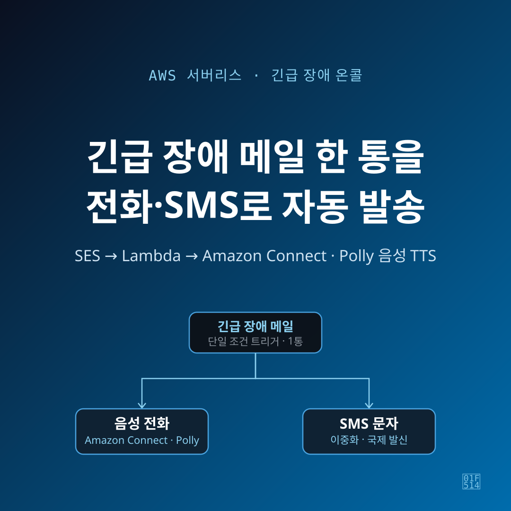
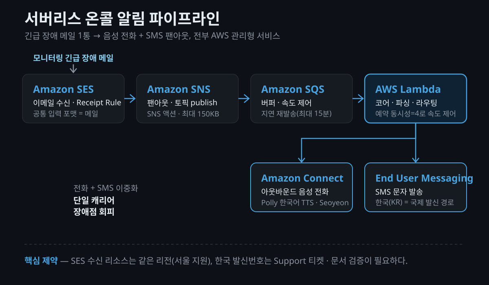

새벽 3시에 서비스가 죽었습니다. 모니터링 시스템은 정확히 그 시각에 경고 메일을 보냈고요. 문제는 그 메일을 아무도 못 봤다는 겁니다. 다음 날 아침에야 밀린 알림을 확인하는 경험, 한 번쯤 겪어봤을 겁니다.

이 글은 그 문제를 풀기 위해 **AWS 서버리스로 긴급 장애 온콜(On-call) 알림 시스템**을 직접 만든 기록입니다. 목표는 단순했습니다. "긴급 장애 메일 1통이 들어오면, 담당자에게 **음성 전화와 SMS를 동시에** 쏜다." 사람이 콘솔을 들여다보고 판단할 필요 없이, 조건 하나로 자동 발동하는 채널을 원했습니다.

전체 아키텍처의 뼈대는 공개된 레퍼런스를 참고했습니다. [올리브영 테크블로그의 Amazon Connect 서버리스 온콜 사례](https://oliveyoung.tech/2025-12-24/amazon-connect/)가 같은 문제를 같은 방식으로 풀어낸 좋은 공개 출처라, 이 구조를 차용하고 제 환경에 맞게 다시 구성했습니다. 이 글은 그중에서도 **공식 문서로 검증되는 부분과, 직접 부딪혀 본 실전 함정**에 초점을 맞췄습니다.



## 왜 별도의 "긴급 장애 전용" 채널이 필요할까?

이미 장애 알림은 메일과 메신저로 받고 있었습니다. 그런데도 굳이 전화·SMS 채널을 따로 만든 이유는 명확합니다. **메일은 야간에 못 봅니다.** 슬랙 알림도 무음 모드에 들어가면 마찬가지죠.

그래서 설계 원칙을 이렇게 잡았습니다.

- **단일 조건 트리거**: "긴급 장애 메일 1통" 이라는 조건 하나로만 발동합니다. 복잡한 룰 엔진도, 운영자의 판단도 끼워 넣지 않습니다. 새벽에 깨워야 하는 이유는 단순해야 합니다.
- **운영자 판단 불필요**: 사람이 개입해서 "이건 전화할 급이다/아니다"를 고르는 순간, 그 사람이 자고 있으면 시스템이 멈춥니다.
- **전화 + SMS 이중화**: 전화를 못 받아도 문자가 남고, 문자를 놓쳐도 전화가 울립니다. 뒤에서 다시 이야기하지만, 이 이중화는 취향이 아니라 **AWS 공식 문서가 권장하는 원칙**이기도 합니다.

기존 알림과 독립된, 오직 "지금 당장 일어나야 하는" 상황만을 위한 전용 회선. 그게 이 시스템의 존재 이유입니다.

## 전체 아키텍처는 어떻게 흐를까?

파이프라인은 전부 AWS 관리형 서비스로만 엮었습니다. 상시 켜 둘 서버가 없으니 서버리스(Serverless)죠. 흐름은 이렇습니다.

```
모니터링 긴급 장애 메일
   ↓
Amazon SES (Receipt Rule, 이메일 수신)
   ↓
Amazon SNS (팬아웃)
   ↓
Amazon SQS (버퍼)
   ↓
AWS Lambda (코어 로직)
   ↓            ↓
Amazon Connect  AWS End User
음성 전화        Messaging SMS
(Polly TTS)      (문자)
```

각 단계가 왜 그 서비스인지 짚어보겠습니다.

- **SES (Simple Email Service) 수신** — 시작점을 "이메일"로 잡은 게 핵심입니다. 어떤 모니터링 도구든 최소한 이메일 알림 하나는 보낼 수 있으니, **메일을 공통 입력 포맷**으로 삼으면 소스가 무엇이든 받아낼 수 있습니다. SES의 Receipt Rule이 들어온 메일을 다음 단계로 넘깁니다.
- **SNS (Simple Notification Service) 팬아웃** — SES Receipt Rule은 수신 메일을 SNS 토픽으로 publish합니다. 하나의 입력을 여러 구독자로 부챗살처럼 퍼뜨리는(fan-out) 지점입니다.
- **SQS (Simple Queue Service) 버퍼** — SNS와 Lambda 사이에 큐를 하나 끼웠습니다. 뒤에 나올 **재발송 지연**과 **호출 속도 제어**를 위한 완충 지대입니다.
- **Lambda 코어** — 실제 두뇌입니다. 메일을 파싱해 담당자 번호를 뽑고, 발신 여부를 판단하고, Connect와 SMS를 호출합니다.
- **Amazon Connect 음성 + SMS 동시 발송** — Connect의 아웃바운드 음성 API로 전화를 걸고, Polly가 한국어 TTS로 상황을 읽어 줍니다. 동시에 문자도 보냅니다.



## 어떤 설계 결정을 했고, 왜 그랬을까?

아키텍처 그림보다 값진 건 "왜 그렇게 했나"입니다. 몇 가지 결정을 남겨 둡니다.

**발신 도메인 화이트리스트.** 초기에 한 번 크게 데였습니다. 스팸 메일이 수신 주소로 흘러들어와 한밤중에 엉뚱한 전화가 나간 겁니다. 그래서 **허용된 발신 도메인만 통과**시키는 화이트리스트를 넣었습니다. 유의할 점 하나 — 검사는 **envelope 발신자와 헤더 From 양쪽**을 봐야 합니다. 메일 그룹(그룹스)이 중간에서 envelope를 재작성하는 경우가 있어, 한쪽만 보면 뚫립니다.

**Lambda Reserved Concurrency = 4.** Connect 아웃바운드 발신에는 호출 속도 제한(Rate Limit)이 있습니다. Lambda의 예약 동시성(Reserved Concurrency)을 4로 묶어 두면, 함수가 그 이상 동시에 뜨지 않아 자연스럽게 초당 호출 속도를 억제할 수 있습니다. 공개 레퍼런스도 같은 목적으로 이 값을 씁니다.

**Stateless plus-addressing.** 담당자별 라우팅을 DB 없이 처리하고 싶었습니다. 그래서 수신 주소에 서브주소(plus-addressing, RFC 5233)를 썼습니다. `oncall+<E164>@oncall.example.com` 형태로 두면, `+` 뒤에 담당자 전화번호(E.164 표기)가 그대로 실려 옵니다. Lambda가 정규식으로 이 번호를 뽑아내면 됩니다. 담당자가 바뀌면 모니터링 쪽 수신 주소만 바꾸면 되니, **그룹 멤버십 관리도 주소로** 끝나고 상태 저장소가 필요 없습니다.

**DLQ 생략 — 의도적 트레이드오프.** 실패 메시지를 받는 데드레터 큐(DLQ)를 두지 않았습니다. 볼륨이 낮고(하루 몇 건), 이메일이라는 1차 채널이 이미 살아 있기 때문입니다. 대신 실패 감지는 **Lambda 에러에 CloudWatch 알람**을 걸어 처리합니다. 규모가 커지면 다시 봐야 할 결정이지만, 지금 단계에선 단순함이 이깁니다.

**제목 규약과 본문 JSON 하이브리드.** 메일 제목을 그대로 음성으로 읽히므로, 제목을 `{서비스} {증상}` 규약으로 씁니다(예: "결제 API 응답 지연"). 대괄호·약어·기호를 지양하면 TTS가 훨씬 자연스럽게 읽습니다. 더 정교한 제어가 필요하면 본문에 JSON을 실어 하이브리드로 씁니다.

- `tts`: 음성으로 읽을 문구를 직접 지정
- `status`: `Down`이면 전화+SMS, `Up`(복구)이면 SMS만
- `test: true`: 테스트용 발동 안 함

본문 JSON이 없으면 **제목으로 폴백(fallback)**해 그대로 읽습니다.

## 실전에서 발목 잡은 함정들은?

여기부터가 이 글의 핵심입니다. 아키텍처 그림은 어디에나 있지만, 아래 함정들은 직접 부딪혀 봐야 알 수 있는 것들이라 값이 나갑니다.

### SES 인바운드는 리전을 먼저 확인해야 합니다

SES **이메일 수신은 리전마다 지원 여부가 다릅니다.** 아무 리전에서나 되는 게 아니라, [공식 "Email Receiving endpoints" 표](https://docs.aws.amazon.com/general/latest/gr/ses.html)에 나열된 리전에서만 동작합니다. 다행히 **서울(ap-northeast-2)은 수신을 지원**하고, MX 대상은 `inbound-smtp.ap-northeast-2.amazonaws.com` 입니다.

여기서 놓치기 쉬운 조건 — [수신에 쓰는 리소스(SNS 토픽·KMS 키·Lambda 등)는 SES 엔드포인트와 같은 리전](https://docs.aws.amazon.com/ses/latest/dg/regions.html)에 있어야 합니다(S3 버킷만 예외). 그리고 해당 리전에 **활성 receipt rule set**을 하나 만들어 둬야 수신이 켜집니다. 이걸 모르고 리전을 섞으면 나중에 크로스리전 재작업 리스크를 떠안게 됩니다.

### 한국 발신번호 규제 — 가장 큰 함정

솔직히 이 시스템에서 가장 오래 걸린 부분은 코드가 아니라 **번호 발급**이었습니다. 한국은 통신 규제가 강한 국가라, Amazon Connect 발신번호를 콘솔에서 셀프서비스로 뚝딱 살 수 없습니다.

[공식 문서](https://docs.aws.amazon.com/connect/latest/adminguide/phone-number-requirements.html) 기준으로 정리하면 이렇습니다.

- **콘솔 셀프서비스 불가.** 한국 번호는 모든 유형에서 **AWS Support 티켓을 통한 문서 검증·주문**이 필요합니다.
- **사업자등록증이 필수 서류.** 등록 주소가 표시된 정식 문서가 있어야 하고, 실체 없는 주소(PO Box 등)는 안 됩니다.
- **번호 유형이 중요합니다.**
  - **+82 70 (VoIP)**: 신규 주문 **가능**. 새 발신번호가 필요하면 가장 현실적인 선택지입니다.
  - **+82 2 (서울 지역번호)**: 신규 발급 불가, **포팅(porting) 전용**입니다. 한국 규제상 신규 지역번호는 물리 회선 설치가 전제라, 기존 통신사에서 [일정 기간 물리 설치된 번호를 포팅](https://docs.aws.amazon.com/connect/latest/adminguide/porting-numbers-sk.html)해야 합니다.

유의사항 하나 — 지역/대표/토ール프리 같은 번호(GRTFN)에는 착신용 **070 VoIP 번호가 캐리어에서 함께 배정**됩니다. 이 070 번호를 인스턴스에서 먼저 지우면 인바운드·아웃바운드가 모두 실패하니 건드리지 말아야 합니다. 전반적으로 절차가 한국어로 진행되고 양식도 여러 장이라, **리드타임을 넉넉히** 잡아야 합니다.

### 한국 SMS는 "국제 발신"만 됩니다

문자도 함정이 있습니다. 우선 [새 계정은 샌드박스(sandbox) 상태](https://docs.aws.amazon.com/sms-voice/latest/userguide/sandbox.html)로 시작합니다. 샌드박스에서는 월 SMS 지출 한도가 **$1.00**이고, **검증된 수신번호(최대 10개)로만** 보낼 수 있습니다. 프로덕션 전환과 한도 상향은 채널별로 AWS Support 케이스를 열어야 합니다.

그리고 여기가 정확히 짚어야 할 지점입니다. [공식 "지원 국가/지역" 표](https://docs.aws.amazon.com/sms-voice/latest/userguide/phone-numbers-sms-by-country.html)에서 한국(KR)은 **short code·long code·Sender ID·양방향(two-way) 모두 미지원**이고, **International sending만 "Yes"**로 표시됩니다. 즉 한국으로 가는 SMS는 **국제(공유) 경로로만** 나갑니다.

흔히 "Sender ID를 등록하면 발신자 표기가 된다"고 알려져 있는데, 표를 그대로 읽으면 한국은 셀프서비스 불가를 넘어 **현재 Sender ID 자체가 미지원**입니다. 그래서 발신자 표기나 도달률은 국제 경로와 캐리어 사정에 좌우됩니다. 이 부분은 단정하지 않는 게 정확합니다.

### SNS→SES 이중 파싱과 한글 제목 디코드

Lambda에서 이벤트를 받아 보면 한 겹이 아닙니다. SES 수신(SNS 액션) → SNS → SQS를 거치면서, Lambda가 받는 SQS 레코드의 `body`는 **SNS Notification JSON**이고, 그 안의 `Message` 필드에 다시 SES 알림이나 원본 MIME이 들어 있습니다. **JSON을 한 번 풀고 그 안을 또 파싱**해야 하는 [이중 파싱](https://docs.aws.amazon.com/ses/latest/dg/receiving-email-action-sns.html) 구조입니다.

한글 제목이면 함정이 하나 더 있습니다. 비ASCII 제목은 `=?UTF-8?B?...?=` 같은 **RFC 2047 MIME 인코딩**으로 들어오므로, TTS로 읽거나 파싱하기 전에 **반드시 디코드**해야 합니다. 안 그러면 담당자 전화에서 정체불명의 인코딩 문자열이 흘러나옵니다.

한 가지 더 — SNS 액션으로 받는 메일은 [헤더 포함 최대 150KB](https://docs.aws.amazon.com/ses/latest/dg/receiving-email-action-sns.html)이고, 초과하면 바운스됩니다. 긴급 알림은 제목·짧은 본문이 핵심이라 대개 문제없지만, 첨부나 긴 HTML 본문이 붙는 메일이라면 SNS 대신 **S3 액션**으로 받아야 합니다. 그리고 SES가 토픽에 publish할 수 있도록 **SNS 토픽 정책에 `ses.amazonaws.com` 프린시펄의 `SNS:Publish`를 허용**(남용 방지로 `AWS:SourceAccount`·`AWS:SourceArn` 조건 추가)하는 것도 잊지 말아야 합니다.

### Polly는 한국어 음성을 지정해야 합니다

TTS를 기본 음성으로 두면 영어 음성이 한국어를 읽어 억양이 어색합니다. [Amazon Polly의 한국어 음성 `Seoyeon`(ko-KR)](https://docs.aws.amazon.com/polly/latest/dg/generative-voices.html)을 명시적으로 지정해야 합니다. Neural TTS 버전이 있고, 생성형(generative) 변형은 서울 리전을 포함해 제공됩니다. 사소해 보여도, 새벽에 상황을 정확히 알아들으려면 억양이 생각보다 중요합니다.

### 10분 뒤 재발송, 어디까지 되나?

"전화를 못 받으면 10분 뒤 한 번 더" 정도는 SQS로 됩니다. [SQS의 `DelaySeconds`(지연 큐)와 메시지 타이머 최대값은 900초(15분)](https://docs.aws.amazon.com/AWSSimpleQueueService/latest/SQSDeveloperGuide/sqs-delay-queues.html)라, 짧은 1회 재발송은 이 지연으로 구현할 수 있습니다.

다만 **한 번 넣은 지연 메시지는 취소가 어렵습니다.** 그래서 "1차 무응답이면 2차 담당자, 그래도 없으면 3차" 같은 **다단계·취소 가능한 에스컬레이션**은 SQS delay로는 무리입니다. 그건 **EventBridge Scheduler나 Step Functions**로 가야 하는 영역입니다. 지금은 전원 동시 발송으로 두고, 순차 에스컬레이션은 확장 옵션으로 남겨 뒀습니다.

## 비용은 얼마나 들까?

결론부터 말하면, **서버리스 백본은 저볼륨에서 거의 공짜에 가깝습니다.** SES 수신·SNS·SQS·Lambda는 하루 몇 건~수십 건 수준의 트래픽에서 프리티어 범위에 들어와 사실상 ≈ $0 수준입니다(공개 과금 모델 기반 일반화이고, 실제 금액은 계정·사용량에 따라 다릅니다).

실비는 대부분 **Amazon Connect 번호 유지비(고정)와 통화·문자 종량 요금(변동)**에서 나옵니다. 예를 들어 공개 문서에는 대표번호에 붙는 [shared cost DID가 하루 $0.5433](https://docs.aws.amazon.com/connect/latest/adminguide/porting-numbers-sk.html)로 표기된 사례가 있습니다. 한국 통화·SMS 단가는 캐리어와 국제 경로에 따라 달라지므로 이런 **공개 단가는 근사치**로만 봐야 합니다.

정리하면, 공개 단가 기준으로 **월 몇 달러에서 수십 달러 수준이고, 그 대부분이 번호(DID) 유지비와 통화·문자 요금**입니다. 서버리스 처리 비용 자체는 저볼륨에서 무시할 만합니다. 구체적인 내부 추정 수치는 계정마다 다르니 여기서는 공개 단가 기반 예시로만 남겨 둡니다.

## 마무리하며

이 시스템의 핵심은 화려한 기술이 아니라 **다중 채널 리던던시(Redundancy)**입니다. 전화·SMS·메일을 굳이 겹쳐 쓰는 이유는, [AWS 공식 문서 스스로가 "각 국가의 SMS 발신 번호는 단일 캐리어 파트너를 통해 제공되어, 그 파트너가 장애 나면 단일 장애점이 된다"](https://docs.aws.amazon.com/sms-voice/latest/userguide/phone-numbers-sms-by-country.html)며 업무상 중요한 알림은 여러 채널로 이중화하라고 권하기 때문입니다. 새벽 3시의 알림 하나를 위해 채널을 겹치는 건 과잉이 아니라 정공법입니다.

향후 확장은 두 방향으로 열어 뒀습니다. 하나는 앞서 말한 **순차 에스컬레이션**(1차 무응답 시 2차 호출)이고, 다른 하나는 **수신 확인(ack)**을 받아 무한 재발송을 멈추는 장치입니다. 둘 다 Step Functions로 가면 자연스럽게 붙습니다.

비슷한 온콜 부담을 겪고 있다면, 거창한 룰 엔진부터 짜기보다 **"긴급 메일 1통 → 전화 1통"이라는 가장 단순한 한 줄부터** 시작해 보시길 권합니다. 채널을 늘리는 건 그다음이어도 늦지 않습니다.

## 참고 자료 (공식 출처)

- [Amazon SES endpoints and quotas (Email Receiving endpoints)](https://docs.aws.amazon.com/general/latest/gr/ses.html)
- [Regions and Amazon SES (Email receiving)](https://docs.aws.amazon.com/ses/latest/dg/regions.html)
- [Publish to Amazon SNS topic action (150KB·인코딩·MIME)](https://docs.aws.amazon.com/ses/latest/dg/receiving-email-action-sns.html)
- [Giving permissions to Amazon SES for email receiving (SNS 토픽 정책)](https://docs.aws.amazon.com/ses/latest/dg/receiving-email-permissions.html)
- [Region requirements for ordering and porting phone numbers in Connect](https://docs.aws.amazon.com/connect/latest/adminguide/phone-number-requirements.html)
- [Guidelines for porting phone numbers in South Korea](https://docs.aws.amazon.com/connect/latest/adminguide/porting-numbers-sk.html)
- [Generative voices — Amazon Polly (Seoyeon)](https://docs.aws.amazon.com/polly/latest/dg/generative-voices.html)
- [SMS/MMS and Voice sandbox in AWS End User Messaging SMS](https://docs.aws.amazon.com/sms-voice/latest/userguide/sandbox.html)
- [Supported countries and regions for SMS (South Korea)](https://docs.aws.amazon.com/sms-voice/latest/userguide/phone-numbers-sms-by-country.html)
- [Amazon SQS delay queues / message timers](https://docs.aws.amazon.com/AWSSimpleQueueService/latest/SQSDeveloperGuide/sqs-delay-queues.html)
- [올리브영 테크블로그 — Amazon Connect 서버리스 온콜 (아키텍처 공개 출처)](https://oliveyoung.tech/2025-12-24/amazon-connect/)

#AWS #서버리스 #온콜 #AmazonConnect #SES #SNS #SQS #Lambda #Polly #장애알림 #SMS #TTS #인프라자동화 #서버리스아키텍처
