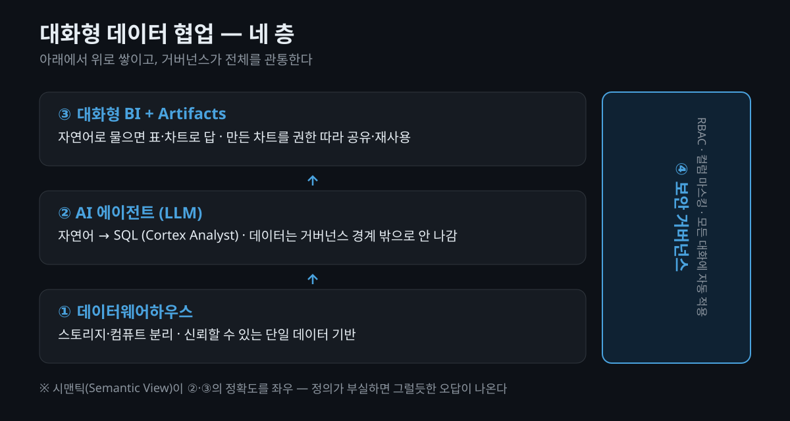

"이 데이터 좀 확인해 주실 수 있어요?" 데이터를 다루는 팀이라면 하루에도 몇 번씩 받는 요청입니다. 그런데 정작 요청하는 쪽은 이렇게 말하죠 — "사소한 질문이라 여쭤보기 망설였어요." 데이터는 쌓여 있는데, 그 데이터에 **질문을 던지는 일**은 여전히 누군가의 손을 거쳐야 하는 게 현실입니다.

최근 Snowflake의 세션에 다녀왔는데, 거기서 본 **대화형 데이터 협업(cowork)** 개념이 이 오래된 병목에 대한 꽤 구체적인 답으로 보였습니다. 단순히 "AI를 붙였다"가 아니라, **데이터웨어하우스 → AI 에이전트 → 대화형 BI → 보안 거버넌스**가 하나의 흐름으로 이어지는 그림이었거든요. 이 글에서는 그 네 층을 짚고, 그게 왜 데이터 조직이 가야 할 방향과 맞닿는지 정리해 보겠습니다.

## 왜 지금 '대화형'이 화두일까요?

먼저 문제부터 짚어보죠. 전통적인 데이터 아키텍처는 **사일로(silo)** 로 갈라져 있습니다. 부서별·목적별로 데이터가 흩어지고, 그걸 잇는 ETL 파이프라인은 복잡해지고, 리포팅은 또 별도 도구로 넘어갑니다. 그 결과가 익숙하죠 — 분석 하나 받는 데 수일에서 수주, 데이터팀은 인프라 관리에 대부분의 리소스를 쓰고, 정작 "질문에 답하는" 일은 뒤로 밀립니다.

여기서 핵심은 **비정형 데이터(unstructured data)의 폭증**입니다. 문서, 로그, PDF, 이미지까지 의사결정에 필요한 데이터가 정형 테이블 밖에 흩어져 있는데, 기존 BI로는 이걸 한 번에 묻고 답하기가 어렵습니다. "대화형"이 화두가 된 건 그래서예요 — 사람이 데이터 구조를 몰라도, **자연어로 물으면 정형·비정형을 가로질러 답이 나오는** 경험을 원하기 때문입니다.

## 네 층으로 본 '대화형 데이터 협업'

제가 본 그림을 네 층으로 나눠보면 이렇습니다.

### ① 바닥 — 데이터웨어하우스

모든 것의 바닥은 여전히 **데이터웨어하우스(DW)** 입니다. Snowflake는 **스토리지와 컴퓨트를 분리**한 구조라, 분석 쿼리가 몰려도 서로 성능을 갉아먹지 않고 필요한 만큼 컴퓨트를 늘렸다 줄일 수 있습니다. AWS·Azure·GCP 어디서든 돌아가고요. 대화형이든 뭐든, **신뢰할 수 있는 단일 데이터 기반**이 없으면 그 위의 모든 게 흔들린다는 점은 변하지 않습니다.

### ② 그 위 — AI 에이전트(LLM)

그 위에 **AI 에이전트** 층이 올라갑니다. Snowflake는 이걸 **Snowflake Intelligence**(대화형 경험)와 **Cortex Agents**(정형·비정형을 가로지르는 추론·다단계 작업)로 부르는데요. 핵심 조각은 **Cortex Analyst** — 자연어 질문을 **SQL로 바꿔** 실행해 주는 기능입니다. ([Cortex Analyst 문서](https://docs.snowflake.com/en/user-guide/snowflake-cortex/cortex-analyst))

여기서 눈여겨본 건 **데이터가 거버넌스 경계를 벗어나지 않는다**는 설계입니다. Snowflake가 호스팅하는 LLM으로 처리되어, 프롬프트·메타데이터를 포함해 데이터가 외부로 나가지 않고 고객 데이터로 모델을 학습하지도 않습니다. "AI를 쓰되 데이터는 안에 둔다" — 사내 데이터를 다루는 입장에선 이게 도입의 전제 조건이죠.

### ③ 얼굴 — 대화형 BI와 artifact

사용자가 실제로 마주하는 얼굴은 **대화형 BI** 입니다. "제주도에서 상위 관광지 3개 알려줘" 같은 질문을 던지면, 필요하면 PDF 문서까지 뒤져(문서 검색·파싱) 답을 만들고, 결과를 **표·차트·그래프로** 내놓습니다. 이어지는 질문도 맥락을 이어받고요.

특히 눈여겨본 개념이 **Artifacts** 였습니다. 대화로 만든 차트를 그냥 흘려보내지 않고 **기록해 두고 구성원과 공유·재사용**하는 거죠. 그런데 여기에도 규칙이 있습니다 — **보는 사람의 데이터 권한에 따라 같은 차트라도 표현되는 결과가 달라집니다.** 공유가 곧 정보 유출이 되지 않도록요.

### ④ 뼈대 — 보안 거버넌스

그리고 이 모든 걸 관통하는 뼈대가 **거버넌스** 입니다. 데모에서 가장 구체적이었던 장면이 이거였어요 — 고객 전화번호 같은 민감 컬럼을 두고:

- 시맨틱 뷰에서 그 컬럼을 **아예 노출하지 않거나**,
- 대화 결과에서 "이건 비공개 자료입니다"로 **답을 막거나**,
- **마스킹(masking)** 을 걸어두면 쿼리를 돌려도 마스킹된 값으로만 결과가 나옵니다.

핵심은 이 통제가 **AI 대화에 자동으로 적용된다**는 점입니다. Snowflake Intelligence는 이미 설정된 **역할 기반 접근제어(RBAC)와 데이터 마스킹 정책을 모든 대화에서 그대로 존중**합니다. ([AI-Powered BI](https://www.snowflake.com/en/product/use-cases/ai-powered-bi/)) 즉 "권한 없는 사람이 자연어로 우회 질문해서 민감정보를 빼낸다"가 원천적으로 막히는 구조죠.

> **유의사항.** 자연어 인터페이스의 함정은 "그럴듯하지만 틀린 답"입니다. 뒤에서 볼 **시맨틱(semantic) 정의**가 부실하면, AI가 엉뚱한 컬럼을 골라 자신 있게 틀립니다. 대화형의 신뢰도는 모델이 아니라 **데이터에 붙인 정의**에서 갈립니다.

## 사실 핵심은 '시맨틱'입니다

네 층 중에 겉으로 안 보이지만 제일 중요한 게 **Semantic View** 입니다. 테이블과 컬럼만 던져주면 AI는 현업의 질문을 이해하지 못해요. "매출"이 어느 테이블의 어느 컬럼인지, 팩트와 디멘전은 어떻게 연결되는지 — 이런 **비즈니스 개념·지표·관계를 데이터 구조에 연결**해 두는 게 시맨틱 뷰입니다. ([Native Semantic Views](https://www.snowflake.com/en/engineering-blog/native-semantic-views-ai-bi/))

Cortex Analyst가 자연어를 SQL로 정확히 바꾸는 것도 이 시맨틱 뷰를 근거로 삼기 때문입니다. 실제로 세션에서도 "하나씩 정의하기 번거롭다"는 페인포인트와 그걸 **자동으로 정의**해 주는 기능이 같이 나왔는데요, 뒤집어 말하면 그만큼 **정의(semantics)가 이 구조의 심장**이라는 뜻입니다.

## 그래서, 데이터 조직은 어디로 가야 할까요?

여기서부터는 제 생각입니다. 이런 도구를 보고 얻는 교훈은 "AI 붙이자"가 아니라 그 반대예요 — **AI가 정확히 일할 수 있도록 데이터와 기준을 먼저 정비하는 것**이 진짜 일입니다.

이 방향을 앞서 걸은 사례가 토스플레이스의 데이터봇 **판다(PANDA)** 입니다. 눈여겨볼 지점은 전체 데이터 요청의 **70%가 복잡한 분석이 아니라 "정확한 수치를 확인하는 단순 추출"** 이었다는 대목인데요. ([토스 테크](https://toss.tech/article/da-assistant-panda)) 이 단순·반복 요청이 바로 팀 사이의 **사일로와 데이터 요청·전달에 시간을 잡아먹는** 지점입니다. 대화형·셀프서비스가 실제로 노리는 게 정확히 이 70%죠. 그리고 판다 팀이 가장 공들인 것도 AI가 아니라 그 앞단 — **같은 개념을 다른 이름으로 쓰지 않도록 DW 표준화 컨벤션**을 잡는 일이었습니다.

방향을 세 단계로 정리하면 이렇습니다.

1. **표준화** — 같은 개념을 여러 이름·기준으로 관리하면 자동화 결과를 믿을 수 없습니다. 핵심 데이터와 지표를 **단일 기준**으로 정리하고, **비즈니스 언어를 데이터에 연결**(시맨틱)합니다.
2. **가시화** — 요청자가 기다리지 않고 직접 확인하는 **셀프서비스 BI**로 확장합니다. 대화형은 이 셀프서비스의 가장 낮은 진입 장벽이고요.
3. **자동화** — 반복되는 요청 분류·검증·재처리·요약을 AI로 흘려보냅니다. 단, 앞의 두 단계가 없으면 자동화는 **틀린 답을 빠르게 뱉는 기계**가 됩니다.

완전한 대화형이 최종 그림이라면, 현실적인 **중간 단계**도 있습니다. **공공데이터 포털**을 떠올려 보세요 — 기간(연·월)과 주제별로 데이터셋을 등록해 두고, 필요한 사람이 **신청해서 받아 분석**하는 형태죠. 사내에도 핵심 데이터를 이렇게 **카탈로그로 등록**해 두면(예: 표준 지표의 월별 스냅샷, 검증된 마트), 매번 "데이터 좀 뽑아주세요"로 오가던 요청이 셀프서비스로 흡수됩니다. 대화형은 이 카탈로그 위에 얹히는 **마지막 층**이고요. 즉 처음부터 대화형을 목표로 하기보다, **표준화된 데이터를 신청·활용하는 셀프서비스**부터 깔면 사일로와 요청 시간이 눈에 띄게 줄어듭니다.

그리고 이 셋을 관통하는 전제가 **거버넌스**입니다. 신뢰도가 다른 데이터를 같은 수준으로 다루지 않고(검증된 마트 vs 원천 로그), 민감정보는 **컬럼 단위로 통제**해서, "누구나 물어볼 수 있다"와 "아무 데이터나 보인다"를 분리하는 것. 대화형이 편리할수록 이 뼈대가 더 중요해집니다.

## 그래도, 공짜 점심은 아닙니다

여기까지 보면 매끄럽지만, 현실에서 걸리는 지점도 분명합니다. 균형을 위해 짚어두죠.

- **시맨틱 정의는 결국 사람의 일입니다.** 비즈니스 용어·지표·관계를 데이터에 붙이는 건 상당한 초기 작업이고, "자동 정의" 기능이 있어도 **사람이 검수**해야 믿을 수 있습니다. 대화형의 품질은 딱 이 밑작업만큼만 나옵니다.
- **한 곳에 몰아넣는 만큼 종속(lock-in)도 커집니다.** 데이터·분석·AI·거버넌스를 한 플랫폼에 묶으면 편하지만, 나중에 갈아타기는 그만큼 어려워집니다. 컴퓨트 과금 구조상 **비용 감**도 미리 잡아둬야 하고요.
- **자연어는 여전히 틀릴 수 있습니다.** 정의가 부실하면 그럴듯한 오답이 나오고, 사용자는 그걸 검증 없이 믿기 쉽습니다. "누구나 물어볼 수 있다"가 "누구나 맞는 답을 얻는다"는 아니에요.

그래서 이 그림은 "도입하면 해결"이 아니라, **기준·정의·거버넌스라는 밑작업을 누가 하느냐**의 문제로 되돌아옵니다. 결국 앞 절 이야기로 이어지죠.

## 마무리

정리하면, Snowflake가 보여준 그림은 **"데이터 창고 → AI 에이전트 → 대화형 BI → 컬럼 단위 거버넌스"** 라는, 서로 분리돼 있던 조각들을 하나의 흐름으로 꿴 것이었습니다. 기술적으로 새로운 부품이 있다기보다, **데이터 조직이 오래 지향해 온 방향(신뢰할 수 있는 기준 위에서 누구나 데이터를 활용)을 제품 형태로 압축**해 보여줬다는 점이 눈에 띄었어요.

당장 무언가를 도입할 게 아니더라도, 지금 다루는 데이터에 **비즈니스 정의가 붙어 있는지**, **민감 컬럼이 컬럼 단위로 통제되고 있는지** 한 번 점검해 보면 좋겠습니다. 대화형 시대의 준비물은 화려한 모델이 아니라, 결국 잘 정의되고 잘 통제된 데이터니까요.

## 참고 자료 (공식 출처)

- [Cortex Analyst — Snowflake Docs](https://docs.snowflake.com/en/user-guide/snowflake-cortex/cortex-analyst) (자연어→SQL, 시맨틱 뷰 기반)
- [Cortex Agents — Snowflake Docs](https://docs.snowflake.com/en/user-guide/snowflake-cortex/cortex-agents) (정형·비정형 추론, 다단계 작업)
- [Snowflake’s Native Semantic Views](https://www.snowflake.com/en/engineering-blog/native-semantic-views-ai-bi/) (비즈니스 개념·지표·관계 정의)
- [AI-Powered BI](https://www.snowflake.com/en/product/use-cases/ai-powered-bi/) (RBAC·마스킹 정책을 대화에서 자동 존중)
- [Snowflake Intelligence 소개](https://www.snowflake.com/en/blog/intelligence-snowflake-summit-2025/) (대화형 데이터 경험)
- [토스플레이스 데이터봇 '판다(PANDA)' 소개 — 토스 테크](https://toss.tech/article/da-assistant-panda) (요청의 70%가 단순 추출, DW 표준화 컨벤션 사례)
