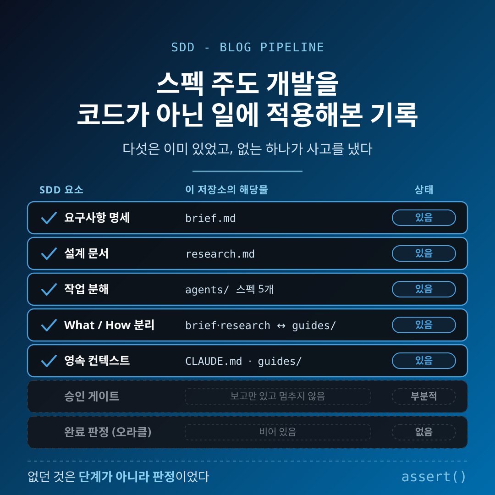
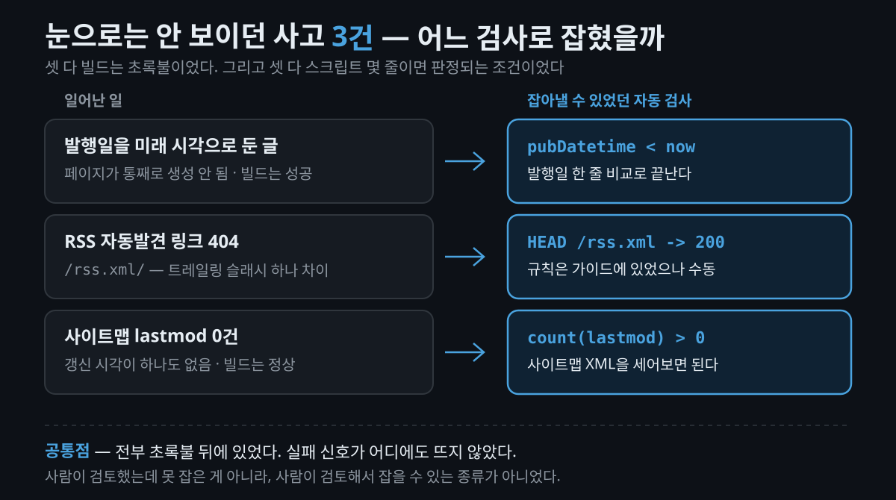
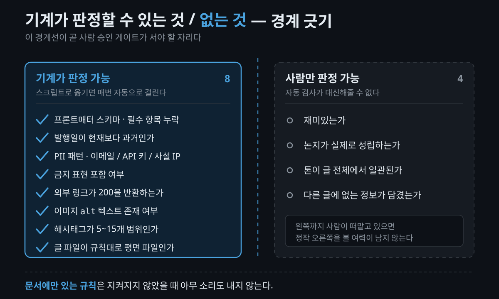

코드용으로 만들어진 방법론을, 코드가 아닌 일에 그대로 대볼 수 있을까요.

**스펙 주도 개발(Spec-Driven Development, SDD)** 은 이름 그대로 명세(spec)가 진실 공급원이 되고 코드는 거기서 파생되는 산출물이 되는 개발 방식입니다. 2025년 이후 GitHub Spec Kit, AWS Kiro 같은 도구로 자리를 잡았는데, 설명은 하나같이 소프트웨어를 전제로 합니다.

그런데 제가 굴리는 이 블로그는 코드를 만들지 않습니다. 주제를 넣으면 에이전트 다섯이 단계를 나눠 글 하나를 만들어 내는 파이프라인이죠. 리서치 → 글쓰기 → 이미지 → 통합, 각 단계의 산출물이 다음 단계의 입력이 됩니다.

그래서 대조해봤습니다. SDD가 요구하는 요소를 하나씩 꺼내 이 저장소에 해당하는 것이 있는지 확인하는 식으로요. 결과가 예상과 달라서 기록으로 남깁니다. 참고로 클로드 코드(Claude Code)로 **코드**를 만들 때의 문서 우선 절차는 이전 글에서 따로 다뤘습니다. 이 글은 그 반대편 — 코드가 아닌 산출물에도 같은 뼈대가 서는지에 대한 이야기입니다.

## 스펙 주도 개발은 결국 무엇을 하는 방법인가?

한 줄로 줄이면 "코드가 아니라 명세가 권위를 갖는다"입니다. Thoughtworks는 이를 [잘 작성된 요구사항 명세를 프롬프트로 삼아 실행 가능한 코드를 만드는 패러다임](https://www.thoughtworks.com/en-us/insights/blog/agile-engineering-practices/spec-driven-development-unpacking-2025-new-engineering-practices)이라고 정리합니다. 자유 대화로 에이전트에게 맡기면 매번 다른 품질이 나오고 긴 대화에서 의도가 표류하는데, 그 실패에 대한 반작용으로 나온 흐름이죠.

여기서 중요한 건 도구 이름이 아니라 **각 단계가 왜 있는가**입니다. 정리가 잘 된 프레임이 하나 있습니다.

- **요구사항** — 제품의 모호함을 줄인다
- **설계** — 기술의 모호함을 줄인다
- **작업 분해** — 실행의 모호함을 줄인다
- **검증** — 이 사슬이 유지됐음을 증명한다

즉 SDD는 "문서를 많이 쓰자"가 아니라 **서로 다른 종류의 모호함을 각각 다른 장치로 제거하는 구조**입니다. 그리고 이 정의 어디에도 "코드여야 한다"는 조건은 없습니다. 대조를 해볼 만하다고 판단한 이유가 이것입니다.

## 대조해보니 무엇이 이미 있었나?

먼저 SDD의 구성 요소를 왼쪽에 세우고, 이 저장소에서 그 역할을 하는 파일을 오른쪽에 놓아봤습니다.

| SDD 요소 | 이 저장소의 해당물 | 상태 |
|---|---|---|
| 요구사항 명세 | `brief.md` (논지·독자·슬러그 확정) | 있음 |
| 설계 문서 | `research.md` (사실·출처·충돌 기록) | 있음 |
| 작업 분해 | 에이전트 스펙 5개 (`agents/`) | 있음 |
| What / How 분리 | brief·research(무엇) ↔ `guides/`(어떻게) | 있음 |
| 영속 컨텍스트 | `CLAUDE.md` + `guides/` + `CONTENT-RULES.md` | 있음 |
| 승인 게이트 | 단계 사이 사용자 보고 | 부분적 |
| 완료 판정(오라클) | — | 흩어져 있음 |

새로 지을 게 없었습니다. Kiro의 스티어링(steering) 파일이 하는 일은 `guides/`가 이미 하고 있고, spec-kit의 프로젝트 원칙 수립 단계는 `CONTENT-RULES.md`와 자리가 같습니다. 명세가 "이번 변경에만 해당하는 요구사항"이라면 영속 컨텍스트는 "모든 변경에 걸치는 불변 규칙"인데, 두 축이 이미 분리돼 있었던 것이죠.

다만 승인 게이트에 '부분적'이라고 적은 데는 이유가 있습니다. 규칙에는 "각 단계 사이에 진행 상황을 한 줄로 알린다"고만 돼 있습니다. 보고는 하는데 **거기서 멈춰서 승인을 기다리라는 말은 없습니다.** 알림과 게이트는 다른 물건이죠. 주제를 정하는 첫 단계에만 "임의로 자동 선택하지 않는다"는 문장이 명시돼 있고, 나머지 단계는 그대로 흘러갑니다.

솔직히 말하면 기분 좋은 발견은 아니었습니다. 구조가 이미 맞다면, 문제가 있을 때 "구조를 도입하면 해결된다"는 답이 사라지기 때문입니다.

## 그런데 왜 명세와 실제가 어긋났나?

구조가 다 있는데도 저장소를 훑어보니 **명세 드리프트(spec drift)** 가 세 건 나왔습니다. 명세가 말하는 것과 실제로 하는 것 사이의 간극입니다.

- **이미지 형식** — 이미지 담당 에이전트 명세는 산출물을 PNG로 아홉 군데에서 명시합니다. 실제 저장소의 이미지는 SVG 34개, PNG 14개입니다. 어느 시점부터 SVG로 옮겨갔는데 명세는 그대로였습니다.
- **분량 기준** — 글쓰기 에이전트 명세는 "보통 한글 1,500자+"라고 적혀 있습니다. 실제 발행글은 4,000~5,000자대에 몰려 있고, 위로는 1만 자를 넘긴 것도 있습니다. 상한이 없으니 매번 다른 길이가 나옵니다.
- **경로 표기** — 같은 폴더를 가리키는 표기가 `<주제-슬러그>`, `<슬러그>`, `<주제>`, `[주제-슬러그]` 네 가지로 갈려 있었습니다.

원인은 단순합니다. **명세가 실행되지 않기 때문**입니다. 코드에서는 명세와 구현이 어긋나면 테스트가 깨지고 타입 검사가 막습니다. 글에서는 명세가 어긋나도 아무 일이 일어나지 않습니다. `.png`라고 적힌 문장은 SVG가 나와도 조용합니다.

여기에 더 뼈아픈 지적이 하나 붙습니다. 자동 검사는 명세에서 벗어난 산출물은 잡을 수 있어도, **의도에서 벗어난 명세 자체는 잡지 못한다**는 것이죠. 명세를 자신 있게 갱신하고도 여전히 틀릴 수 있습니다.

## 없는 하나는 무엇이었나?

대조표에서 유일하게 비어 있던 칸, 오라클(oracle)입니다. 기계가 "됐다/안 됐다"를 판정해주는 장치를 말합니다.

이 지점을 가장 정확하게 찌른 문장은 [PAELLADOC의 수용 기준 글](https://paelladoc.com/blog/acceptance-criteria-for-ai-agents/)에 있습니다. "실행 가능한 테스트가 **대리 오라클(proxy oracle)** 역할을 한다. 그것이 없으면 SDD는 단계만 더 붙은 프롬프트 주도 개발이다." 요구사항을 잘 쓰는 이유도 결국 여기에 닿습니다. 에이전트가 완료를 '단언'하는 대신 '증명'하게 만들려는 것이죠.

추상적인 이야기로 들렸는데, 실제로 겪은 사고 세 건이 전부 여기에 해당했습니다.

- **발행일을 미래 시각으로 둔 글** — 이 블로그는 예약 발행을 지원해서, 발행일이 아직 오지 않은 글은 페이지 자체를 만들지 않습니다. 그래서 페이지가 통째로 생성되지 않았는데 **빌드는 성공**했습니다. 실패 신호가 어디에도 뜨지 않았습니다.
- **RSS 자동발견 링크 404** — `<head>`에 넣는 RSS 링크에 트레일링 슬래시가 붙어 있었습니다. RSS는 페이지가 아니라 엔드포인트라 `/rss.xml/`은 404입니다. 스타일 가이드에 "발행 전 링크는 200 응답을 확인"이라는 규칙이 **있었는데도** 실행되지 않았습니다.
- **사이트맵 lastmod 0건** — 검색엔진에 "이 글이 언제 갱신됐는지" 알려주는 값이 하나도 없었습니다. 이것도 빌드는 정상이었습니다.

세 건의 공통점이 선명합니다. 전부 **눈으로 읽어서는 보이지 않는 실패**였고, 전부 초록불 뒤에 있었습니다. 사람이 검토했는데도 못 잡은 게 아니라, 사람이 검토해서 잡을 수 있는 종류가 아니었던 겁니다.

## 오라클이 정말 없었던 걸까?

여기서 판단이 한 번 뒤집혔습니다. 사고 세 건을 되짚어 보니, 셋 다 **기계가 판정할 수 있는 조건**이었습니다. 발행일이 현재보다 과거인가, 링크가 200을 반환하는가, `lastmod` 값이 존재하는가. 전부 스크립트 몇 줄이면 끝나는 검사입니다.

그러니까 오라클이 "없는" 게 아니었습니다. **흩어져 있고 수동이었을 뿐**입니다. 규칙은 이미 문서에 적혀 있었고, 실행할 사람이 매번 기억해야 했을 뿐이죠.

그래서 경계를 그어봤습니다. 이게 이 대조에서 얻은 가장 실용적인 결과입니다.

**기계가 판정할 수 있는 것**

- 프론트매터 스키마 — 필수 항목 누락, 타입 오류
- 발행일이 현재보다 과거인가
- PII 패턴 — 이메일, API 키, 사설 IP
- 금지 표현 포함 여부 (스타일 가이드에 명시된 것들)
- 본문 외부 링크가 200을 반환하는가
- 이미지 `alt` 텍스트 존재 여부
- 해시태그 개수가 5~15개 범위인가
- 글 파일이 규칙대로 평면 파일인가 (폴더형으로 두면 주소가 깨집니다)

**기계가 판정할 수 없는 것**

- 재미있는가
- 논지가 실제로 성립하는가
- 톤이 글 전체에서 일관된가
- 다른 글에 없는 정보가 담겼는가

이 경계선이 곧 **사람 승인 게이트가 서야 할 자리**입니다. 오라클이 없는 도메인에서는 승인 게이트가 오라클을 대신하는 유일한 장치인데, 왼쪽 항목까지 사람이 떠맡고 있으면 정작 오른쪽을 볼 여력이 남지 않습니다. 발행일 형식을 눈으로 확인하느라 논지가 무너진 걸 놓치는 식이죠.

> **유의사항**
> 규칙을 문서에 적는 것과 규칙이 실행되게 만드는 것은 전혀 다른 일입니다. "링크는 200을 확인한다"는 규칙이 가이드에 있었는데도 404가 그대로 나갔습니다. 문서에만 있는 규칙은 지켜지지 않았을 때 아무 소리도 내지 않습니다.

## 그래서 이걸 스펙 주도 개발이라고 불러도 되나?

정직하게 정리하면, 아닙니다.

SDD를 코드 밖으로 가져오면 남는 것은 **"승인 게이트가 있는 다단계 아티팩트 파이프라인 + 영속 컨텍스트"** 입니다. 이건 실제로 작동합니다. 하지만 떨어져 나가는 것이 하필 SDD를 SDD답게 만들었던 자동 강제 장치죠. 테스트, 타입 검사, 빌드, 드리프트 점검이 전부 코드에 붙어 있는 것들입니다.

이 구분을 흐리는 게 이 주제에서 가장 흔한 과장입니다. 그리고 이건 SDD 진영 안에서도 논쟁 중인 지점입니다. "SDD는 혁명이 아니라 브랜딩을 바꾼 BDD일 뿐"이라는 평가가 계속 따라다니고, 명세 품질을 체계적으로 평가할 방법은 지금도 없다고 정리됩니다.

몇 가지는 특히 조심해서 봐야 합니다.

- **효율 수치는 대부분 벤더 주장입니다.** "40시간짜리 기능을 8시간 미만에 출하했다"(Kiro), "재생성 사이클이 한 자릿수 규모로 줄었다"(Spec Kit) 같은 문장이 자주 인용되는데, 둘 다 벤더가 낸 값이고 기준선 산정 방식과 측정 방법이 공개돼 있지 않습니다. 방향성 참고까지만 하는 게 안전합니다.
- **비코드 적용 사례는 이번 조사에서 찾지 못했습니다.** "없다"가 아니라 "찾지 못했다"입니다. 검색은 거의 전부 소프트웨어 개발 맥락으로 되돌아왔고, 데이터 파이프라인 사례는 결국 코드라 반례가 되지 않습니다. 이 공백이 이 대조를 직접 해본 이유이기도 합니다.

> **유의사항**
> 작은 작업에 정식 명세를 붙이는 건 과잉입니다. [Kiro 공식 문서](https://kiro.dev/docs/specs/best-practices/)조차 단순한 작업은 그냥 채팅으로 하라고 안내합니다. 오버헤드 대비 가치는 일정 복잡도 위에서만 성립합니다.

## 마무리하며

대조해서 얻은 결론은 하나로 줄어듭니다. **파이프라인에 없던 것은 단계가 아니라 판정이었습니다.**

단계를 나누고 문서를 남기는 일은 코드가 아닌 데서도 그대로 됩니다. 오히려 잘 됩니다. 하지만 그 단계들을 실제로 붙들어 두던 힘은 문서가 아니라 "어긋나면 빨간불이 켜진다"는 사실에서 나왔고, 그 부분은 따라오지 않았습니다.

비슷하게 문서로 굴러가는 작업 흐름을 갖고 계신 분이라면, 명세에 적어둔 규칙 중 **기계가 판정할 수 있는 것 하나**를 골라 스크립트로 옮겨보시길 권합니다. 발행일 검사 한 줄, 링크 응답 확인 한 줄이면 충분합니다. 나머지 판단을 사람이 볼 여유는 거기서 생깁니다.

## 참고 자료 (공식 출처)

- [Spec-driven development: Unpacking one of 2025's key new AI-assisted engineering practices — Thoughtworks](https://www.thoughtworks.com/en-us/insights/blog/agile-engineering-practices/spec-driven-development-unpacking-2025-new-engineering-practices)
- [Spec-driven development with AI: Get started with a new open source toolkit — GitHub Blog](https://github.blog/ai-and-ml/generative-ai/spec-driven-development-with-ai-get-started-with-a-new-open-source-toolkit/)
- [Acceptance criteria agents can actually verify — PAELLADOC](https://paelladoc.com/blog/acceptance-criteria-for-ai-agents/)
- [Kiro Docs — Specs Best Practices](https://kiro.dev/docs/specs/best-practices/)
- [Spec Driven Development isn't Waterfall — Marc Brooker](https://brooker.co.za/blog/2026/04/09/waterfall-vs-spec.html)
- [github/spec-kit](https://github.com/github/spec-kit)

#스펙주도개발 #SpecDrivenDevelopment #SDD #AI에이전트 #명세드리프트 #워크플로우자동화 #블로그자동화 #ClaudeCode #SpecKit #Kiro #기술블로그
